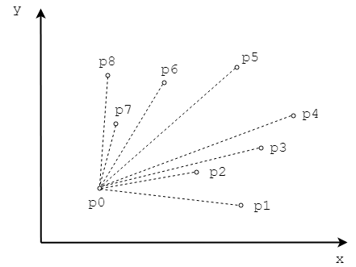
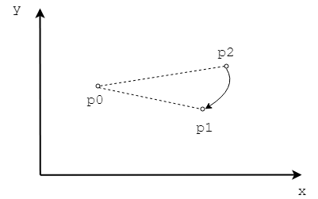
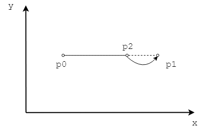

<script type="text/javascript" src="https://cdnjs.cloudflare.com/ajax/libs/mathjax/2.7.1/MathJax.js?config=TeX-AMS-MML_HTMLorMML"></script>

# Graham Scan - Graham扫描算法

--------

#### 问题

用Graham Scan算法求拥有$$ n $$个点的点集$$ Q $$的凸包$$ CH(Q) $$，任意两点的坐标不同。

#### 解法

在二维平面上选取$$ y $$坐标最小，$$ x $$坐标最小的顶点$$ p_0 $$，将其余$$ n-1 $$个顶点$$ [p_1, p_2, \dots, p_{n-1}] $$按照以$$ p_0 $$的顺时针方向排序。如图所示：



上图中以$$ p_0 $$点为基准，对其余点排序的结果为$$ [p_1, p_2, p_3, p_4, p_5, p_6, p_7, p_8] $$。

根据Cross中向量叉积的知识，可知对于三个顶点$$ p_0, p_1, p_2 $$组成的向量$$ \vec{p_0 p_1}, \vec{p_0 p_2} $$，设$$ C = \vec{p_0 p_1} \times \vec{p_0 p_2} $$有以下情况：

1. 若$$ C \gt 0 $$则$$ \vec{p_0 p_2} $$在$$ \vec{p_0 p_1} $$逆时针方向。如图：


{:start="2"}
2. 若$$ C \lt 0 $$则$$ \vec{p_0 p_2} $$在$$ \vec{p_0 p_1} $$顺时针方向。如图：



{:start="3"}
3. 若$$ C = 0 $$则$$ \vec{p_0 p_1} $$与$$ \vec{p_0 p_2} $$方向相同。对于向量完全相同的两顶点$$ p_1, p_2 $$，按照到$$ p_0 $$距离从近到远排序。如图：



排序时比较任意两点到$$ p_0 $$的向量叉积都为负数，则整组顶点可以按照顺时针排列。设排列后的顶点顺序为$$ [p_1, p_2, \dots, p_{n-1}] $$。

设置一个空堆栈$$ stack = \varnothing $$，初始时推入三个顶点$$ p_0, p_1, p_2 $$，此时堆栈为$$ stack = [p_0, p_1, p_2] $$。

然后遍历剩余顶点$$ [p_3, \dots, p_{n-1} ] $$，对于每个顶点$$ p_i $$，考虑堆栈$$ stack $$的头部顶点$$ p_{top} $$、次头部顶点$$ p_{next-top} $$，判断这三个点组成的两个向量$$ \vec{p_{top} p_i} $$和$$ \vec{p_{next-top} p_{top}} $$，前者是否在后者的顺时针方向，即满足

$$
\vec{p_{next-top} p_{top}} \times \vec{p_{top} p_i} \lt 0
$$

1. 若$$ p_i $$不满足条件，说明不是凸包上的点，对堆栈$$ stack $$进行出栈操作（推出头部顶点$$ top $$）。然后再重复判断$$ \vec{p_{next-top} p_{top}} \times \vec{p_{top} p_i} $$的值，直到满足该条件为止；

2. 若$$ p_i $$满足条件，说明是凸包上的点，将其推入堆栈$$ stack $$中。然后继续考虑下一个顶点$$ p_{i+1} $$；

用伪代码来描述上述过程是

```
for i = 3 to n-1:
  while size(stack) >= 2 and ccw(next_top(stack), top(stack), p[i]) <= 0:
    pop(stack)
  push(stack, p[i])
end
```
遍历完点集$$ Q $$中所有顶点后，堆栈$$ stack $$中的点即为$$ Q $$的凸包$$ CH(Q) $$。该算法的时间复杂度为$$ O(n \cdot log_2 n) $$。

--------

#### Introduction to Algorithms

* [VII.Selected Topics - 33.Computational Geometry - 33.3.Finding the convex hull](https://www.google.com/search?q=Introduction+to+Algorithms+3rd+Edition+pdf)

--------

#### 源码

[GrahamScan.h](https://github.com/linrongbin16/Way-to-Algorithm/blob/master/src/AnalyticGeometry/ConvexHull/GrahamScan.h)

[GrahamScan.cpp](https://github.com/linrongbin16/Way-to-Algorithm/blob/master/src/AnalyticGeometry/ConvexHull/GrahamScan.cpp)

#### 测试

[GrahamScanTest.cpp](https://github.com/linrongbin16/Way-to-Algorithm/blob/master/src/AnalyticGeometry/ConvexHull/GrahamScanTest.cpp)
