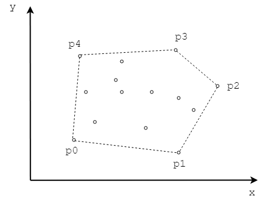

# Section-2 Convex Hull
# 第2节 凸包

1. [GrahamScan Graham扫描算法](GrahamScan/)
2. [QuickConvexHull 快速凸包算法](QuickConvexHull/)
3. [RotatingCalipers 旋转卡壳](RotatingCalipers/)

--------

#### 凸包

凸包（Convex Hull）是二维平面上一组点集$$ Q $$的最小凸多边形$$ P $$，满足$$ Q $$中的任意点要么在$$ P $$内部，要么在$$ P $$的边界上。形象地说，可以想象$$ Q $$中的每个点都是钉在木板上的一个铁钉，凸包$$ P $$是一根拉紧的橡皮筋，包住所有铁钉后构成的形状。如图所示：

上图中$$ [p_0, p_1, p_2, p_3, p_4] $$是点集$$ Q $$的凸包，记作$$ CH(Q) $$。
