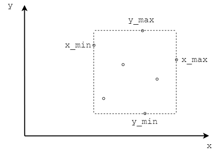

# Nearest Neighbor - 最近点对

--------

#### 问题

求出二维平面坐标系上$$ n $$个点中最近两点的距离。

#### 解法

遍历所有顶点求出任意两点间的距离，从而求出最近距离，该方法的时间复杂度为$$ O(n^2) $$，本文介绍一个更快的算法。

通过分治法将二维平面坐标系上的$$ n $$个顶点作为一个区域$$ s $$，可知该区域的$$ x $$坐标范围为$$ [ x_{min}, x_{max} ] $$，$$ y $$坐标范围为$$ [ y_{min}, y_{max} ] $$。如下图所示：

在区域$$ s $$中选取$$ x $$坐标最接近$$ \frac{x_{min} + x_{max}}{2} $$的顶点$$ p $$，用垂直于$$ x $$轴，$$ x $$坐标为$$ x_{p} $$的直线将该区域划分为左右两个子区域$$ left $$和$$ right $$。顶点$$ p $$不属于$$ left $$或$$ right $$任意区域。对两个子区域，类似的继续进行划分，直到区域中顶点的数量$$ n \leq 3 $$。

当一个区域中的顶点数量$$ n \leq 3 $$时，可以直接求出这些顶点中的最近两点距离$$ dist_{min} $$。对于两个相邻子区域，虽然已知两个子区域内的最近两点距离，但两个相邻子区域合并后的最近两点距离仍然不确定。

当合并两个相邻子区域$$ left $$和$$ right $$时，设两个子区域的最近两点距离分别为$$ dist_{left}, dist_{right} $$，分割两个区域的中点为$$ p $$。对于$$ left $$区域中的任意顶点$$ a $$，若其满足

$$
\begin{matrix}
\mid x_a - x_p \mid \leq dist_{left}    \\
\mid y_a - y_p \mid \leq dist_{left}
\end{matrix}
$$

则$$ a $$与$$ p $$有可能是最近点对，不满足该条件的$$ a $$与$$ p $$必然不是最近点对。

通过直接判断$$ x, y $$轴可以避免计算二维平面上两点距离时的乘法运算，最终只需要计算出$$ p $$与它周围最近的的一部分顶点的距离即可。算出点$$ p $$与它周围顶点的距离$$ dist_{ap} $$。同理，对于区域$$ right $$中的所有满足下列条件的顶点$$ b $$：

$$
\begin{matrix}
\mid x_b - x_p \mid \leq dist_{right}   \\
\mid y_b - y_p \mid \leq dist_{right}
\end{matrix}
$$

点$$ p $$与这些顶点的距离为$$ dist_{bp} $$。在$$ p $$周围的顶点，以及$$ left, right $$区域中的最近点对，在这些点对中选出距离最近的两点。重复上述操作，递归合并相邻两区域，最终可以求出$$ n $$个点中的最近两点距离。

该算法的时间复杂度为$$ O(log_2 n) $$。

--------

#### 源码

[NearestNeighbor.h](https://github.com/linrongbin16/Way-to-Algorithm/blob/master/src/AnalyticGeometry/Polygon/NearestNeighbor.h)

[NearestNeighbor.cpp](https://github.com/linrongbin16/Way-to-Algorithm/blob/master/src/AnalyticGeometry/Polygon/NearestNeighbor.cpp)

#### 测试

[NearestNeighborTest.cpp](https://github.com/linrongbin16/Way-to-Algorithm/blob/master/src/AnalyticGeometry/Polygon/NearestNeighborTest.cpp)
