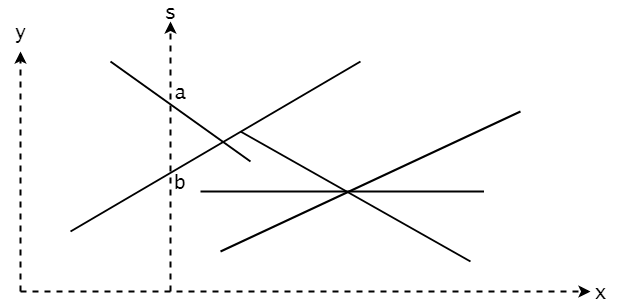
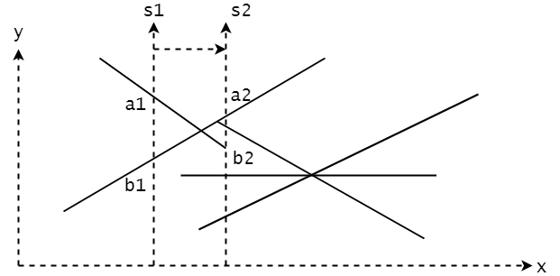

# Sweeping - 扫除算法

--------

#### 问题

判断一组线段中是否存在相交的线段。

#### 解法

对于$$ n $$条线段，暴力枚举任意两条线段是否相交的时间复杂度为$$ O(n^2) $$。Sweeping算法有更低的时间复杂度。

首先介绍扫除线，在平面中设置一条垂直于$$ x $$轴，平行于$$ y $$轴的直线$$ s $$，从左向右依次经过所有线段。如图所示：

假设扫除线$$ s $$与线段$$ l_{1} $$和$$ l_{2} $$同时相交，存在以下情况：

若$$ l_{1} $$与$$ s $$的交点$$ a $$的$$ y $$轴坐标大于$$ l_{2} $$与$$ s $$的交点$$ b $$的$$ y $$轴坐标，则称在$$ x $$轴的这个位置$$ l_{1} \gt l_{2} $$；反之若交点$$ a $$的$$ y $$轴坐标小于交点$$ b $$的$$ y $$轴坐标，则称在$$ x $$轴这个位置$$ l_{1} \lt l_{2} $$。这是一个全序关系。

显然，若$$ l_{1} $$，$$ l_{2} $$线段相交，则$$ s $$从左向右经过此交点时，$$ l_{1} $$与$$ l_{2} $$的全序关系会变化（从$$ l_{1} \gt l_{2} $$变为$$ l_{1} \lt l_{2} $$，或从$$ l_{1} \lt l_{2} $$变为$$ l_{1} \gt l_{2} $$）。

将所有线段的端点按照$$ x $$坐标从小到大排序，若两个端点的$$ x $$坐标相等，则在线段的左端点的端点优先（两个端点中$$ x $$坐标较小的端点为左端点，若$$ x $$坐标相等则$$ y $$坐标较小的端点算作左端点）。排序之后的所有端点组成事件点序列。当$$ s $$经过某个点时，有两线段的全序关系发生了变化，则认为这两线段相交。

扫除线从左边向右边移动经过每个端点，维护状态$$ T $$，该状态记录了当前扫除线与哪些线段的端点相交，以及端点的坐标。由此可得：

$$ (1) $$ 当扫除线遇到线段$$ l_{1} $$的左端点$$ a $$时，将线段$$ l_{1} $$加入状态$$ T $$。若此时状态$$ T $$中存在相交的端点$$ b $$（在线段$$ l_{2} $$上），若$$ l_{2} $$与$$ l_{1} $$相交，则可知这组线段中存在相交的线段；

$$ (2) $$ 当扫除线遇到线段$$ l_{1} $$的右端点$$ a $$时，将线段$$ l_{1} $$从状态$$ T $$中删除。若此时状态$$ T $$中存在相交的端点$$ b $$和$$ c $$（端点$$ b $$在线段$$ l_{2} $$上，端点$$ c $$在线段$$ l_{3} $$上），若$$ b $$在$$ a $$上方、$$ c $$在$$ a $$下方（反之亦然），且$$ l_{2} $$与$$ l_{3} $$相交，则可知这组线段中存在相交的线段；

状态$$ T $$通过红黑树实现，需要实现：插入线段$$ Insert(l) $$，删除线段$$ Erase(l) $$、查询线段$$ l $$上方的线段$$ Above(l) $$，查询线段$$ l $$下方的线段$$ Below(l) $$四种操作。

对于数量为$$ n $$的一组线段，该算法的时间复杂度为$$ O(n) $$。

--------

#### 算法导论-第33章计算几何学

* [VII.Selected Topics - 33.Computational Geometry - 33.2.Determining whether any pair of segments intersects](https://mcdtu.files.wordpress.com/2017/03/introduction-to-algorithms-3rd-edition-sep-2010.pdf)

--------

#### 源码

[Sweeping.h](https://github.com/linrongbin16/Way-to-Algorithm/blob/master/src/AnalyticGeometry/Polygon/Sweeping.h)

[Sweeping.cpp](https://github.com/linrongbin16/Way-to-Algorithm/blob/master/src/AnalyticGeometry/Polygon/Sweeping.cpp)

#### 测试

[SweepingTest.cpp](https://github.com/linrongbin16/Way-to-Algorithm/blob/master/src/AnalyticGeometry/Polygon/SweepingTest.cpp)
