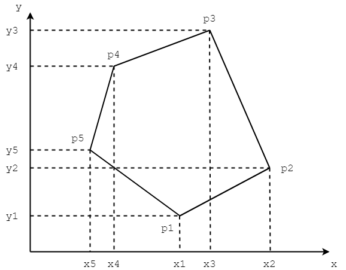

# Chapter-10 Analytic Geometry
# 第10章 解析几何

--------

1. Section-1 Polygon 第1节 多边形
    1. [Cross 向量叉积](Polygon/Cross/)
    2. [SegmentIntersection 线段相交](Polygon/SegmentIntersection/)
    3. [Sweeping 扫除算法](Polygon/Sweeping/)
    4. [ConvexPolygonArea 凸多边形面积](Polygon/ConvexPolygonArea/)
    5. [ConvexPolygonGravityCenter 凸多边形重心](Polygon/ConvexPolygonGravityCenter/)
    6. [NearestNeighbor 最近点对](Polygon/NearestNeighbor/)
2. [Section-2 ConvexHull 第2节 凸包](ConvexHull/)
    2. [GrahamScan Graham扫描算法](ConvexHull/GrahamScan/)
    3. [QuickConvexHull 快速凸包算法](ConvexHull/QuickConvexHull/)
    4. [RotatingCalipers 旋转卡壳](Polygon/RotatingCalipers/)

--------

#### 公共类库源码

[Util.h](https://github.com/linrongbin16/Way-to-Algorithm/blob/master/src/AnalyticGeometry/Util.h)

[Util.cpp](https://github.com/linrongbin16/Way-to-Algorithm/blob/master/src/AnalyticGeometry/Util.cpp)
