# Catalan - 卡特兰数

--------

#### 问题

1. 现在把$$ 12 $$个高矮不同的人排成两排，要求每排必须从矮到高排列，且第二排的人比第一排对应的人要高。请问有多少种排列方式。这个问题也可以描述为，把$$ 12 $$个不同的正整数排成两排，要求从小到大，且第二排的数字比第一排对应的数字要大，求出排列方式$$ n $$。如下图所示：

2.

#### 解法

卡特兰数（又称卡塔兰数）是组合数学中常见的数列，在计算凸多边形面积划分和棋盘路径、以及进出栈方法数中具有很多应用。

卡特兰数$$ C_{n} $$满足以下递推关系：

$$

f(n) = frac{1}{n + 1}(
        \begin{cases}
        2 \times n \\
        n
        \end{cases}
        ) 其中（n \ge 0）

$$

卡特兰数可以解决的问题：

计算n+2条边的凸多边形中划分三角形的个数
在此模型中，选取任意的两条边为基点，在剩余的n条边中，可知是
两部分的卷积公式 Cn=sum(Ci*C(n-i)) 0<i<n

计算网格中的路径方案数：
在n*n的网格中，求从左下角到右上角的路径的方案数，
要求不能穿过对角线
这个问题可以转换成第三中模型

进出栈的问题：
设有n个1和n个-1随机组合，在其中添加括号，是的每个括号中的值
都不为负数，也就是一类dyck word数的计算

dyck word数：是一个有n个X和n个Y组成的字串，且所有部分的字串
满足x的个数不小于y的个数，一下为5中情况(n=3)
XXXYYY XYXXYY XYXYXY XXYYXY XXYXYY
将上述X换成左括号，Y换成右括号，Cn表示组合式算法个数C3=5.

求出$$ n $$的卡特兰数$$ f(n) $$

#### 解法

#include <iostream>
#include <stdio.h>
#include <cmath>
using namespace std;

void catalan(int**a,int* b)  //求卡特兰数
{
    int i,j,len,carry,temp;
    a[1][0]=b[1]=1;
    len=1;
    for(i=2;i<=100;i++)
    {
        for(j=0;j<len;j++)    //乘法
            a[i][j]=a[i-1][j]*(4*(i-1)+2);
        carry=0;
        for(j=0;j<len;j++)    //处理相乘结果
        {
            temp=a[i][j]+carry;
            a[i][j]=temp%10;
            carry=temp/10;
        }
        while(carry)    //进位处理
        {
            a[i][len++]=carry%10;
            carry/=10;
        }
        carry=0;
        for(j=len-1;j>=0;j--) //除法
        {
            temp=carry*10+a[i][j];
            a[i][j]=temp/(i+1);
            carry=temp%(i+1);
        }
        while(!a[i][len-1])     //高位零处理
            len--;
        b[i]=len;
    }
}

--------

#### 源码

[import, lang:"c_cpp"](../../../src/CombinatorialMathematics/Catalan.h)

#### 测试

[import, lang:"c_cpp"](../../../src/CombinatorialMathematics/Catalan.cpp)
