

# AVL Tree - AVL二叉树

--------

#### 描述

AVL树是最早发明的一种自平衡二叉查找树，树中的任何节点的左右两个子树的高度最大差别为$$ 1 $$，因此也称为高度平衡树。AVL树的查找、插入、删除操作的平均时间复杂度都是$$ O(log_{2}⁡n) $$，AVL树高度为$$ O(log_{2}⁡n) $$。

为了保持树的左右子树的平衡，避免一侧过长或过短，AVL树会对LL（左左）、RR（右右）、LR（左右）、RL（右左）四种情况进行调整：

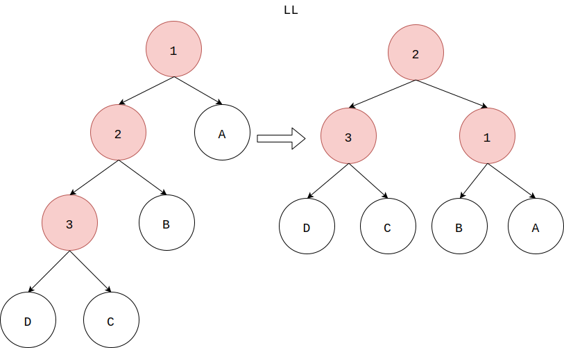

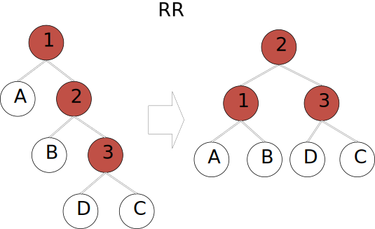

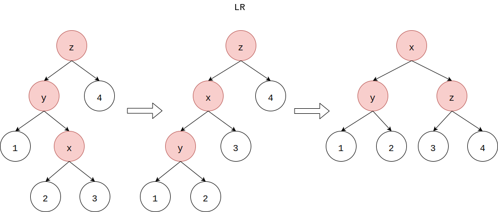

上面四种情况包含了所有从不平衡转化为平衡的步骤，其中单向右旋平衡处理LL，单向左旋平衡处理RR，双向旋转（先左后右）平衡处理LR，双向旋转（先右后左）平衡处理RL。

这四种操作既能够平衡左右子树的高度，还能够保持树的有序性。即平衡后的树的左子树中所有节点仍然小于（或大于）树的根节点，而右子树中所有节点仍然大于（或小于）树的根节点。

AVL树的每个节点都有一个高度值$$ depth $$，树的平衡因子为$$ balanceFactor = leftTree.depth - rightTree.depth $$，即左右子树的深度之差。当一个节点的$$ | balanceFactor | \le 1 $$时该子树平衡；当$$ | balanceFactor | \le 2 $$时该子树不平衡。

将空节点的高度值视作$$ - 1 $$，一个节点的高度值为$$ depth_{node} = max⁡(depth_{node.leftChild},depth_{node.rightChild}) + 1 $$。上面LL、RR、LR和RL四种操作，都会将其节点$$ 1 $$的高度值减$$ 2 $$，其余节点的高度值都不变。

对于下面这个AVL树，每个节点中上面的数字是节点下标号，下面的数字是该节点的高度值$$ depth $$。将节点$$ 18 $$插入下面的AVL树：

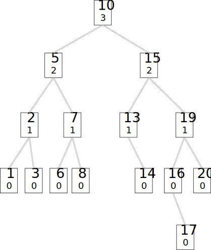

$$ (1) $$从根节点开始，将节点$$ 18 $$与节点$$ 10 $$比较，有$$ 18 \lt 10 $$，因此把节点$$ 18 $$插入节点$$ 10 $$的右子树；

$$ (2) $$将节点$$ 18 $$与节点$$ 15 $$比较，有$$ 18 \gt 15 $$，因此把节点$$ 18 $$插入节点$$ 15 $$的右子树；

$$ (3) $$将节点$$ 18 $$与节点$$ 19 $$比较，有$$ 18 \lt 19 $$，因此把节点$$ 18 $$插入节点$$ 19 $$的左子树；

$$ (4) $$将节点$$ 18 $$与节点$$ 16 $$比较，有$$ 18 \gt 16 $$，因此把节点$$ 18 $$插入节点$$ 16 $$的右子树；

$$ (5) $$将节点$$ 18 $$与节点$$ 17 $$比较，有$$ 18 \gt 17 $$，因此把节点$$ 18 $$插入节点$$ 17 $$的右子树，节点$$ 17 $$的右孩子节点为空，因此节点$$ 18 $$成为节点$$ 17 $$的右孩子节点；

然后从节点$$ 18 $$开始，向上依次更新所有节点的高度值，若新的高度值不满足AVL树的平衡性，则进行旋转操作：

$$ (6) $$节点$$ 18 $$为叶子节点，因此高度值为$$ 0 $$；

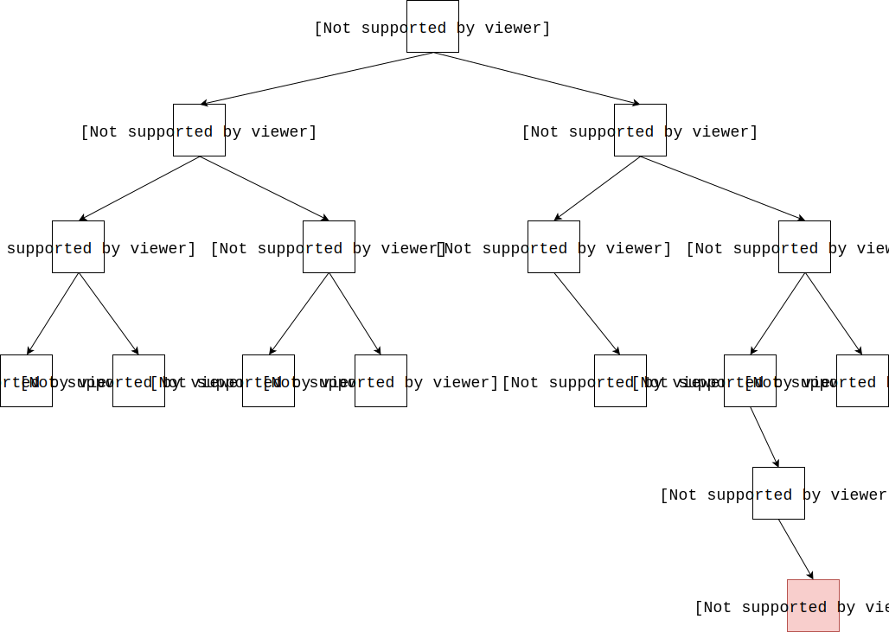

$$ (7) $$节点$$ 17 $$的平衡因子为$$ balanceFactor_{17} = |depth_{nil} - depth_{18}| = |- 1 - 0| = 1 $$，不需要旋转，高度值更新为$$ depth_{17} = max⁡(depth_{17.leftChild},depth_{17.rightChild}) + 1 = max⁡(-1,0) + 1 = 1 $$；

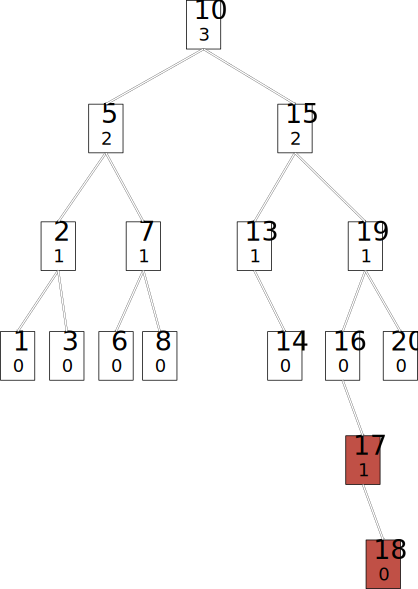

$$ (8) $$节点$$ 16 $$的平衡因子为$$ balanceFactor_{16} = |depth_{nil} - depth_{17} | = |- 1 - 1| = 2 $$，高度值更新为$$ depth_{16} = max⁡(depth_{16.leftChild},depth_{16.rightChild}) + 1 = max⁡(-1,1) + 1 = 2 $$，由于节点$$ 16 $$的平衡因子超过$$ 1 $$，需要进行RR操作，旋转后节点$$ 16 $$的高度值减$$ 2 $$；

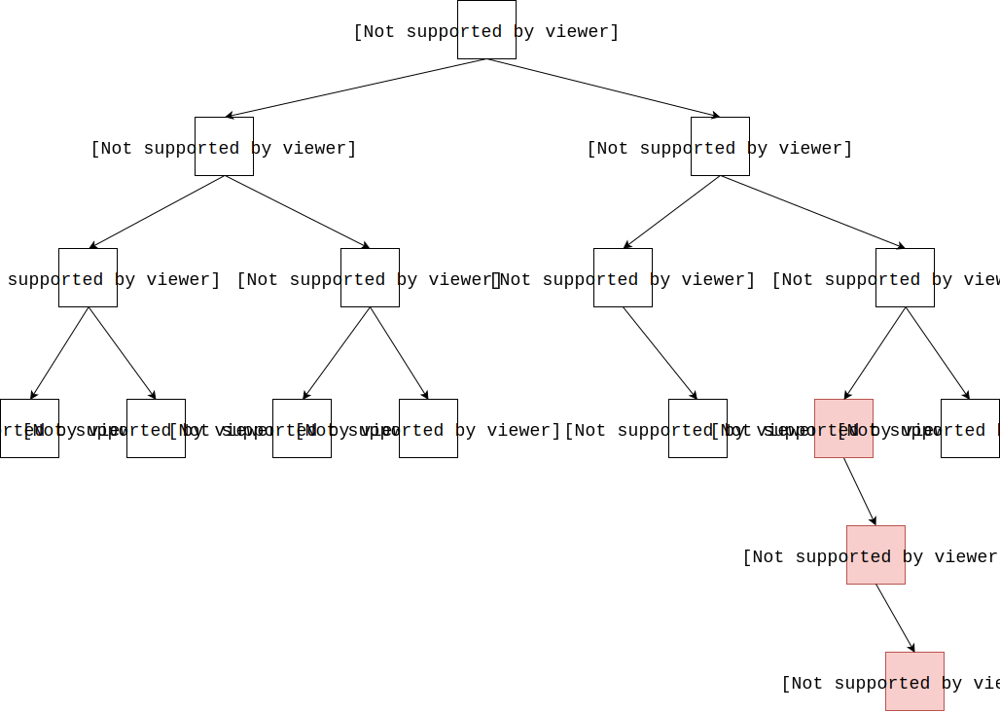

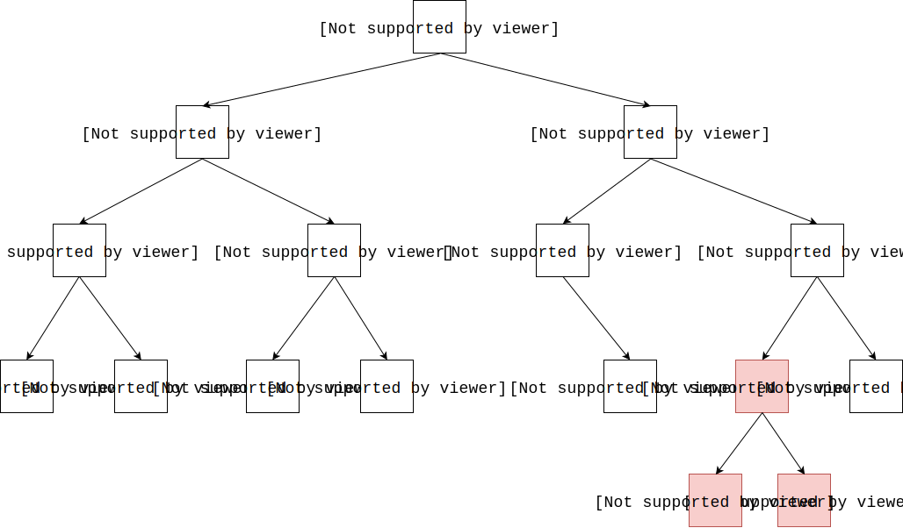

$$ (9) $$节点$$ 19 $$的平衡因子为$$ balanceFactor_{19} = |depth_{17} - depth_{20}| = |1 - 0| = 1 $$，高度值更新为$$ depth_{19} = max⁡(depth_{19.leftChild},depth_{19.rightChild}) + 1 = max⁡(1,0) + 1 = 2 $$；

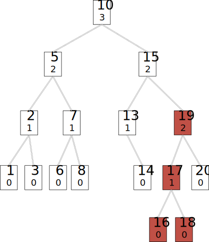

$$ (10) $$节点$$ 15 $$的平衡因子为$$ balanceFactor_{15} = |depth_{13} - depth_{19}| = |1 - 2| = 1 $$，高度值更新为$$ depth_{15} = max⁡(depth_{15.leftChild},depth_{15.rightChild}) + 1 = max⁡(1,2) + 1 = 3 $$；

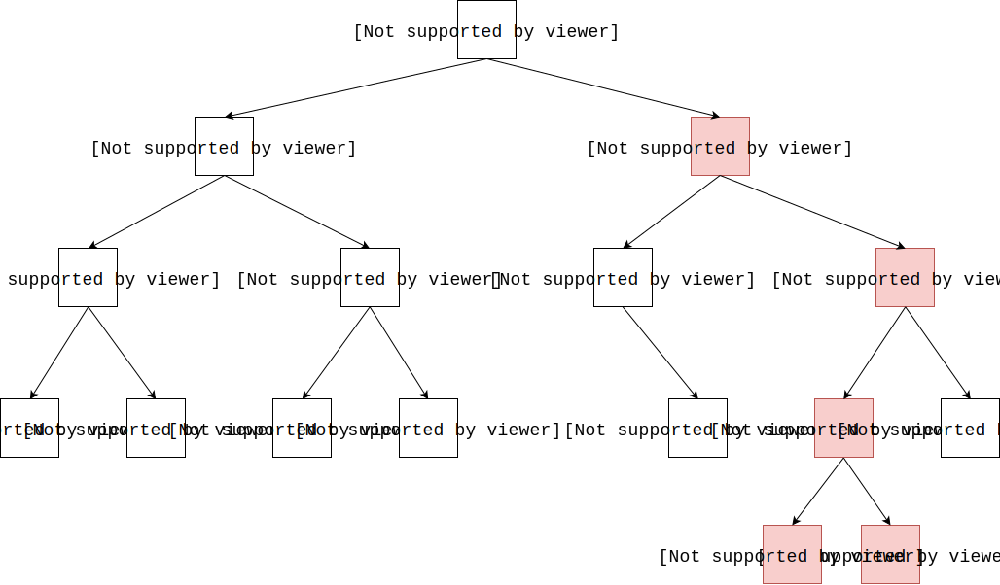

$$ (11) $$节点$$ 10 $$的平衡因子为$$ balanceFactor_{10} = |depth_{5} - depth_{15}| = |2 - 3| = 1 $$，高度值更新为$$ depth_{10} = max⁡(depth_{10.leftChild},depth_{10.rightChild}) + 1 = max⁡(2,3) + 1 = 4 $$；

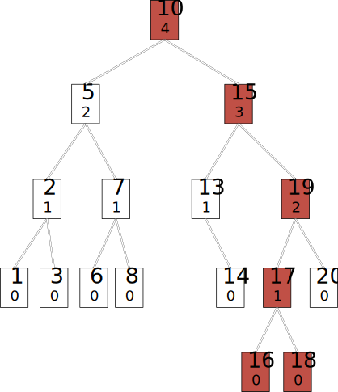

--------

#### 源码

[import, lang:"c_cpp"](../../../src/DataStructure/AVLTree.h)

#### 测试

[import, lang:"c_cpp"](../../../src/DataStructure/AVLTree.cpp)
