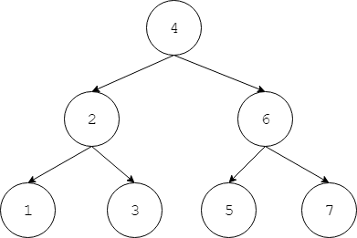
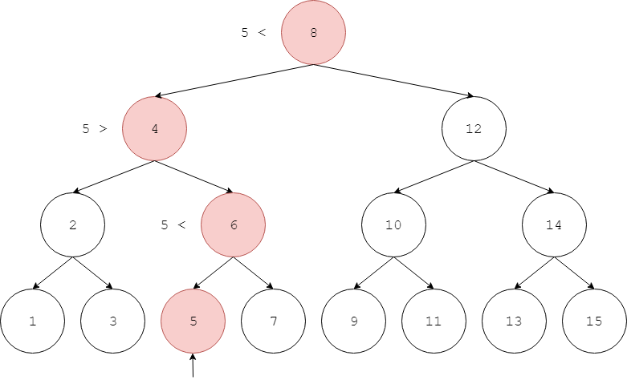
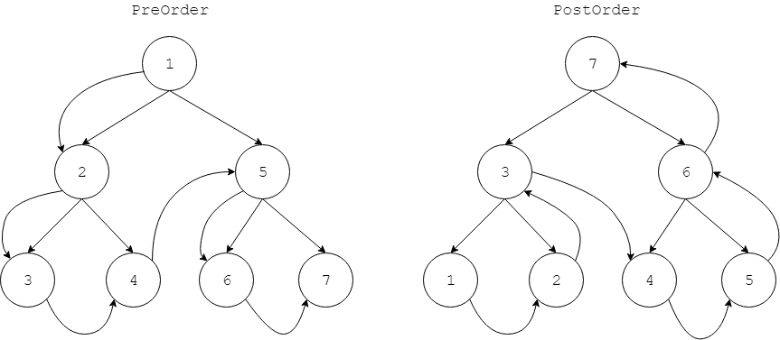
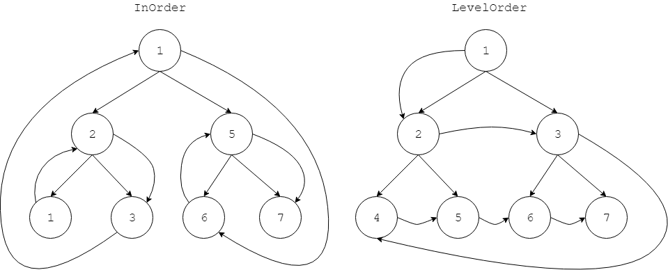
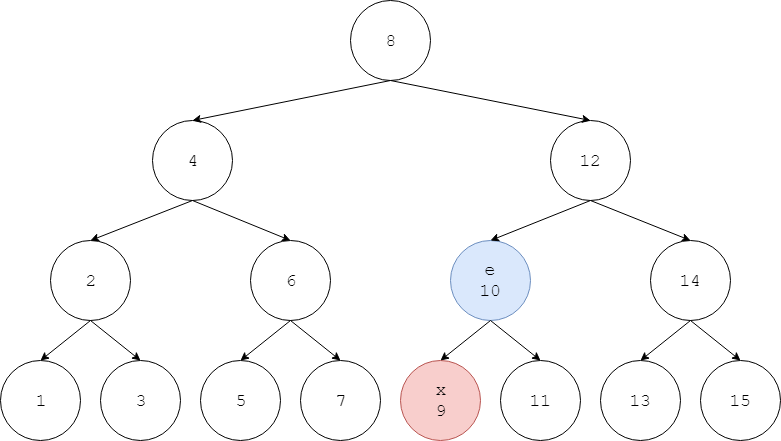
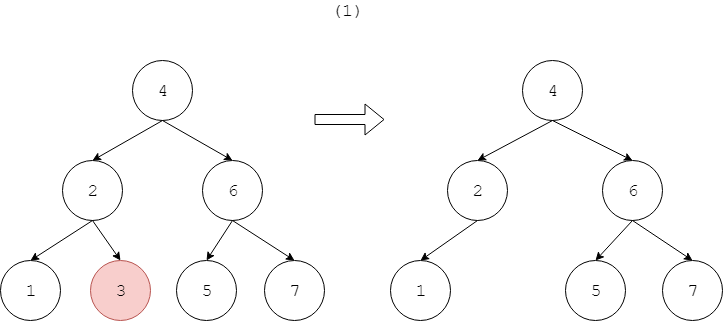
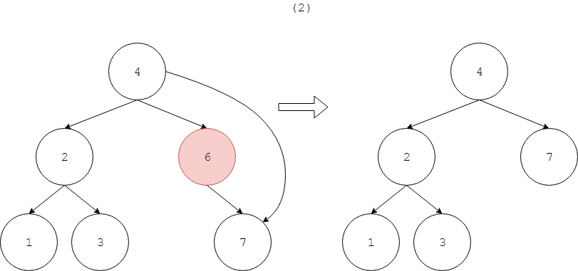
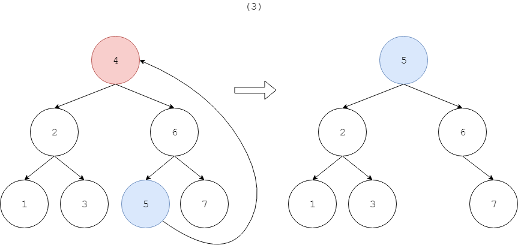
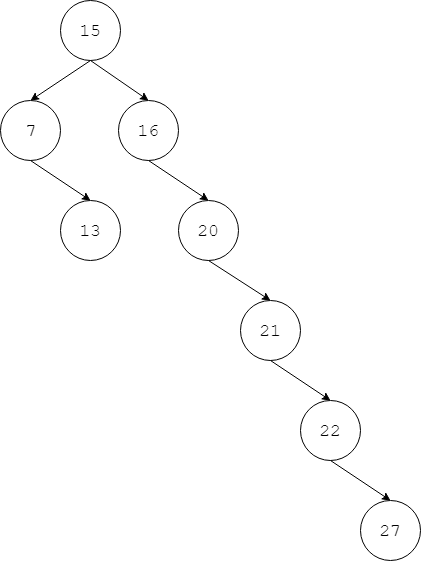

# Binary Search Tree(Ordered Binary Tree) - 二叉查找树（有序二叉树）

--------

#### 遍历

二叉查找树和二分查找算法的思路一样，但使用树形结构来实现。

二叉查找树上节点$$ x $$的左孩子节点为$$ left_{x} $$，右孩子节点为$$ right_{x} $$。二叉查找树上任意节点$$ x $$的左子树上所有节点都小于$$ x $$，右子树上所有节点都大于$$ x $$，即$$ left_{x} \lt x \lt right_{x} $$。二叉查找树中不允许两个相等的节点（通过一些方法可以实现包含重复键值的二叉查找树，但为了方便本文中不考虑这种情况）。

拥有$$ n $$个节点且安排良好的（金字塔型的）二叉查找树可以在$$ O(log_2 n) $$的时间复杂度内查找任意元素。在二叉查找树上查询一个节点的过程和二分查找完全一样，从根节点开始依次比较被查找的节点$$ x $$和当前节点$$ e $$，若$$ x = e $$则查找结束；若$$ x \lt e $$则继续在左子树中查找；若$$ x \gt e $$则继续在右子树中查找：

二叉树有四种遍历方式：

$$ (1) $$ 先序遍历（$$ PreOrder $$），访问顺序总是$$ x \rightarrow left_{x} \rightarrow right_{x} $$；

$$ (2) $$ 后序遍历（$$ PostOrder $$），访问顺序总是$$ left_{x} \rightarrow right_{x} \rightarrow x $$；

$$ (3) $$ 中序遍历（$$ InOrder $$），访问顺序总是$$ left_{x} \rightarrow x \rightarrow right_{x} $$；

$$ (4) $$ 层序遍历（$$ LevelOrder $$），访问顺序类似BFS算法，一层一层的访问所有节点）；

下图中节点的访问顺序按照数字从小到大：

#### 插入

往二叉查找树插入节点$$ x $$时，首先在树上尝试搜索$$ x $$，搜索失败时会停下的节点$$ e $$就是合适插入的位置。若$$ x \lt e $$则将其作为$$ e $$的左孩子节点，若$$ x \gt e $$则将其作为$$ e $$的右孩子节点。为了方便我们不考虑重复插入$$ x $$的情况。

#### 删除

从二叉查找树中删除节点$$ x $$时需要保证二叉查找树的属性（$$ left_{x} \lt x \lt right_{x} $$），有三种情况：

$$ (1) $$ 若$$ x $$为叶子节点，既没有左孩子节点也没有右孩子节点，直接删除；

$$ (2) $$ 若$$ x $$只有一个孩子节点$$ y $$，则像链表一样将$$ x $$从其父节点和$$ y $$之间删除；

$$ (3) $$ 若$$ x $$同时有左右孩子节点，按照中序遍历找出二叉树中比$$ x $$大的下一个节点$$ next $$（中序遍历下的后继节点），用其值代替$$ x $$，实际删除节点$$ next $$；

下图演示了上述的三种删除情况：

随机的插入/删除会让二叉查找树退化为链表，如图所示是一个糟糕的二叉查找树，虽然它满足节点之间有序，但是查找的时间复杂度已经退化为了$$ O(n) $$。

--------

#### 源码

[BinarySearchTree.h](https://github.com/linrongbin16/Way-to-Algorithm/blob/master/src/DataStructure/BinarySearchTree.h)

[BinarySearchTree.cpp](https://github.com/linrongbin16/Way-to-Algorithm/blob/master/src/DataStructure/BinarySearchTree.cpp)

#### 测试

[BinarySearchTreeTest.cpp](https://github.com/linrongbin16/Way-to-Algorithm/blob/master/src/DataStructure/BinarySearchTreeTest.cpp)

