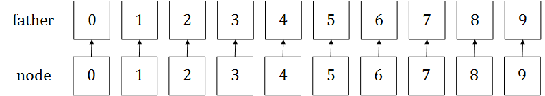
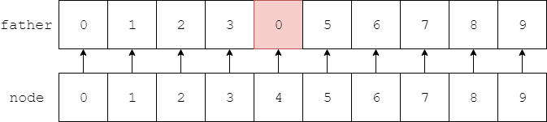
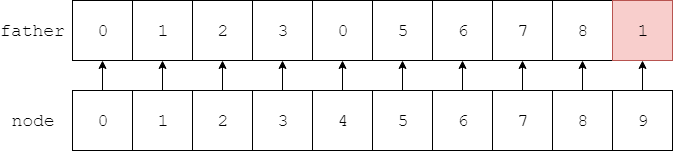
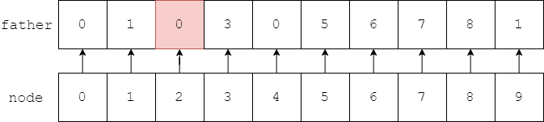
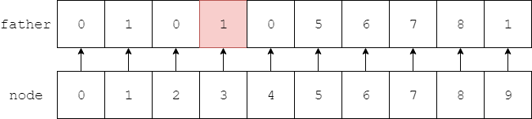
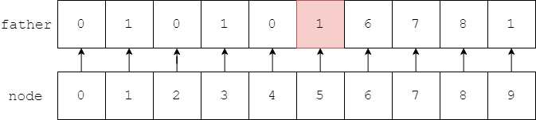
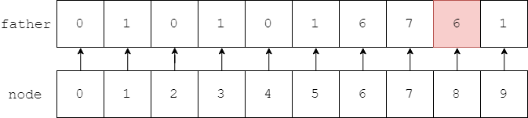
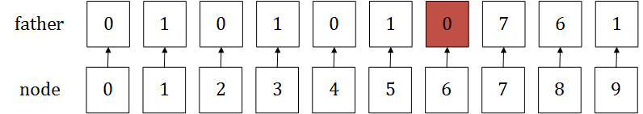
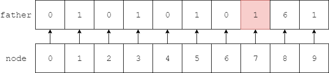

--------
* [Upper Folder - 上一级目录](../)
* [Source Code - 源码](https://github.com/zhaochenyou/Way-to-Algorithm/blob/master/src/DataStructure/DisjointSet.hpp)
* [Test Code - 测试](https://github.com/zhaochenyou/Way-to-Algorithm/blob/master/src/DataStructure/DisjointSet.cpp)

--------

<h1 align="center">Disjoint Set</h1>
<h1 align="center">并查集</h1>
 
描述：  
&emsp;&emsp;现在有一个拥有\(n\)个成员的集合\(s = \{ x_0,x_1,x_2, \cdots ,x_{n-1} \} \)，依次声明\(x_i\)和\(x_j\)属于或不属于同一个家族，最终将所有成员分为两个家庭。每个家族中只有唯一一个祖先，其余的成员必然有一个父亲，递归的向上查找，除了祖先自己，其余每个成员所属的祖先只有\(2\)种可能。并查集是一种适合成员分类的高效树形数据结构，支持快速分类和查询。  
&emsp;&emsp;设\(father[x]\)为\(x\)节点的父节点，当\(father[x] = x\)时称\(x\)为祖先节点，它是家族中所有其他成员共同的唯一祖先，设\(ancestor[x]\)是\(x\)的祖先节点。  
&emsp;&emsp;对于拥有\(10\)个成员的集合\(s = \{ 0,1,2,3,4,5,6,7,8,9 \} \)，将其分成两个家庭\(A\)和\(B\)。初始时令每个成员的父亲都是自己，如图所示：  

&emsp;&emsp;当声明\(2\)个成员\(x_i\)和\(x_j\)（\(x_i \le x_j\)）属于同一家庭，直接令\(x_i\)的节点祖先为\(x_j\)的父亲（也可以反过来），即\(father[x_j] = ancestor[x_i]\)。这样的操作会使元素\(x_j\)的最接近祖先节点，从而缩短了递归向上查找的路径长度，因此该操作也称为压缩路径。  
&emsp;&emsp;下面对上图中的集合\(s\)进行具体演示：  
&emsp;&emsp;\((1)\)声明\(0\)和\(4\)属于同一家庭，比较\(0\)和\(4\)的祖宗节点，设置\(father[4] = ancestor[0] = 0\)，本文中我们取左节点的祖宗节点作为右节点的父节点；  

&emsp;&emsp;\((2)\)声明\(1\)和\(9\)节点属于同一家庭，设置\(father[9] = ancestor[1] = 1\)；  

&emsp;&emsp;\((3)\)声明\(0\)和\(2\)节点属于同一家庭，设置\(father[2] = ancestor[0] = 0\)；  

&emsp;&emsp;\((4)\)声明\(1\)和\(3\)节点属于同一家庭，设置\(father[3] = ancestor[1] = 1\)；  

&emsp;&emsp;\((5)\)声明\(3\)和\(5\)节点属于同一家庭，设置\(father[5] = ancestor[3] = 1\)；  

&emsp;&emsp;\((6)\)声明\(6\)和\(8\)节点属于同一家庭，设置\(father[8] = ancestor[6] = 6\)；  

&emsp;&emsp;\((7)\)声明\(2\)和\(6\)节点属于同一家庭，设置\(father[6] = ancestor[2] = 0\)；  

&emsp;&emsp;\((8)\)声明\(1\)和\(7\)节点属于同一家庭，设置\(father[7] = ancestor[1] = 1\)；  

&emsp;&emsp;合并两节点\(x\)和\(y\)时，根据固定规则设置\(father[y] = ancestor[x]\)（或者相反）；查询节点\(x\)的祖宗节点时，若\(father[x] \neq ancestor[x]\)则设置\(father[x] = ancestor[x]\)。并查集的分类、查询操作的时间复杂度接近\(O(1)\)。  

--------
--------
