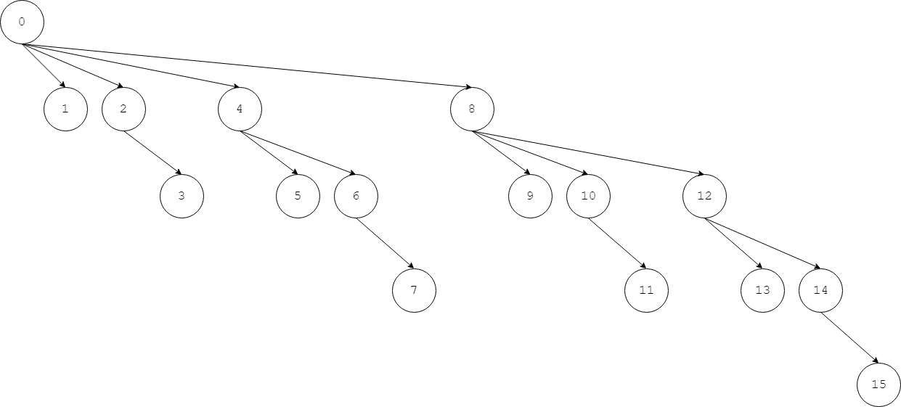

<script type="text/javascript" src="https://cdnjs.cloudflare.com/ajax/libs/mathjax/2.7.1/MathJax.js?config=TeX-AMS-MML_HTMLorMML"></script>

# Fenwick Tree(Binary Indexed Tree) - 树状数组（二进制索引树）

--------

#### 树状数组（二进制索引树）

对于区间$$ s = [x_{0}, x_{2}, \dots, x_{n-1}] $$，求区间$$ s[p,q) $$（其中$$ 0 \leq p \lt q \lt n $$）上的所有成员之和。该区间可以修改每个元素的值，新增/删除新的元素。

循环累加数组，或者SegmentTree都可以解决该问题，但这里介绍Fenwick树（树状数组/二进制索引树），时间复杂度与SegmentTree一样是$$ O(log_2 n) $$，实际中由于使用字节操作，FenwickTree实际运行时占用内存少，速度更快。

函数LowBit用于计算一个数字的二进制形式下最低位的$$ 1 $$对应的十进制值。比如$$ 34_{10} = 10,0010_2 $$最低位的$$ 1 $$对应的十进制值为$$ 2_{10} $$，$$ 12_{10} = 1100_{2} $$最低位的$$ 1 $$对应的十进制值为$$ 4_{10} $$，$$ 8_{10} = 1000_2 $$最低位的$$ 1 $$对应的十进制值为$$ 8_{10} $$，即$$ LowBit(34) = 2 $$，$$ LowBit(12) = 4 $$，$$ LowBit(8) = 8 $$。

LowBit函数的C++实现如下：

``` c++
int LowBit(int x) {
    return x & (x ^ (x-1));
}
```

或者利用补码的特性写成：

``` c++
int LowBit(int x) {
    return x & (-x);
}
```

内存中的数字按照补码存储（正整数的补码与原码相同，负整数的补码是原码取反加一，并且最高位$$ bit $$设置为$$ 1 $$）。比如：

$$
\begin{matrix}

34_{10} = 0010,0010_{2} & - 34_{10} = 1101,1110_{2}  \\

12_{10} = 0000,1100_{2} & - 12_{10} = 1111,0100_{2}  \\

8_{10} = 0000,1000_{2} & - 8_{10} = 1111,1000_{2}

\end{matrix}
$$

对于非负整数$$ x $$，$$ x $$与$$ - x $$进行位与操作，即可得到$$ x $$中最低位的$$ 1 $$所代表的十进制的值。比如：

$$
\begin{matrix}

34_{10} \; \& \; (- 34_{10} ) = 0010,0010_{2} \; \& \; 1101,1110_{2} = 10_{2} = 2_{10}  \\

12_{10} \; \& \; (- 12_{10} ) = 0000,1100_{2} \; \& \; 1111,0100_{2} = 100_{2} = 4_{10} \\

8_{10} \; \& \; (- 8_{10} ) = 0000,1000_{2} \; \& \; 1111,1000_{2} = 1000_2 = 8_{10} 

\end{matrix}
$$

FenwickTree的核心是任意数字都可以用$$ 2 $$的次方和来表示，设置数组$$ bits $$，令$$ bits[i] = \sum_{j=i}^{i-2^r+1} j $$，其中$$ r = LowBit(i) $$。



用$$ 4 $$个bit可以表示范围$$ [0, 16) $$上的所有整数，将每个bit作为根节点的孩子节点。而每个bit的孩子节点，是


$$ (2) $$ 维护$$ s $$前缀和的数组$$ bit $$

对于长度为$$ n $$的数组$$ s $$（该算法需要数组下标从$$ 1 $$开始，因此数组$$ s $$的范围为$$ [1,n] $$），数组$$ bit $$中的元素$$ bit[i] = \sum_{j = i-LowBit(i)+1}^{i}s[j] $$。比如：

$$
\begin{array}{lcr}
bit[1] = \sum_{j = 1-1+1}^{1}s[j] = s[1] \\
bit[2] = \sum_{j = 2-2+1}^{2}s[j] = s[1]+s[2] \\
bit[3] = \sum_{j = 3-1+1}^{3}s[j] = s[3] \\
bit[4] = \sum_{j = 4-4+1}^{4}s[j] = s[1]+s[2]+s[3]+s[4] \\
bit[5] = \sum_{j = 5-1+1}^{5}s[j] = s[5] \\
bit[6] = \sum_{j = 6-2+1}^{6}s[j] = s[5]+s[6] \\
bit[7] = \sum_{j = 7-1+1}^{7}s[j] = s[7] \\
bit[8] = \sum_{j = 8-8+1}^{8}s[j] = s[1]+s[2]+s[3]+s[4]+s[5]+s[6]+s[7]+s[8] \\
bit[9] = \sum_{j = 9-9+1}^{9}s[j] = s[9]
\end{array}
$$

在数组$$ bit $$的基础上，求数组$$ s $$中$$ [0,p] $$的和，只需累加所有$$ bit[i] $$，其中初始时$$ i = p $$，每累加一次\(bit[i]\)，\(i\)值减去\(LowBit(i)\)，直到\(i \le 0\)。（这里我暂时也没找到更好的讲解方法，解释的不是很清晰）

对于长度为$$ n $$的数组$$ s $$，构造树状数组的时间复杂度为$$ O(n \cdot log_2⁡n) $$，查询区域和的时间复杂度为$$ O(log_2 n) $$，修改数组$$ s $$中一个值的时间复杂度为$$ O(log_2⁡n) $$，空间复杂度为$$ O(n) $$。

--------

#### 二进制索引树

* http://citeseerx.ist.psu.edu/viewdoc/download;jsessionid=07BA8E50FC6C41AAE5CFCE28AEB9656E?doi=10.1.1.14.8917&rep=rep1&type=pdf
* https://www.topcoder.com/community/data-science/data-science-tutorials/binary-indexed-trees/
* https://www.geeksforgeeks.org/binary-indexed-tree-or-fenwick-tree-2/

--------

#### 源码

[FenwickTree.h](https://github.com/linrongbin16/Way-to-Algorithm/blob/master/src/DataStructure/FenwickTree.h)

[FenwickTree.cpp](https://github.com/linrongbin16/Way-to-Algorithm/blob/master/src/DataStructure/FenwickTree.cpp)

#### 测试

[FenwickTreeTest.cpp](https://github.com/linrongbin16/Way-to-Algorithm/blob/master/src/DataStructure/FenwickTreeTest.cpp)
