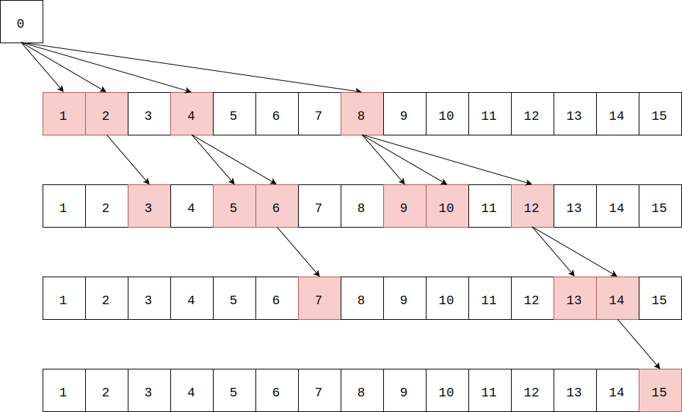
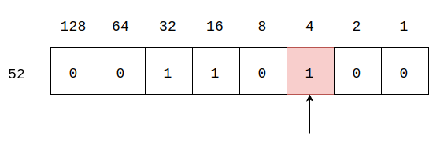
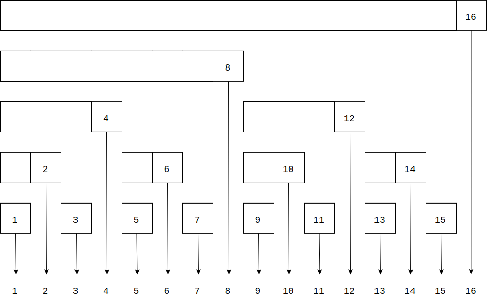

<script type="text/javascript" src="https://cdnjs.cloudflare.com/ajax/libs/mathjax/2.7.1/MathJax.js?config=TeX-AMS-MML_HTMLorMML"></script>

# Fenwick Tree(Binary Indexed Tree) - 树状数组（二进制索引树）

--------

#### 树状数组（二进制索引树）

对于区间$$ s = [x_{1}, x_{2}, x_{3}, \dots, x_{n}] $$，求区间$$ s[p,q) $$（其中$$ 1 \leq p \lt  q \leq n $$）上的所有成员之和（简称区域和/区间和）。区间上任意位置$$ s[i] $$的值可以修改，但所有元素都恒为非负整数。

循环累加数组的算法和SegmentTree算法都可以解决该问题，Fenwick树（树状数组/二进制索引树）与SegmentRee同样在时间复杂度$$ O(log_2 n) $$内求出某个区域上的和，但空间复杂度更低。实际上由于字节操作，FenwickTree不但占用内存少，且速度更快（内存更紧凑的软件速度更快）。

设$$ sum(n) = \sum_{i=1}^{n} s[i] $$，那么$$ s[p,q) $$的区间和可以表示为$$ sum(q-1) - sum(p-1) $$。本问题可以转化为求区间$$ s $$上前$$ n $$个元素之和的问题。

FenwickTree的灵感来源于任意非负整数都可以表示为$$ 2 $$的次方和，比如$$ 3 = 2^1 + 2^0, 7 = 2^2 + 2^1 + 2^0, 8 = 2^3 $$。所以任意非负整数可以用一个代表bit的数组表示：$$ 3 = [0, 0, 1, 1] $$，$$ 7 = [0, 1, 1, 1] $$，$$ 8 = [1, 0, 0, 0] $$，即二进制数字$$ 0011, 0111, 1000 $$。那么区域$$ s $$可以用$$ n $$个二进制数组来表示所有数字，用Fenwick树结构来表示：



引入最低有效位lowbit函数来构造Fenwick树上的每个节点。$$ lowbit $$是一个非负整数的二进制数字中，最低的非$$ 0 $$位的数字（比如$$ lowbit_{3} = 1, lowbit_{6} = 2, lowbit_{8} = 8, lowbit_{11} = 1 $$，显然奇数有$$ lowbit_{ord} \equiv 1 $$）：



令Fenwick树上的节点$$ x $$存储值$$ t[x] $$：

$$

t[x] = \sum_{i=x-lowbit(x)+1}^{x} s[i]

$$

比如：

$$

\begin{matrix}
t[1] & = \sum_{i=1-1+1}^{1} s[i] & = \sum_{i=1}^{1} s[i] & = s[1]   &   x=1 \\
t[2] & = \sum_{i=2-2+1}^{2} s[i] & = \sum_{i=1}^{2} s[i] & = s[1] + s[2]   &   x=2 \\
t[3] & = \sum_{i=3-1+1}^{3} s[i] & = \sum_{i=3}^{3} s[i] & = s[3]   &   x=3 \\
t[4] & = \sum_{i=4-4+1}^{4} s[i] & = \sum_{i=1}^{4} s[i] & = s[1] + \cdots + s[4]   &   x=4 \\
t[5] & = \sum_{i=5-1+1}^{5} s[i] & = \sum_{i=5}^{5} s[i] & = s[5]   &   x=5 \\
t[6] & = \sum_{i=6-2+1}^{6} s[i] & = \sum_{i=5}^{6} s[i] & = s[5] + s[6]   &   x=6 \\
t[7] & = \sum_{i=7-1+1}^{7} s[i] & = \sum_{i=7}^{7} s[i] & = s[7]   &   x=7 \\
t[8] & = \sum_{i=8-8+1}^{8} s[i] & = \sum_{i=1}^{8} s[i] & = s[1] + \cdots + s[8]   &   x=8 \\
t[9] & = \sum_{i=9-1+1}^{9} s[i] & = \sum_{i=1}^{9} s[i] & = s[9]   &   x=9 \\
t[10] & = \sum_{i=10-2+1}^{10} s[i] & = \sum_{i=9}^{10} s[i]    & = s[9] + s[10]    &   x=10 \\
t[11] & = \sum_{i=11-1+1}^{11} s[i] & = \sum_{i=11}^{11} s[i]   & = s[11]   &   x=11 \\
t[12] & = \sum_{i=12-4+1}^{12} s[i] & = \sum_{i=9}^{12} s[i]    & = s[9] + \cdots + s[12]    &   x=12 \\
t[13] & = \sum_{i=13-1+1}^{13} s[i] & = \sum_{i=13}^{13} s[i]   & = s[13]   &   x=13 \\
t[14] & = \sum_{i=14-2+1}^{14} s[i] & = \sum_{i=13}^{14} s[i]   & = s[13] + s[14]   &   x=14 \\
t[15] & = \sum_{i=15-1+1}^{15} s[i] & = \sum_{i=15}^{15} s[i]   & = s[15]   &   x=15 \\
t[16] & = \sum_{i=16-16+1}^{16} s[i] & = \sum_{i=1}^{16} s[i]   & = s[1] + \cdots + s[16]   &   x=16 \\
\cdots
\end{matrix}

$$

Fenwick树上每个节点$$ i $$覆盖到的区域之和如图所示：



设数字$$ x $$用$$ 2 $$的次方和表示为：

$$
x = [bit_{1}, bit_{2}, \dots, bit_{m}]
$$

比如$$ 6 = [4, 2], 8 = [8], 10 = [8, 2]  $$。那么恰好有：

$$ 
sum(x) = t[x] + sum(x - lowbit(x))
$$

求非负整数$$ x $$的最低有效位分为以下几步：

$$ (1) $$ 减1使$$ x $$的最低有效位变为0（$$ x - 1 $$），最低有效位之前的那些0变为1，比如$$ 1000 - 1 = 111 $$；

$$ (2) $$ 然后异或操作（$$ x \oplus (x-1) $$）就可以将$$ x $$的最低有效位及之前的所有位设置为1，比如$$ 1000 \oplus 0111 = 1111 $$；

$$ (3) $$ 最后与原$$ x $$做与操作（$$ x \wedge (x \oplus (x-1)) $$），结果即为最低有效位对应的数字；

lowbit函数的C++实现如下：

``` c++
int LowBit(int x) {
    return x & (x ^ (x-1));
}
```

或者利用反码特性，实现为：

``` c++
int LowBit(int x) {
    return x & (-x);
}
```

对于长度为$$ n $$的区域$$ s $$，构造Fenwick树的时间复杂度为$$ O(n \cdot log_2⁡n) $$，查询区域和的时间复杂度为$$ O(log_2 n) $$，修改区域上一个值的时间复杂度为$$ O(log_2⁡n) $$，空间复杂度为$$ O(n) $$。

--------

#### 二进制索引树

* http://citeseerx.ist.psu.edu/viewdoc/download;jsessionid=07BA8E50FC6C41AAE5CFCE28AEB9656E?doi=10.1.1.14.8917&rep=rep1&type=pdf
* https://www.topcoder.com/community/data-science/data-science-tutorials/binary-indexed-trees/

--------

#### 源码

[FenwickTree.h](https://github.com/linrongbin16/Way-to-Algorithm/blob/master/src/DataStructure/FenwickTree.h)

[FenwickTree.cpp](https://github.com/linrongbin16/Way-to-Algorithm/blob/master/src/DataStructure/FenwickTree.cpp)

#### 测试

[FenwickTreeTest.cpp](https://github.com/linrongbin16/Way-to-Algorithm/blob/master/src/DataStructure/FenwickTreeTest.cpp)
