

# Leftist Tree(Leftist Heap) - 左偏树（左倾堆）

--------

#### 描述

左偏树是一种接近于堆的二叉树，它的根节点总是树中的最小值或最大值。与堆不同的是，两个堆的合并需要遍历被合并的堆中所有元素，依次插入另一个堆中，而左偏树可以支持更快速的合并操作。本问题只考虑根节点为最小值情况的左偏树。

左偏树的主要操作有$$ (1) $$合并两个左偏树；$$ (2) $$插入新节点；$$ (3) $$查找最值；$$ (4) $$删除最值。其中$$ (2) - (4) $$的实现依赖于$$ (1) $$，合并操作是左偏树的核心。

定义左偏树中一个节点的距离$$ d $$，其值为该节点到最右下的叶子节点的距离。左偏树具有以下性质：

$$ (1) $$父节点键值小于等于其左右孩子节点的键值，$$ father \le father.leftChild $$且$$ father \le father.rightChild $$；

$$ (2) $$父节点的左孩子节点的距离大于等于右孩子节点的距离，$$ d_{father.leftChild} \ge d_{father.rightChild} $$；

$$ (3) $$父节点的距离等于其右孩子节点的距离加$$ 1 $$，$$ d_{father} = d_{father.rightChild} + 1 $$；

$$ (4) $$具有$$ n $$个节点的左偏树的根节点的距离小于等于$$ log_2⁡(n+1) - 1 $$，$$ d_{root} \le log_2⁡(n+1) - 1 $$；

下图中的每个节点中，上面的数字代表节点的下标号，下面的数字代表该节点的距离：

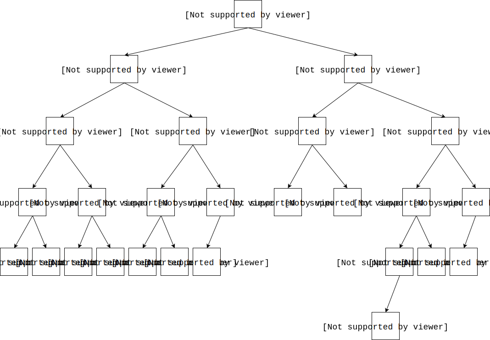

合并两个左偏树的操作，可以简单的看作$$ (1) $$递归向下合并子树的根节点；$$ (2) $$递归向上更新所有被修改过的节点的距离。我们通过合并下面两个左偏树来进行演示：

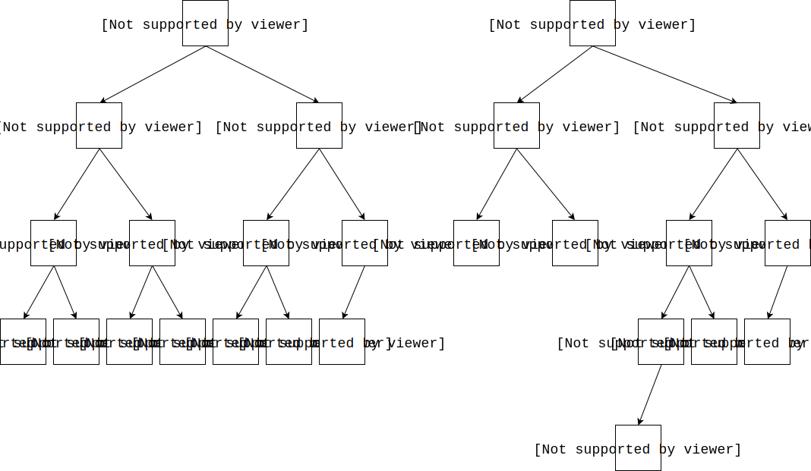

$$ (1) $$比较两树根节点的值$$ 6 \lt 7 $$，节点$$ 7 $$沿着节点$$ 6 $$向右下寻找第$$ 1 $$个满足$$ 7 \lt x $$的节点$$ x $$，替换$$ x $$作为节点$$ 6 $$的新右孩子节点。该节点为节点$$ 8 $$（$$ 7 \lt 8 $$），节点$$ 6 $$的原右孩子节点$$ 8 $$暂时脱离；

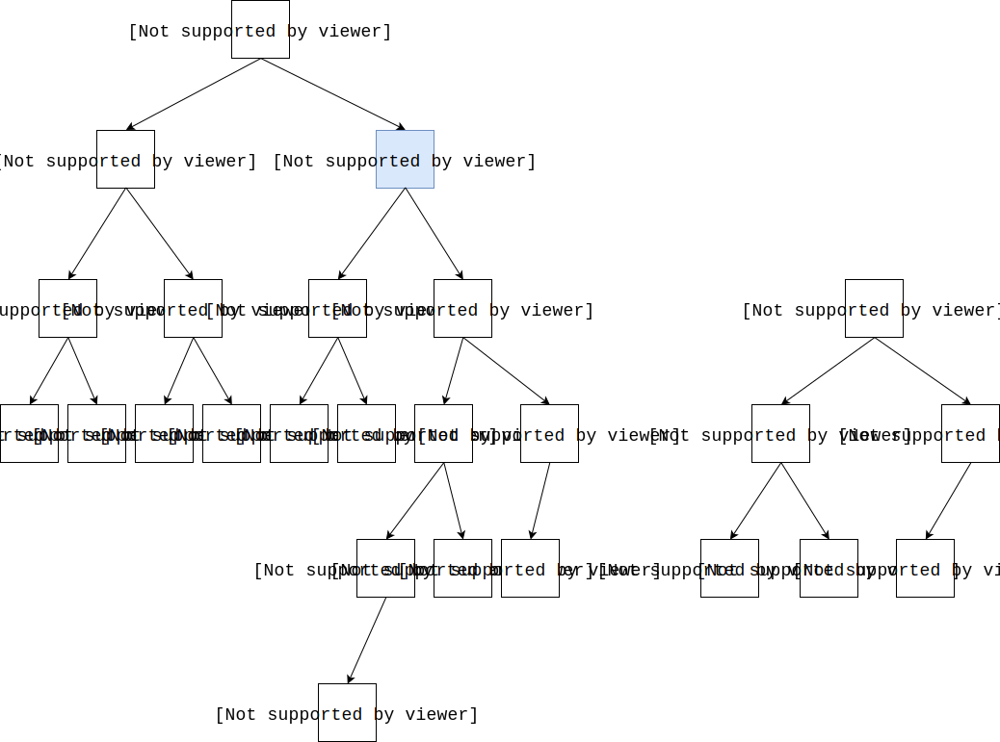

$$ (2) $$节点$$ 8 $$沿着节点$$ 7 $$向右下寻找第$$ 1 $$个满足$$ 8 \lt x $$的节点$$ x $$，替换$$ x $$作为节点$$ 7 $$的新右孩子节点。该节点为节点$$ 12 $$（$$ 8 \lt 12 $$），节点$$ 7 $$的原右孩子节点$$ 12 $$暂时脱离；

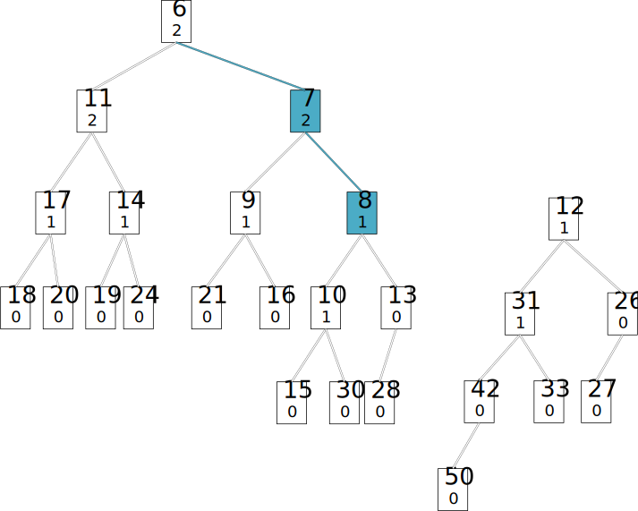

$$ (3) $$节点$$ 12 $$沿着节点$$ 8 $$向右下寻找第$$ 1 $$个满足$$ 12 \lt x $$的节点$$ x $$，替换$$ x $$作为节点$$ 8 $$的新右孩子节点。该节点为节点$$ 13 $$（$$ 12 \lt 13 $$），节点$$ 8 $$的原右孩子节点$$ 13 $$暂时脱离；

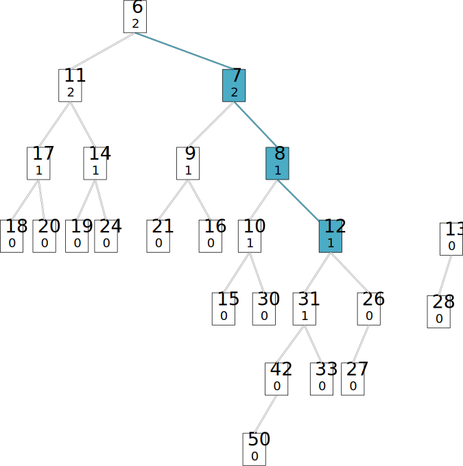

$$ (4) $$节点$$ 13 $$沿着节点$$ 12 $$向右下寻找第$$ 1 $$个满足$$ 13 \lt x $$的节点$$ x $$，替换$$ x $$作为节点$$ 12 $$的新右孩子节点。该节点为节点$$ 26 $$（$$ 13 \lt 26 $$），节点$$ 12 $$的原右孩子节点$$ 26 $$暂时脱离；

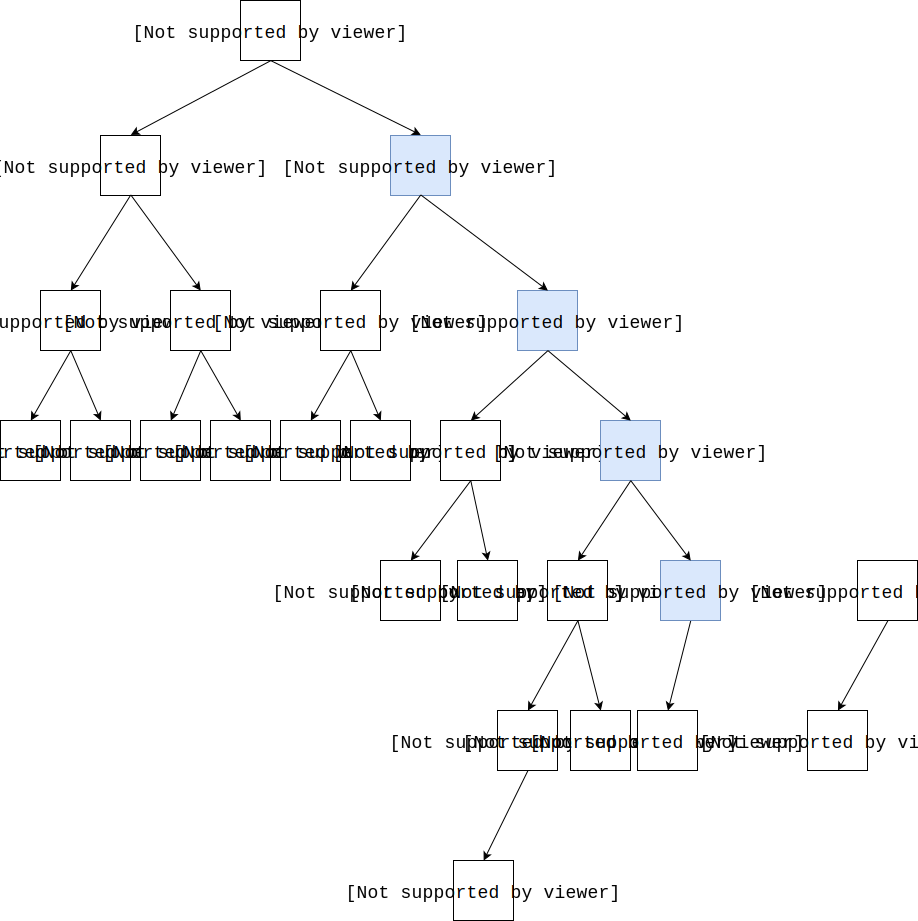

$$ (5) $$节点$$ 26 $$沿着节点$$ 13 $$向右下寻找第$$ 1 $$个满足$$ 26 \lt x $$的节点$$ x $$，节点$$ 13 $$没有右孩子节点，因此节点$$ 26 $$直接成为节点$$ 13 $$的右孩子节点，不再需要替换，合并操作结束；

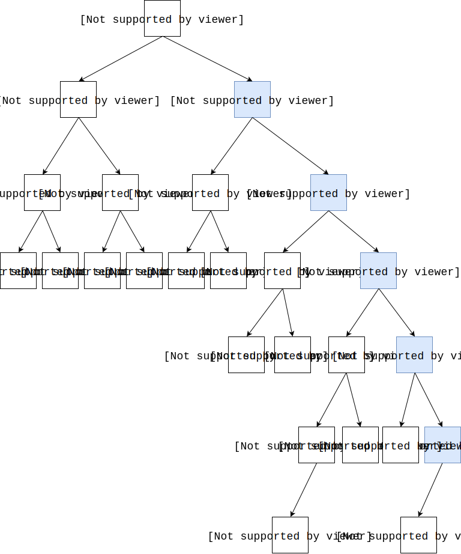

向右下插入节点的操作会影响到左偏树的平衡性，右子树变得越来越庞大。而且所有节点的距离也是错的（没有更新）。实际上每一步合并操作后还需要检查左右子树的距离属性：$$ (1) $$对于$$ d_{leftChild} \lt d_{rightChild} $$的情况，交换左右子树；$$ (2) $$对于$$ d_{root} \neq d_{rightChild} + 1 $$的情况，更新$$ d_{root} $$。

节点距离的更新必须从叶子节点开始向上进行，对于之前步骤中修改过的节点，重新遍历计算其距离（其中空节点的距离认为$$ - 1 $$）：

$$ (6) $$对于节点$$ 26 $$，$$ d_{26.leftChild} = d_{27} = 0 \ge d_{26.rightChild} = {d_{nil}} = - 1 $$，不需要交换左右子树，$$ d_{26} = d_{26.rightChild} + 1 = d_{nil} + 1 = - 1 + 1 = 0 $$；

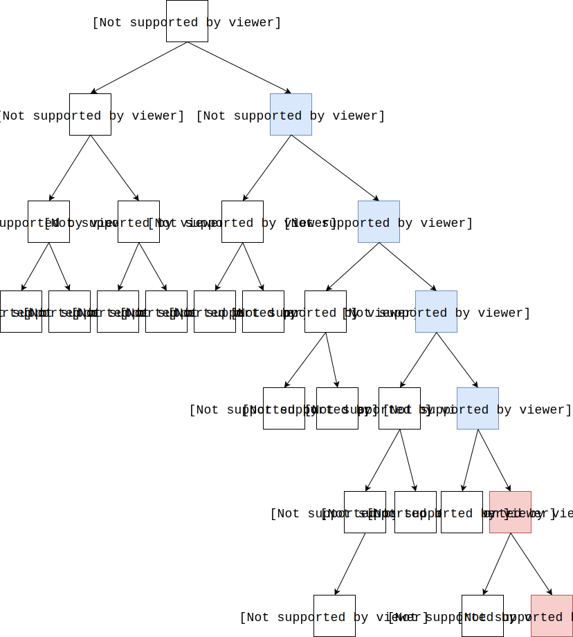

$$ (7) $$对于节点$$ 13 $$，$$ d_{13.leftChild} = d_{28} = 0 \ge d_{13.rightChild} = d_{26} = 0 $$，不需要交换左右子树，$$ d_{13} = d_{13.rightChild} + 1 = d_{26} + 1 = 0 + 1 = 1 $$；

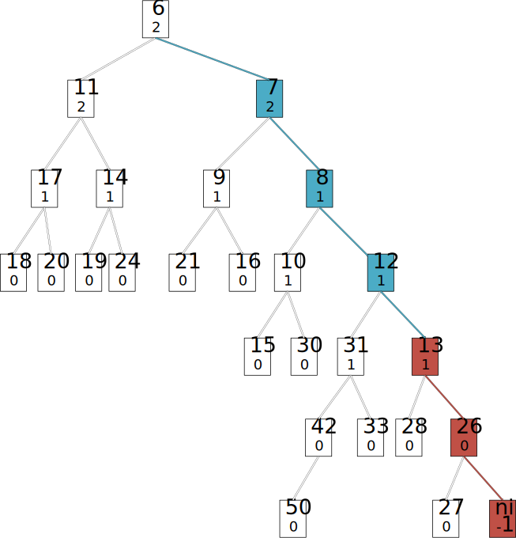

$$ (8) $$对于节点$$ 12 $$，$$ d_{12.leftChild} = d_{31} = 1 \ge d_{13.rightChild} = d_{26} = 1 $$，不需要交换左右子树，$$ d_{12} = d_{12.rightChild} + 1 = d_{13} + 1 = 1 + 1 = 2 $$；

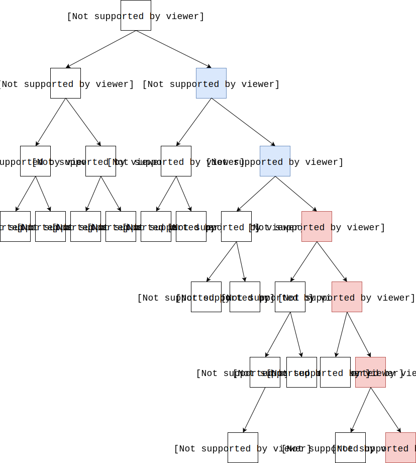

$$ (9) $$对于节点$$ 8 $$，$$ d_{8.leftChild} = d_{10} = 1 \lt d_{8.rightChild} = d_{12} = 2 $$，需要交换子树$$ 10 $$和子树$$ 12 $$，$$ d_{8} = d_{8.rightChild} + 1 = d_{10} + 1 = 1 + 1 = 2 $$；

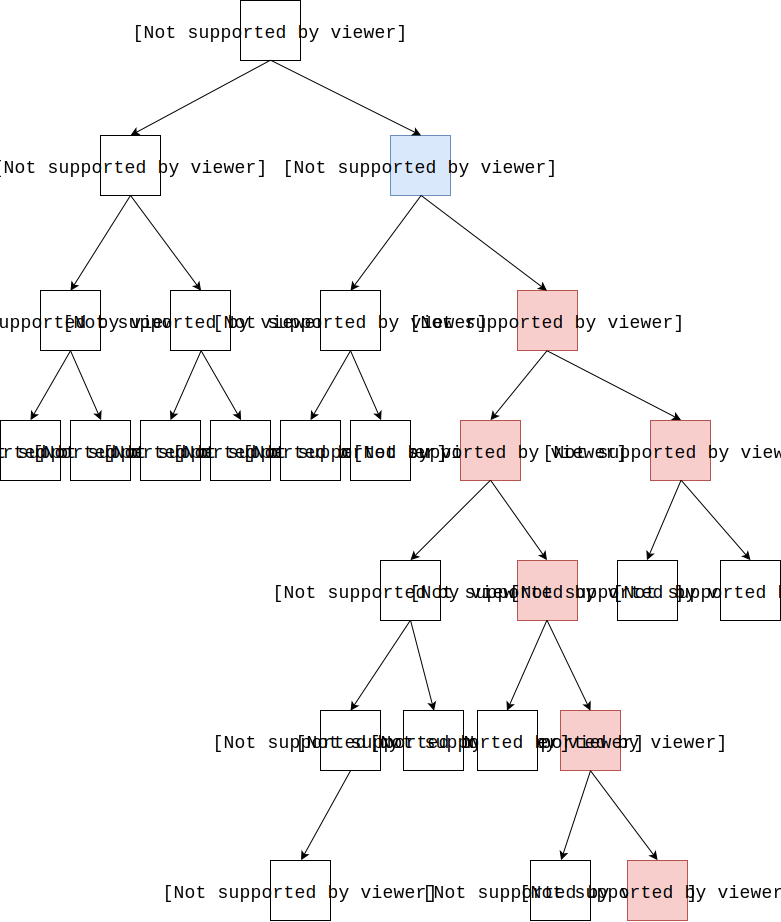

$$ (10) $$对于节点$$ 7 $$，$$ d_{7.leftChild} = d_{9} = 1 \lt d_{7.rightChild} = d_{8} = 2 $$，需要交换子树$$ 9 $$和子树$$ 8 $$，$$ d_{7} = d_{7.rightChild} + 1 = d_{9} + 1 = 1 + 1 = 2 $$；

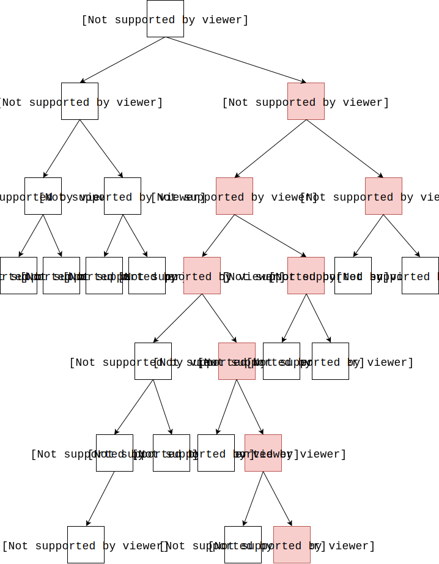

$$ (11) $$对于节点$$ 6 $$，$$ d_{6.leftChild} = d_{11} = 2 \ge d_{6.rightChild} = d_{7} = 2 $$，不需要交换左右子树，$$ d_{6} = d_{6.rightChild} + 1 = d_{7} + 1 = 2 + 1 = 3 $$；

实际编码时可以通过递归的方式将合并子树和更新距离两个操作放在同一个函数中，合并函数Merge返回合并后左偏树的根节点的距离$$ d $$，在Merge中调用左右孩子的合并操作，获取左右孩子的距离，然后再决定是否交换左右子树，并更新父节点的距离。本文的将两个步骤分开是为了方便理解算法。

左偏树的插入操作，可以看作左偏树与一个只有根节点的左偏树的合并操作；删除最值的操作，可以看作删除根节点后，合并左右子树的操作。

左偏树的合并操作、插入节点操作、删除根节点操作的时间复杂度都为$$ O(log_2⁡n) $$。

--------

#### 源码

[import, lang:"c_cpp"](../../../src/DataStructure/LeftistTree.h)

#### 测试

[import, lang:"c_cpp"](../../../src/DataStructure/LeftistTree.cpp)
