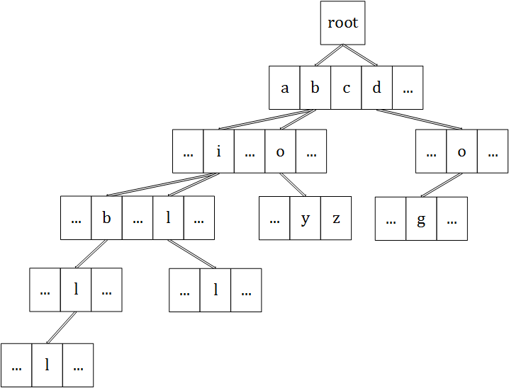

# Prefix Tree(Trie Tree) - 前缀树

--------

#### 描述

前缀树是一种支持在一个英文单词集合中快速查询是否包含某个单词，或者包含某个前缀的一些单词的数据结构，或者记录某个单词出现过的次数。

为了简化问题，本问题假设字典中只会出现$$ a - z $$这$$ 26 $$个小写字母，前缀树中每个节点都包含$$ 26 $$个孩子节点，将跟节点的孩子节点作为所有单词的首字母，向下查找直到跟节点就可以得到完整的单词。一个包含$$ boy $$、$$ dog $$、$$ bible $$、$$ bill $$的前缀树如图：

这样每次查找单词时，按照前缀从根节点开始向下匹配每个孩子节点的字符即可。前缀树查找一个长度为$$ n $$的单词的时间复杂度为$$ O(n) $$。

--------

#### 源码

[import, lang:"c_cpp", filename:"PrefixTree.h"](../../../src/DataStructure/PrefixTree.h)

[import, lang:"c_cpp", filename:"PrefixTree.cpp"](../../../src/DataStructure/PrefixTree.cpp)

#### 测试

[import, lang:"c_cpp", filename:"PrefixTreeTest.cpp"](../../../src/DataStructure/PrefixTreeTest.cpp)
