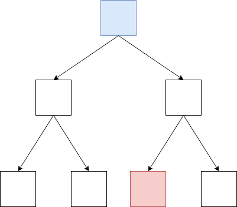

# Chapter-4 Data Structure
# 第4章 数据结构

--------

1. [DisjointSet 并查集](DisjointSet/)
2. [PrefixTree(TrieTree) 前缀树](PrefixTree/)
3. [LeftistTree(LeftistHeap) 左偏树（左偏堆）](LeftistTree/)
4. [SegmentTree 线段树](SegmentTree/)
5. [FenwickTree(BinaryIndexedTree) 树状数组](FenwickTree/)
6. [BinarySearchTree 二叉查找树](BinarySearchTree/)
7. [AVLTree AVL平衡树](AVLTree/)
8. [RedBlackTree 红黑树](RedBlackTree/)
9. [SkipList 跳跃表](SkipList/)
