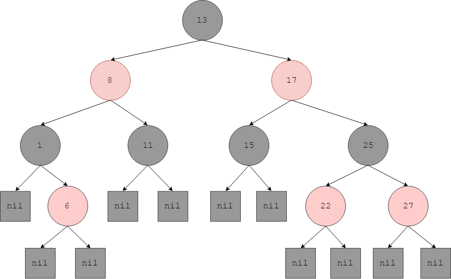
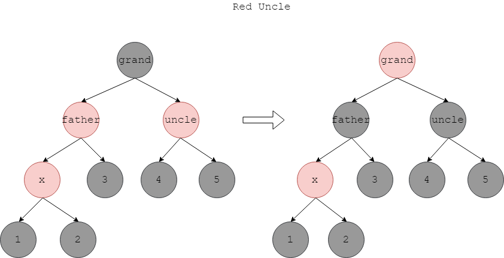
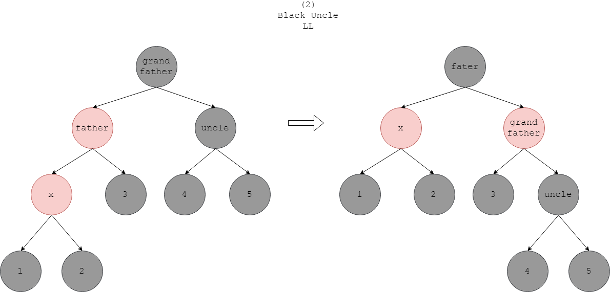

# Red Black Tree - 红黑树

--------

#### 红黑树

红黑树比AVL树的实际性能更好，AVL树的插入/删除操作需要从根节点遍历到叶子节点，再从叶子节点回到根节点，操作次数约是$$ 2 \times (log_2 n) $$。而红黑树的操作次数约是$$ log_2 n + 4 $$，面对较大的数据集时，红黑树的实际运行速度比AVL树快一倍。尽管它们插入/删除/查找的时间复杂度都是$$ O(log_2 n) $$。

除了基本的二叉查找树属性，红黑树还拥有以下特性：

$$ (1) $$ 节点是红色或黑色的；

$$ (2) $$ 根节点是黑色的；

$$ (3) $$ 叶子节点的左右孩子节点都为$$ nil $$节点，$$ nil $$节点是黑色的；

$$ (4) $$ 红色节点的左右孩子节点都是黑色的；

$$ (5) $$ 根节点到任意$$ nil $$节点途中经过的黑色节点的数量相同；

插入节点会破坏红黑树的属性，这时从插入位置向上检查每一个节点$$ x $$的状态，必要时通过上述的LL/LR操作来调整自己：

$$ (1) $$

--------

#### Red Black Tree

* http://faculty.cs.niu.edu/~freedman/340/340notes/340redblk.htm
* https://www.cs.princeton.edu/~rs/talks/LLRB/RedBlack.pdf

--------

#### 源码

[RedBlackTree.h](https://github.com/linrongbin16/Way-to-Algorithm/blob/master/src/DataStructure/RedBlackTree.h)

[RedBlackTree.cpp](https://github.com/linrongbin16/Way-to-Algorithm/blob/master/src/DataStructure/RedBlackTree.cpp)

#### 测试

[RedBlackTreeTest.cpp](https://github.com/linrongbin16/Way-to-Algorithm/blob/master/src/DataStructure/RedBlackTreeTest.cpp)
