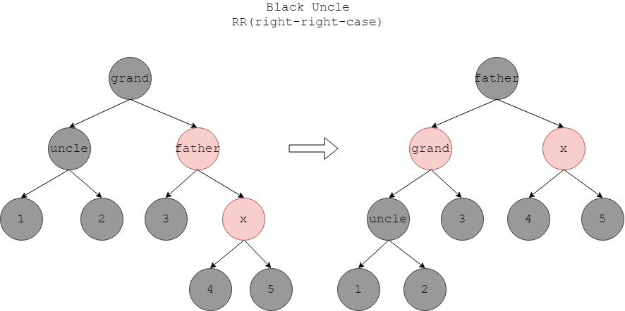
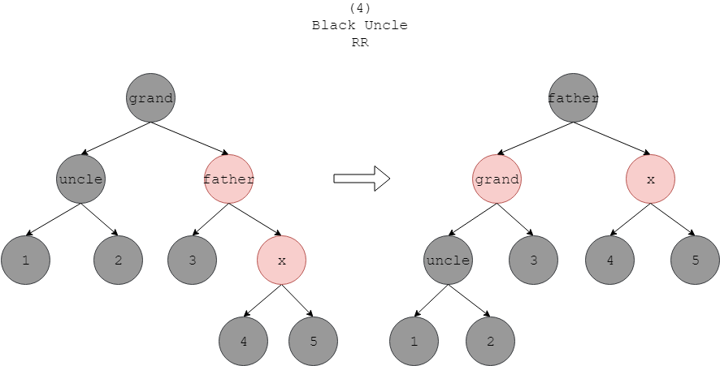
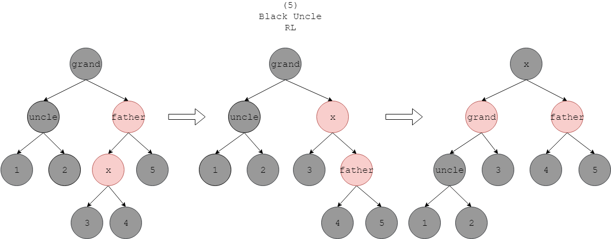

# Red Black Tree - 红黑树

--------

#### 特性

红黑树比AVL树的实际性能更好，红黑树的操作次数约是$$ log_2 n + 4 $$，而不是AVL树的$$ 2 \times log_2 n $$次。尽管它们的插入/删除/查找时间复杂度都是$$ O(log_2 n) $$。

除了基本的二叉查找树属性，红黑树还拥有以下特性：

$$ (1) $$ 节点是红色或黑色的；

$$ (2) $$ 根节点是黑色的；

$$ (3) $$ 叶子节点的左右孩子节点都为$$ nil $$节点，$$ nil $$节点是黑色的；

$$ (4) $$ 红色节点的左右孩子节点都是黑色的；

$$ (5) $$ 根节点到任意$$ nil $$节点途中经过的黑色节点的数量相同；

红黑树是一种可伸缩的金字塔形状，其中的黑色节点严格保持金字塔形状，而红色节点就像弹簧一样。任意分支上的红色节点和黑色节点数量（包括空节点）总满足$$ 0 \leq n_{red} \lt n_{black} $$。

#### 插入

红黑树的插入过程与AVL树类似，按照二分查找找到适合的位置插入新节点$$ x $$，然后从$$ x $$沿着父节点向上对每个节点检查，若红黑树的属性被破坏则通过以下规则调整自己。下面是所有需要调整的情况：

上面五种情况中，若处于$$ Red Uncle $$情况则按照$$ (1) $$进行旋转和重新染色，再从$$ grandfather $$节点开始下一次检查（跳过了一个节点）；若处于$$ Black Uncle $$情况则按照$$ (2) - (5) $$进行旋转和染色，之后该树必然满足红黑树属性，不必继续向上依次检查所有节点，停止检查，插入结束。

#### 删除

红黑树删除前半部分与AVLTree、BinarySearchTree相同，这里不再赘述。

前两种情况中实际删除的节点是$$ x $$，第三种情况实际删除的节点是$$ x $$的后继节点$$ y $$。

--------

#### Red Black Tree

* http://faculty.cs.niu.edu/~freedman/340/340notes/340redblk.htm
* https://www.cs.princeton.edu/~rs/talks/LLRB/RedBlack.pdf

--------

#### 源码

[RedBlackTree.h](https://github.com/linrongbin16/Way-to-Algorithm/blob/master/src/DataStructure/RedBlackTree.h)

[RedBlackTree.cpp](https://github.com/linrongbin16/Way-to-Algorithm/blob/master/src/DataStructure/RedBlackTree.cpp)

#### 测试

[RedBlackTreeTest.cpp](https://github.com/linrongbin16/Way-to-Algorithm/blob/master/src/DataStructure/RedBlackTreeTest.cpp)
