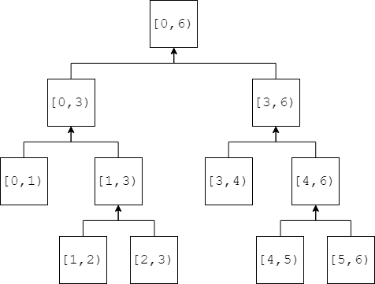

# Segment Tree - 线段树

--------

#### 描述

线段树是一种二叉树，它将长度为$$ n $$的数组$$ s[0,n - 1] $$划分成区间，树中的每个节点$$ [i,j] $$（$$ 0 \leq i \leq j \lt n $$）表示范围$$ s[i,j] $$上被关注的内容，例如该区间所有元素的和、最小元素的值、最大元素的值、第$$ k $$大的值等。本问题关注范围$$ s[i,j] $$上所有元素之和。

在本节中我们计算该区域上所有元素的和，即节点$$ [i,j] $$代表数组$$ s[i,j] $$的和。其左子树表示$$ s[i, \frac{i + j}{2}] $$的和，右子树表示区域$$ s[ \frac{i + j}{2} + 1,j] $$的和。叶子节点$$ [i,i] $$（其中$$ 0 \leq i \leq n - 1 $$）表示的区域长度为$$ 1 $$。

线段树$$ s[0,5] $$如下图所示：

构造操作：从根节点开始，递归的将节点$$ [i,j] $$拆分为$$ [i, \frac{i+j}{2}] $$和$$ [ \frac{i+j}{2}+1,j] $$（其中$$ 0 \leq i \leq j \lt n $$），父节点所代表的区域和等于左右孩子节点代表的区域和之和，即$$ sum[i,j] = sum[i, \frac{i + j}{2}] + sum[ \frac{i + j}{2} + 1,j] $$，重复该操作直到叶子节点为止。该操作的时间复杂度为$$ O(n) $$。

单点更新操作：修改数组$$ s $$中任意一个值$$ s[i] $$（其中$$ 0 \leq i \leq n-1 $$），则包括该值的所有节点，从叶子节点一直到它的所有根节点和祖先节点，都需要修改。该操作的时间复杂度为$$ O(log_2⁡n) $$。

查询操作：从根节点向下依次查询所有子节点，若节点属于被查询的区域则直接返回；若节点中只有一部分区域匹配则继续查询其左右子节点。最终将所有匹配到的区域的和加起来即为查询区域的和。该操作的时间复杂度为$$ O(log_2⁡n) $$。

实际编代码的时候，对于长度为$$ n $$的数组$$ s[0,n-1] $$，为了方便我们用数组$$ t $$来表示二叉树（而不是真的写一个拥有两个指针的结构体），下标为$$ i $$的左孩子节点下标为$$ 2i+1 $$，右孩子节点下标为$$ 2i+2 $$。$$ t[0] $$为二叉树的根节点，代表$$ s[0,n-1] $$区域的和；其左孩子为$$ t[1] $$，表示$$ s[0, \frac{n}{2}] $$区域之和；右孩子为$$ t[2] $$，表示$$ s[ \frac{n}{2}+1,n-1] $$区域之和；以此类推。

--------

#### 源码

[SegmentTree.h](https://github.com/linrongbin16/Way-to-Algorithm/blob/master/src/DataStructure/SegmentTree.h)

[SegmentTree.cpp](https://github.com/linrongbin16/Way-to-Algorithm/blob/master/src/DataStructure/SegmentTree.cpp)

[import, lang:"c_cpp"](../../../src/DataStructure/SegmentTree.h)

[import, lang:"c_cpp"](../../../src/DataStructure/SegmentTree.cpp)

#### 测试

[SegmentTreeTest.cpp](https://github.com/linrongbin16/Way-to-Algorithm/blob/master/src/DataStructure/SegmentTreeTest.cpp)

[import, lang:"c_cpp"](../../../src/DataStructure/SegmentTreeTest.cpp)
