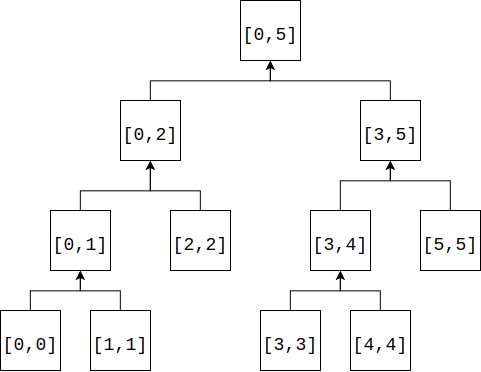

# Segment Tree - 线段树

--------

#### 线段树

给定一段区间上的数字$$ s = [x_{0}, x_{2}, \dots, x_{n-1}] $$，求出$$ [p, q) $$这个区间上的所有数字之和（$$ 0 \leq p \leq q \lt n $$）。该区间可以修改每个元素的值，新增/删除新的元素。

循环累加数组的算法可以在$$ O(1) $$时间复杂度内修改某个位置上的值，$$ O(n) $$时间复杂度内算出$$ [p, q) $$区间上所有元素之和。而线段树可以做到修改值、累加区间的时间复杂度都为$$ O(log_{2} n) $$。

线段树是一种二叉树，它将数组$$ s = [x_{0}, x_{1}, \dots, x_{n-1}] $$划分区间，线段树中节点$$ [p,q) $$表示范围$$ s[p,q) $$上被关注的内容，例如该区间上所有元素的和、最大/最小元素的值、第$$ k $$大的值等。本问题关注区间$$ s[p,q) $$上的元素之和。

节点$$ [p,q) $$代表数组$$ s[p,q) $$上所有元素之和。左子树为$$ s[p, \frac{p + q}{2}) $$上元素之和，右子树为$$ s[\frac{p + q}{2}, q) $$上元素之和。线段树的叶子节点是长度为$$ 1 $$的区域$$ [p,p+1) $$。数组$$ s = [0, 1, 2, 3, 4, 5] $$如图所示：

构造操作：从根节点开始，递归的将节点$$ [p,q) $$拆分为$$ [p, \frac{p+q}{2}) $$和$$ [ \frac{p+q}{2},q) $$，则显然$$ \sum_{i=p}^{q-1} s_{i} = \sum_{i=p}^{\frac{p+q}{2}} s_{i} + \sum_{i = \frac{p+q}{2}}^{q-1} s_{i} $$，即父节点的值等于左右孩子节点值的和，我们将区域$$ s[p,q) $$上所有元素之和记录在线段树的节点$$ [p,q) $$上。像这样递归的分解左右孩子，直到叶子节点为止。构造操作的时间复杂度为$$ O(n) $$。

更新操作：修改区间$$ s $$中任意一个值$$ s[i] $$需要修改从叶子节点$$ [i, i+1) $$到根节点$$ [p,q) $$这一分支上的所有节点，因为它们上所存储的信息都会受到影响。更新操作的时间复杂度为$$ O(log_2⁡n) $$。

查询操作：查询区间$$ s[i,j) $$上所有元素之和，需要递归的从根节点向下匹配。对于节点$$ [p, q) $$有以下四种情况：

$$ (1) $$ 若$$ [p,q) = [i,j) $$则该节点上的值即为所求，算法结束；

$$ (2) $$ 若$$ j \leq \frac{p+q}{2} $$说明$$ [i,j) $$只属于其左孩子；

$$ (3) $$ 若$$ i \geq \frac{p+q}{2} $$说明$$ [i,j) $$只属于其右孩子；

$$ (4) $$ 若$$ i \lt \frac{p+q}{2}, j \gt \frac{p+q}{2} $$说明$$ [i, j) $$中一部分属于左孩子，另一部分属于右孩子，这时将$$ [i,j) $$拆分为两部分$$ [i, \frac{p+q}{2}) $$和$$ [\frac{p+q}{2}, j) $$，分别匹配自己所属的区域；

实际编码时用数组$$ t $$来表示二叉树（也可以真的写一个二叉树），节点$$ i $$的左孩子为$$ 2i+1 $$，右孩子为$$ 2i+2 $$。$$ t[0] $$为二叉树根节点，代表$$ s[0,n) $$区域上所有元素之和，左孩子$$ t[1] $$表示$$ s[0, \frac{n}{2}) $$区域之和，右孩子$$ t[2] $$表示$$ s[\frac{n}{2}, n) $$区域之和，以此类推。

--------

#### 源码

[SegmentTree.h](https://github.com/linrongbin16/Way-to-Algorithm/blob/master/src/DataStructure/SegmentTree.h)

[SegmentTree.cpp](https://github.com/linrongbin16/Way-to-Algorithm/blob/master/src/DataStructure/SegmentTree.cpp)

#### 测试

[SegmentTreeTest.cpp](https://github.com/linrongbin16/Way-to-Algorithm/blob/master/src/DataStructure/SegmentTreeTest.cpp)
