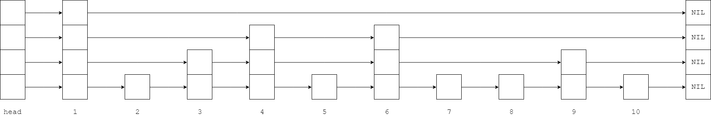
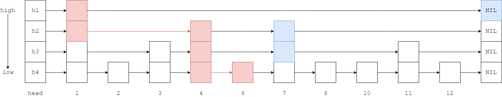
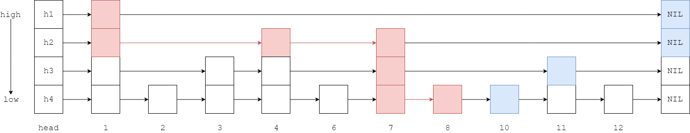

# Skip List - 跳跃表

--------

#### 跳跃表

跳跃表是一种随机化链表数据结构，其添加、删除、查找的时间复杂度与平衡树/二叉查找树的时间复杂度相同$$ O(log_2 n) $$。相比平衡树，跳跃表的实现方式更简单，实际应用中对并发的支持更好（内部多条链表可以分别由不同线程操作），但占更多内存。

跳跃表的每个节点可以包含多个指针，因为它们可以参与多个内部链表。下图是一个典型的跳跃表：

#### 查找

在跳跃表中查找元素$$ x $$，要从最高层链表向下到最低层链表，更高一层链表充当了下一层链表的快速跑到。

从第一个节点的最高层链表$$ high $$开始，向右移动找到第一个节点$$ e $$满足$$ e \geq x $$或$$ e = NIL $$。若$$ e = x $$则查找结束；若$$ e \gt x $$或$$ e = NIL $$则退回上一个查找位置，然后移动到下一层链表，再递归的继续向右移动找到第一个满足$$ e' \geq x $$或$$ e' = NIL $$的节点。若直到最低层链表仍无法找到元素$$ x $$则说明该跳跃表中不存在该元素。

以上图中的跳跃表为例，查询元素$$ 6 $$的过程如下图所示：

查询过程中，在$$ h_{1} $$链表中经历了节点$$ [1] $$，在$$ h_{2} $$链表中经历了节点$$ [1, 4] $$，在$$ h_{3} $$链表中经历了节点$$ [4] $$，在$$ h_{4} $$链表中经历了节点$$ [4, 6] $$最终找到元素$$ 6 $$。

查询元素$$ 9 $$的过程如下图所示：

查询过程中，在$$ h_{1} $$链表中经历了节点$$ [1] $$，在$$ h_{2} $$链表中经历了节点$$ [1, 4, 7] $$，在$$ h_{3} $$链表中经历了节点$$ [7] $$，在$$ h_{4} $$链表中经历了节点$$ [7, 8] $$最终无法找到元素$$ 9 $$。

#### 插入

在跳跃表中插入元素$$ x $$，与查找操作基本一致，也是从最高层链表向下到最低层链表（最终节点一定要在最低层的原始链表中插入），找到合适的位置后插入新节点$$ x $$。最低层链表插入节点后，高层链表的节点数量不足导致时间复杂度退化。跳跃表通过随机数来做一个“抛硬币”的操作，决定新节点$$ x $$是否应该提升到上一层链表中。若结果为“是”则一直将新节点$$ x $$提升，若结果为“否”则结束本次插入操作。一般将抛硬币得到“是”的概率设置为$$ \frac{1}{2} $$或$$ \frac{1}{4} $$。

#### 删除

在跳跃表中删除元素$$ x $$，首先查找$$ x $$在最低层的原始链表中的位置，将其删除，然后依次向上，将$$ x $$从所有上层链表中删除即可。

--------

#### Skip Lists

* https://www.cl.cam.ac.uk/teaching/0506/Algorithms/skiplists.pdf

--------

#### 源码

[SkipList.h](https://github.com/linrongbin16/Way-to-Algorithm/blob/master/src/DataStructure/SkipList.h)

[SkipList.cpp](https://github.com/linrongbin16/Way-to-Algorithm/blob/master/src/DataStructure/SkipList.cpp)

#### 测试

[SkipListTest.cpp](https://github.com/linrongbin16/Way-to-Algorithm/blob/master/src/DataStructure/SkipListTest.cpp)

