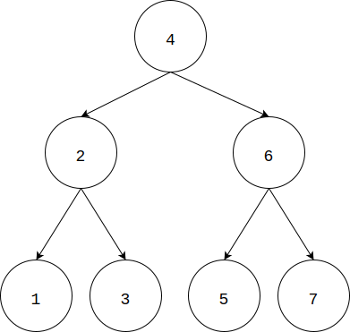
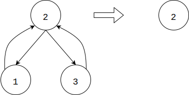

# Binary Tree Merge - 二叉树合并

--------

#### 问题

拥有$$ n $$个节点的二叉树，按照中序遍历将所有节点标记为$$ [1,n] $$，如图：

其中曲线表示节点的中序遍历顺序。

设节点$$ i $$拥有价值$$ v_{i} $$（空节点的价值为$$ 0 $$），以节点$$ i $$为根节点的子树的加分为$$ add_{i} = add_{left} \times add_{right} + v_{i} $$（空节点的加分为$$ 0 $$）。显然以叶子节点$$ i $$为根节点的子树的加分为$$ add_{i} = 0 \times 0 + v_{i} $$。

需要从叶子节点向上求所有子树的加分，若左右子树的加分不确定则需要先确定然后才能求出子树的加分。求加分的顺序不同会导致二叉树的加分不同，求二叉树的最大加分。

#### 解法

根据中序遍历的性质，可知连续节点$$ [i,j] $$刚好属于同一个子树，如图所示：

其中$$ [1,15] $$是$$ 8 $$的子树，$$ [1,6] $$是$$ 4 $$的子树，$$ [4,10] $$是$$ 8 $$的子树，$$ [12,15] $$是$$ 12 $$的子树，等等。

且$$ [i,j] $$中的任意数字$$ k $$作为根节点（$$ i \lt k \lt j $$），则其左子树为$$ [i,k-1] $$，右子树范围为$$ [k+1,j] $$。例如上图中，$$ [1,3] $$属于子树$$ 2 $$（以$$ 2 $$为根节点的子树），$$ [5,7] $$属于子树$$ 6 $$。设$$ f(i,j) $$为以节点$$ [i,j] $$组成的子树的最大合并代价，其中$$ i,j \in [1,n] $$且$$ j \leq i $$，其转移方程如下：

$$
f(i,j) =
\begin{cases}
1                                       &   (initialize)i,j \in [0,n] \\
1 \times 1+v_i                          &   (initialize)i,j \in [1,n],i = j \\
max \{ f(i,k-1) \times f(k+1,j) \}+v_k  &   i,j,k \in [1,n], i \lt k \lt j
\end{cases}
$$

$$ (1) $$将所有可能情况都初始化为最小的合并代价，即$$ 1 $$；

$$ (2) $$对于只有一个节点的子树来说，其合并代价为自身根节点的价值加$$ 1 $$，即$$ f(i,i) = 1+v_i $$，因为左右子树都是空子树，其合并代价为$$ 1 $$；

$$ (3) $$将$$ f(i,j) $$分为$$ f(i,k-1) $$和$$ f(k+1,j) $$左右两个子树，则$$ f(i,j) = f(i,k-1) \times f(k+1,j)+v_k $$，其中$$ i \lt k \lt j $$。在$$ [i,j] $$范围内遍历所有情况，选取最大的即可；

$$ f(1,n) $$即为二叉树的最大合并价值。该算法的时间复杂度是$$ O(n^2) $$。

--------

#### 加分二叉树

* https://acm.sjtu.edu.cn/OnlineJudge/problem/1077

--------

#### 源码

[MaximumBinaryTreeMergeExtension.h](https://github.com/linrongbin16/Way-to-Algorithm/blob/master/src/DynamicProgramming/RegionalDP/MaximumBinaryTreeMergeExtension.h)

[MaximumBinaryTreeMergeExtension.cpp](https://github.com/linrongbin16/Way-to-Algorithm/blob/master/src/DynamicProgramming/RegionalDP/MaximumBinaryTreeMergeExtension.cpp)

#### 测试

[MaximumBinaryTreeMergeExtensionTest.cpp](https://github.com/linrongbin16/Way-to-Algorithm/blob/master/src/DynamicProgramming/RegionalDP/MaximumBinaryTreeMergeExtensionTest.cpp)
