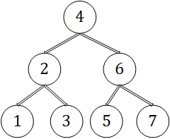

--------
[Upper Folder - 上一级目录](../../)

[Source Code - 源码](https://github.com/zhaochenyou/Way-to-Algorithm/blob/master/src/DynamicProgramming/RegionalDP/MaximumBinaryTreeMerge.hpp)

[Test Code - 测试](https://github.com/zhaochenyou/Way-to-Algorithm/blob/master/src/DynamicProgramming/RegionalDP/MaximumBinaryTreeMerge.cpp)

--------

<h1 align="center">Maximum Binary Tree Merge </h1>
<h1 align="center">最大二叉树合并 </h1>
 
问题：  
&emsp;&emsp;拥有\(n\)个节点的二叉树，按照中序遍历将所有节点标记为\([1,n]\)，如图：  

&emsp;&emsp;节点\(i\)拥有价值\(v_i\)，将子树进行合并，产生的代价的计算方法是\(v_{tree} = v_{leftChild} \times v_{rightChild} + v_{root}\)，即其左子树的合并代价乘以右子树的合并代价，再加根节点自身的价值，特别的我们规定空子树的合并代价为\(1\)。合并顺序的不同会使最终整个树的合并代价不同，求该二叉树的最大合并代价。  
&emsp;&emsp;本问题的原型为“加分二叉树”。  
 
解法：  
&emsp;&emsp;将二叉树中的所有节点按照中序遍历依次编号为\([1,n]\)，根据中序遍历的性质，可知连续节点\([i,j]\)刚好属于\(1\)个子树，且在\([i,j]\)中选取节点\(k\)作为根节点（\(i \lt k \lt j\)），则其左子树为\([i,k-1]\)，右子树范围为\([k+1,j]\)。例如上图中，\([1,3]\)属于子树\(2\)（以\(2\)为根节点的子树），\([5,7]\)属于子树\(6\)。设\(f(i,j)\)为以节点\([i,j]\)组成的子树的最大合并代价，其中\(i,j \in [1,n]\)且\(j \leq i\)，其转移方程如下：  
\[
f(i,j) =
\begin{cases}
1 & (初始化)i,j \in [0,n] \\
1 \times 1+v_i & (初始化)i,j \in [1,n],i = j \\
max \{ f(i,k-1) \times f(k+1,j) \}+v_k & i,j,k \in [1,n],i \lt k \lt j
\end{cases}
\]
&emsp;&emsp;\((1)\)将所有可能情况都初始化为最小的合并代价，即\(1\)；  
&emsp;&emsp;\((2)\)对于只有一个节点的子树来说，其合并代价为自身根节点的价值加\(1\)，即\(f(i,i) = 1+v_i\)，因为左右子树都是空子树，其合并代价为\(1\)；  
&emsp;&emsp;\((3)\)将\(f(i,j)\)分为\(f(i,k-1)\)和\(f(k+1,j)\)左右两个子树，则\(f(i,j) = f(i,k-1) \times f(k+1,j)+v_k\)，其中\(i \lt k \lt j\)。在\([i,j]\)范围内遍历所有情况，选取最大的即可；  
&emsp;&emsp;\(f(1,n)\)即为二叉树的最大合并价值。该算法的时间复杂度是\(O(n^2)\)。  

 
加分二叉树：
* [http://codevs.cn/problem/1090/](http://codevs.cn/problem/1090/)

--------
--------
