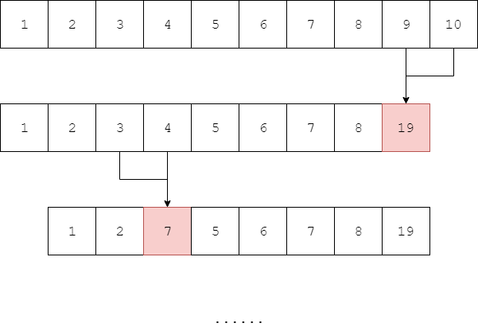

# Minimum Merge Cost - 最小合并代价

--------

#### 问题

将长度为$$ n $$的序列$$ s = [x_{1}, x_{2}, \dots, x_{n}] $$进行合并，每次合并将相邻的两个元素$$ a $$和$$ b $$合并为一个新的元素$$ c $$，并且$$ c = a+b $$，合并的代价也为$$ a+b $$。经过$$ n-1 $$次合并后，序列$$ s $$被合并为1个数字，这个过程的代价是之前所有合并的代价总和。求出将序列$$ s $$合并为一个数字的最小合并代价。合并过程如图：

例如序列$$ s = [1,2,3] $$，合并过程有$$ [1,2,3] \rightarrow [3,3] \rightarrow [6] $$和$$ [1,2,3] \rightarrow [1,5] \rightarrow [6] $$，最终合并代价为$$ 9, 11 $$。

#### 解法

设$$ sum(i,j) $$为序列中区域$$ s[i,j] $$的所有元素之和，$$ f(i,j) $$为合并区域$$ s[i,j] $$的最小代价，其中$$ 1 \leq i \leq j \leq n $$。因此有如下状态转移方程：

$$
f(i,j) =
\begin{cases}
0                                               &   (initialize)    &   i,j \in [0,n]   &   i = j \\
+\infty                                         &   (initialize)    &   i,j \in [0,n]   &   i \neq j \\
min \{⁡f(i,k)+f(k+1,j)+sum(i,k)+sum(k+1,j) \}   &   (loop)          &   i,j,k \in [1,n] &   i \leq k \leq j
\end{cases}
$$

$$ (1) $$ 初始化，对于同一个元素$$ s[i,i] $$不需要合并，因此$$ f(i,i) = 0 $$；

$$ (2) $$ 初始化，对于不同的元素$$ s[i,j] $$需要合并，设未知的$$ f(i,j) = +\infty $$；

$$ (3) $$ 将$$ s[i,k] $$和$$ s[k+1,j] $$这两个区域的元素合并（$$ i \leq k \leq j $$），因此$$ f(i,j) =min \{ f(i,k)+f(k+1,j)+sum(i,k)+sum(k+1,j) \} $$，选择该范围中所有结果的最小值即可；

$$ f(1,n) $$即为序列$$ s $$的最小合并代价。该算法的时间复杂度是$$ O(n^2) $$。

--------

#### 石子合并

* http://acm.nyist.edu.cn/JudgeOnline/problem.php?pid=737

--------

#### 源码

[MinimumMergeCost.h](https://github.com/linrongbin16/Way-to-Algorithm/blob/master/src/DynamicProgramming/RegionalDP/MinimumMergeCost.h)

[MinimumMergeCost.cpp](https://github.com/linrongbin16/Way-to-Algorithm/blob/master/src/DynamicProgramming/RegionalDP/MinimumMergeCost.cpp)

#### 测试

[MinimumMergeCostTest.cpp](https://github.com/linrongbin16/Way-to-Algorithm/blob/master/src/DynamicProgramming/RegionalDP/MinimumMergeCostTest.cpp)
