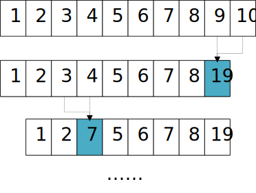

# Minimum Merge Cost - 最小合并代价

--------

#### 问题

对长度为$$ n $$的序列$$ s $$进行合并，每次将相邻的两个元素$$ a $$和$$ b $$合并为一个新的元素$$ c $$，并且$$ c = a+b $$，合并产生的代价也为$$ a+b $$。经过$$ n-1 $$次合并后，序列$$ s $$被合并为$$ 1 $$个数字，这个过程的代价是之前所有合并的代价总和。求出将序列$$ s $$合并为一个数字的最小合并代价。合并过程如图：

本问题的原型为“石子合并”。

#### 解法

设$$ sum(i,j) $$为序列中区域$$ s[i,j] $$的所有元素之和，设$$ f(i,j) $$为合并区域$$ s[i,j] $$产生的最小代价，其中$$ i,j \in [1,n]且i \leq j $$。因此有如下状态转移方程：

$$
f(i,j) =
\begin{cases}
0 & (初始化)i,j \in [0,n],i = j \\
+\infty & (初始化)i,j \in [0,n],i \neq j \\
min \{⁡f(i,k)+f(k+1,j)+sum(i,k)+sum(k+1,j) \} & i,j,k \in [1,n],i \leq k \leq j
\end{cases}
$$

$$ (1) s[i,i] $$不需要合并，因此$$ f(i,i) = 0 $$；

$$ (2) s[i,j] $$需要合并，我们的最终目标是获取合并最小代价，因此设未知的$$ f(i,j) = +\infty $$；

$$ (3) $$假设将$$ s[i,k] $$和$$ s[k+1,j] $$这两个区域的元素合并。合并$$ s[i,k] $$和$$ s[k+1,j] $$的过程中，已知$$ s[i,k] $$范围的总和为$$ sum(i,k) $$，消耗的代价为$$ f(i,k) $$，$$ s[k+1,j] $$范围的总和为$$ sum(k+1,j) $$，消耗的代价为$$ f(k+1,j) $$。因为$$ k \in [i,j] $$，因此$$ f(i,j) =min \{ f(i,k)+f(k+1,j)+sum(i,k)+sum(k+1,j) \} $$，选择该范围中所有结果的最小值即可；

$$ f(0,n) $$即为序列$$ s $$的最小合并代价。该算法的时间复杂度是$$ O(n^2) $$。

--------

#### 石子合并

* http://acm.nyist.edu.cn/JudgeOnline/problem.php?pid=737

--------

#### 源码

[import, lang:"c_cpp"](../../../../src/DynamicProgramming/RegionalDP/MinimumMergeCost.h)

#### 测试

[import, lang:"c_cpp"](../../../../src/DynamicProgramming/RegionalDP/MinimumMergeCost.cpp)
