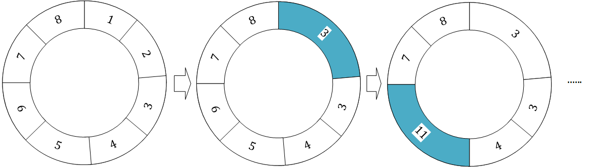

--------
* [Upper Folder - 上一级目录](../../)
* [Source Code - 源码](https://github.com/zhaochenyou/Way-to-Algorithm/blob/master/src/DynamicProgramming/RegionalDP/MinimumMergeCostExtenion.hpp)
* [Test Code - 测试](https://github.com/zhaochenyou/Way-to-Algorithm/blob/master/src/DynamicProgramming/RegionalDP/MinimumMergeCostExtenion.cpp)

--------

<h1 align="center">Minimum Merge Cost Extension</h1>
<h1 align="center">最小合并代价扩展</h1>
 
问题：  
&emsp;&emsp;在&lt;Minimum Merge Cost&gt;问题的基础上进行变化，序列\(s\)是头尾相接的，仍然求最小合并代价。下图演示了一个合并过程：  

 
解法：  
&emsp;&emsp;本问题与&lt;Minimum Merge Cost&gt;问题的核心区别在于序列是首尾相接的，取巧的办法就是把长度为\(n\)的序列\(s\)扩展为原始的\(2\)倍长度，多出的部分用\(s\)再填充一遍，则有\(s[j] = s[i]\)，其中\(i \in [1,n]\)，\(j \in [n+1,2n]\)且\(j = i+n\)，在\(s[n]\)和\(s[n+1]\)两个相邻元素的位置可以模拟出首尾相接的效果。而状态转移方程完全不变，只需要把算法的范围调整为\([0,2n]\)即可。  
&emsp;&emsp;设\(sum(i,j)\)为序列中区域\(s[i,j]\)的所有元素之和，设\(f(i,j)\)为合并区域\(s[i,j]\)产生的最小代价，其中\(i,j \in [1,2n]\)且\(i \leq j\)。因此有如下状态转移方程：  
\[
f(i,j) =
\begin{cases}
0 & (初始化)i,j \in [0,2n],i = j \\
+\infty & (初始化)i,j \in [0,2n],i \neq j \\
min \{f(i,k)+f(k+1,j)+sum(i,k)+sum(k+1,j) \} & i,j \in [0,2n],i \leq k \leq j
\end{cases}
\]
&emsp;&emsp;\((1)\)\(s[i,i]\)不需要合并，因此\(f(i,i) = 0\)；  
&emsp;&emsp;\((2)\)\(s[i,j]\)需要合并，我们的最终目标是获取合并最小代价，因此设未知的\(f(i,j) = +\infty\)；  
&emsp;&emsp;\((3)\)假设将\(s[i,k]\)和\(s[k+1,j]\)这两个区域的元素合并。合并\(s[i,k]\)和\(s[k+1,j]\)的过程中，已知\(s[i,k]\)范围的总和为\(sum(i,k)\)，消耗的代价为\(f(i,k)\)，\(s[k+1,j]\)范围的总和为\(sum(k+1,j)\)，消耗的代价为\(f(k+1,j)\)。因为\(k \in [i,j]\)，因此\(f(i,j) = min \{ f(i,k)+f(k+1,j)+sum(i,k)+sum(k+1,j) \}\)，选择该范围中所有结果的最小值即可；  
&emsp;&emsp;\(f(0,2n)\)即为序列\(s\)的最小合并代价。该算法的时间复杂度是\(O(n^2)\)。  

--------
--------
