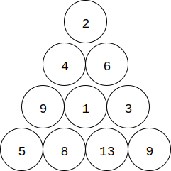
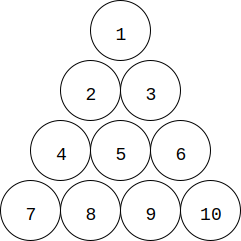

# Triangle Path - 三角形路径

--------

#### 问题

在高度为$$ n $$的三角形上从最上面移动到最下面，三角形上节点$$ i $$的值为$$ v_{i} $$，每次移动只能向下移动左右两个邻节点。从上面移动到下面的代价为所有经过节点的值之和。如图所示：

给定三角形上的$$ k $$个节点，求从上到下的最小移动代价。

#### 解法

高度为$$ n $$的三角形拥有$$ \frac{(n+1) \times n}{2} $$个节点。设节点下标从$$ 1 $$开始，则第$$ n $$行的节点为$$ [\frac{n \times (n-1)}{2} + 1, \dots, \frac{(n+1) \times n}{2}] $$。左边节点为$$ \frac{n \times (n-1)}{2} + 1 $$，右边节点为$$ \frac{(n+1) \times n}{2} $$。

从上图可知，第$$ 1 $$行的节点为$$ [1, 1] $$；第$$ 2 $$行的节点为$$ [2, 3] $$；第$$ 3 $$行的节点为$$ [4, 6] $$；等等。

三角形的第$$ n $$行有$$ n $$个节点，因此节点$$ i $$的左下节点（类似于左孩子节点）为$$ i + n $$，右下节点为$$ i + n + 1 $$。节点$$ i $$的左上节点为$$ i-n-2 $$，右上节点为$$ i-n-1 $$。根据节点下标$$ i $$如何计算其属于第几行呢？因为$$ \frac{n \times (n-1)}{2} + 1 \leq i \leq \frac{(n+1) \times n}{2} $$，可以先粗略的估算$$ n = \lfloor \sqrt{2 \times i} \rfloor $$，然后判断节点$$ i $$是否处于第$$ n $$行中。

设$$ n = height(i) $$可以算出节点$$ i $$的行号，$$ f(i) $$为到达节点$$ i $$的最小移动代价（其中$$ i \in [1, \frac{(n+1) \times n}{2}] $$）。有状态转移方程：

$$
f(i) =
\begin{cases}
v_{1}                                               &   (initialize)    &   i = 1   \\
min(f(i-height(i)-2), f(i-height(i)-1)) + v_{i}     &   (loop)          &   i \in [2,k]
\end{cases}
$$

$$ (1) $$ 初始化，节点1到它自己的代价为$$ f(1) = v_{1} $$；

$$ (2) $$ 对于节点$$ i \in [2,k] $$，其左上节点为$$ lu = i-height(i)- 2 $$，右上节点为$$ ru = i-height(i)-1 $$。显然只能从左上、右上节点到达$$ i $$，则到达$$ i $$的最小代价是这两者中最小的，因此有$$ min(f(i-height(i)-2), f(i-height(i)-1)) + v_{i} $$；

在最后一行中找出最小代价即可。该算法的时间复杂度是$$ O(k^2) $$。

--------

#### LeetCode

* https://leetcode.com/problems/triangle/description/

[leetcode-120.cpp](https://github.com/linrongbin16/Way-to-Algorithm/blob/master/leetcode/leetcode-120.cpp)

--------

#### 源码

[TrianglePath.h](https://github.com/linrongbin16/Way-to-Algorithm/blob/master/src/DynamicProgramming/RegionalDP/TrianglePath.h)

[TrianglePath.cpp](https://github.com/linrongbin16/Way-to-Algorithm/blob/master/src/DynamicProgramming/RegionalDP/TrianglePath.cpp)

#### 测试

[TrianglePathTest.cpp](https://github.com/linrongbin16/Way-to-Algorithm/blob/master/src/DynamicProgramming/RegionalDP/TrianglePathTest.cpp)

