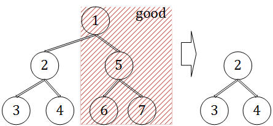
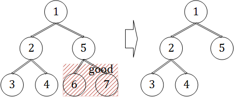
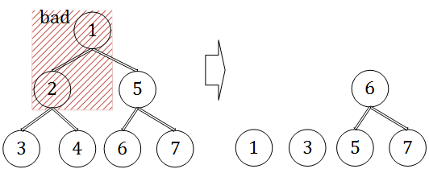

--------
* [Upper Folder - 上一级目录](../../)
* [Source Code - 源码](https://github.com/zhaochenyou/Way-to-Algorithm/blob/master/src/DynamicProgramming/TreeDP/BinaryTreeDP.hpp)
* [Test Code - 测试](https://github.com/zhaochenyou/Way-to-Algorithm/blob/master/src/DynamicProgramming/TreeDP/BinaryTreeDP.cpp)

--------

### Binary Tree DP
### 二叉树动规

问题：

拥有\(n\)个节点的二叉树，节点下标范围为\([0,n)\)，节点\(i\)的权值为\(v_i\)（\(v_i \gt 0\)），整个二叉树的权值为所有节点的权值之和。现在要求只保留\(m\)个节点（\(0 \lt m \lt n-1\)），剪裁掉的节点数量为\(n-1-m\)，要求剩余部分仍然是一个二叉树，而不能是多个二叉树。如图： 

\((1)\)正确剪裁 

\((2)\)正确剪裁 

\((3)\)错误剪裁 

图\((1)\)和\((2)\)剪裁后的剩余部分仍然是二叉树，图\((3)\)剪裁后的剩余部分分为了\(3\)个部分。对于拥有\(n\)个节点的二叉树，求出保留\(m\)个节点的二叉树的最大权值。 

解法：

设\(f(i,j)\)表示以节点\(i\)为根节点的树上，保留\(j\)个节点（包括节点\(i\)自己）的最大权值。其转移方程如下： 

\[
f(i,j) =
\begin{cases}
v_i & (初始化)i,j \in [0,n),i = j \\
max⁡\{f(leftChild_i,k)+f(rightChild_i,j-1-k)+v_i \} & i,j \in [0,n),i \neq j
\end{cases}
\]

\((1)\)节点数量为\(1\)的二叉树，其最大权值即为节点自己的权值，即\(f(i,i) = v_i\)； 

\((2)\)对于该二叉树的左右子树，其根节点分别为\(leftChild_i\)和\(rightChild_i\)，若左子树包含\(k\)个节点（其中\(0 \lt k \lt j-1\)），最大权值为\(f(leftChild_i,k)\)，则右子树包含\(j-1-k\)个节点，最大权值为\(f(rightChild_i,j-1-k)\)。因此选取所有\(k\)的选择中最大的权值即可，即\(f(i,j) = max⁡\{f(leftChild_i,k)+f(rightChild_i,j-1-k)+v_i \}\)； 

最终在\(f(i,m)\)中选择权值最大的作为最终的最大权值（其中\(i \in [0,n)\)）。该算法的时间复杂度是\(O(n^2)\)。 

--------
--------
