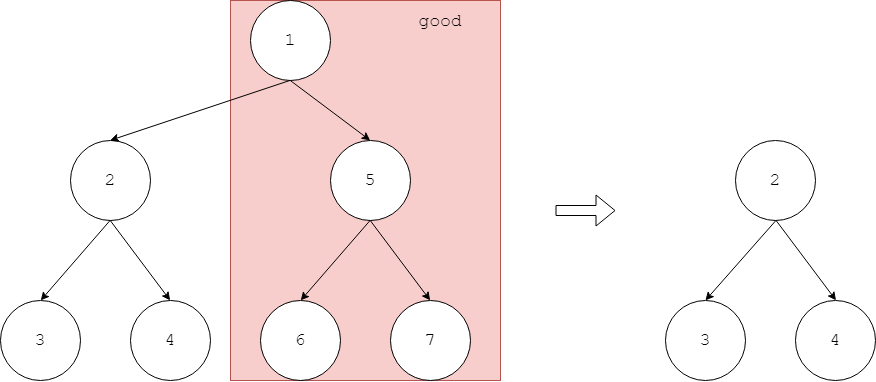
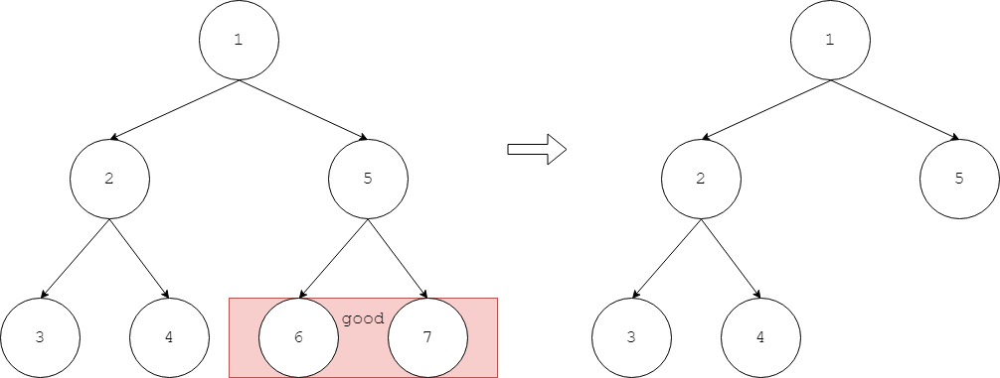
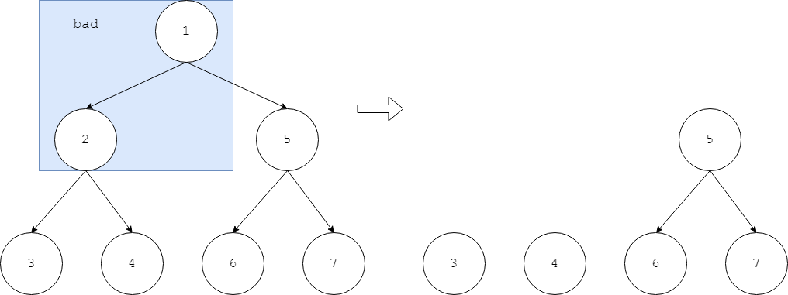

# Max Binary Tree - 最大二叉树

--------

#### 问题

拥有$$ n $$个节点的二叉树，节点范围为$$ [1,n] $$，节点$$ i $$的权值为正整数$$ v_i $$，整个二叉树的权值为所有节点的权值之和。现在要求只保留$$ m $$个节点（$$ 0 \lt m \lt n-1 $$），剪裁掉的节点数量为$$ n-1-m $$，要求剩余部分仍然是一个二叉树，而不能是多个二叉树。如图：

正确剪裁

错误剪裁

对于拥有$$ n $$个节点的二叉树，求出保留$$ m $$个节点的二叉树的最大权值。

#### 解法

设$$ f(i,j) $$表示以节点$$ i $$为根节点的树上，保留$$ j $$个节点（包括节点$$ i $$自己）的最大权值。因此有转移方程如：

$$
f(i,j) =
\begin{cases}
v_i                                                 &   (initialize)    &   i \in [1,n],j = 1 \\
max⁡\{ f(left_i,k)+f(right_i,j-1-k)+v_i \}          &   (loop)          &   i \in [1,n], j \in [2,n]
\end{cases}
$$

$$ (1) $$ 节点数量为$$ 1 $$的二叉树，其最大权值即为节点自己的权值，因此$$ f(i,1) = v_i $$；

$$ (2) $$ 对于根节点为$$ i $$的二叉树，只留$$ j $$个节点。当左子树上有$$ k $$个节点（$$ 1 \leq k \leq j-1 $$），则右子树上有$$ j-1-k $$个节点，因为左右子树的节点数量之和为$$ j - 1 $$（根节点$$ i $$占一个节点）。设其左右孩子节点为$$ left_i $$和$$ right_i $$，左子树的最大权值为$$ f(left_i,k) $$，右子树的最大权值为$$ f(right_i,j-1-k) $$，根节点的子树的最大权值为$$ f(i) = f(left_i, k) + f(right_i, j-1-k) + v_i $$。遍历$$ k \in [1, j-1] $$，在所有可能中选取使$$ f(i,j) $$最大的即可；

$$ f(n,m) $$即为该二叉树留下$$ m $$个节点时的最大权值。该算法的时间复杂度是$$ O(n \times m) $$。

--------

#### 源码

[MaxBinaryTree.h](https://github.com/linrongbin16/Way-to-Algorithm/blob/master/src/DynamicProgramming/TreeDP/MaxBinaryTree.h)

[MaxBinaryTree.cpp](https://github.com/linrongbin16/Way-to-Algorithm/blob/master/src/DynamicProgramming/TreeDP/MaxBinaryTree.cpp)

#### 测试

[MaxBinaryTreeTest.cpp](https://github.com/linrongbin16/Way-to-Algorithm/blob/master/src/DynamicProgramming/TreeDP/MaxBinaryTreeTest.cpp)
