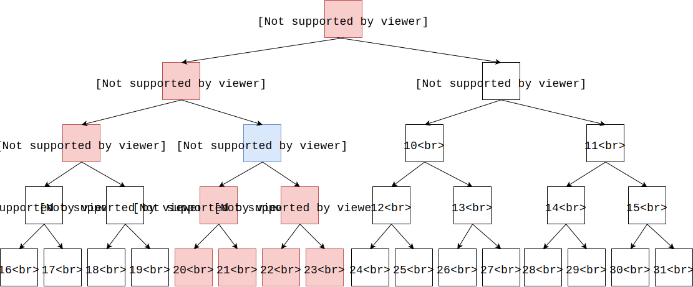
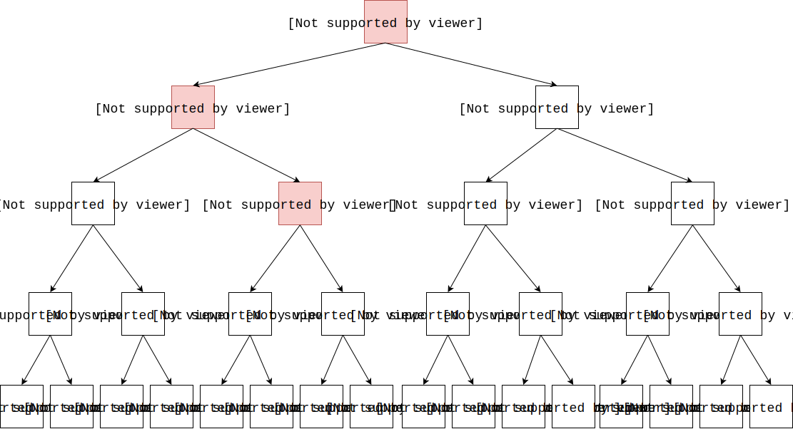
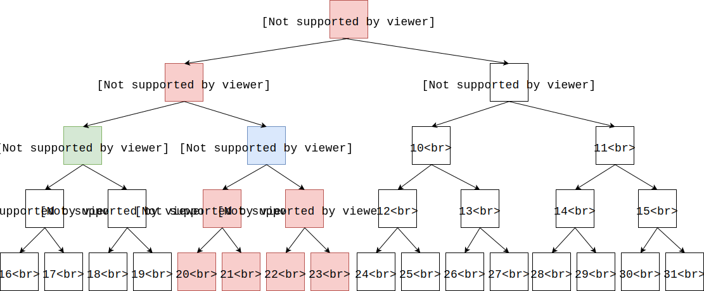

# Max Binary Tree Radius Sum - 最大二叉树半径和

--------

#### 问题

一个二叉树共有$$ n $$个节点，范围为$$ [1,n] $$，每个节点拥有一个权值，所有节点的权值之和不超过$$ m $$。从任意节点$$ i $$都可以到达另一节点$$ j $$，且路线是唯一的，每一条的距离为1（节点与自己的距离为0，与其父节点、左右孩子节点的距离为1）。设节点$$ i $$权值为$$ v_{i} $$，所有到节点$$ i $$的距离小于等于$$ radius $$的节点权值之和为$$ \sum_{p=1}^{n_{i}} v_{p} $$ 。称该权值之和为节点$$ i $$在半径$$ radius $$上的半径和。下图演示了节点$$ 4 $$覆盖到的半径为$$ 2 $$的区域：

求二叉树的最大半径和。

#### 解法

根据上图我们可以看出，找出节点$$ i $$半径$$ radius $$内的所有节点并求和，即可得到该节点的半径和。二叉树中沿着父节点向上移动，和沿着左右孩子向下移动的操作不一样，因此将其区分。设$$ f(i,j) $$表示节点$$ i $$在半径为$$ j $$的范围内，只沿着父节点向上移动的半径和，则有状态转移方程：

$$
f(i,j) =
\begin{cases}
0                                   &   (initialize)    &   i \in [1,n], j = 0 \\
f(father_{i}, j-1) + v_{i}          &   (loop)          &   i, father_{i} \in [1,n], 0 \leq j-1 \lt j \leq m
\end{cases}
$$

$$ (1) $$ 初始化，向上半径为$$ 0 $$时节点$$ i $$的半径和为$$ 0 $$，即$$ g(i,0) = 0 $$；

$$ (2) $$ 节点$$ i $$在半径$$ j $$上向上的半径和，显然等于它的父结点$$ father_{i} $$在半径为$$ j-1 $$上的半径和与它自己的权值之和，即$$ f(i,j) = f(father_{i}, j-1) + v_{i} $$；

下图演示节点$$ 7 $$向上半径为$$ 3 $$所覆盖到的节点：

设$$ g(i,j) $$表示节点$$ i $$在半径$$ j $$的范围内，只沿着左右孩子节点向下移动的半径和，则有状态转移方程：

$$

g(i,j) = 
\begin{cases}
0                                                   &   (initialize)    &   i \in [1,n], j = 0 \\
g(left_{i}, j-1) + g(right_{i}, j-1) + v_{i}        &   (loop)          &   i, left_{i}, right_{i} \in [1,n], 0 \leq j-1 \lt j \leq m
\end{cases}
$$

$$ (1) $$ 初始化，向下半径为$$ 0 $$时节点$$ i $$的半径和为$$ 0 $$，即$$ g(i,0) = 0 $$；

$$ (2) $$ 节点$$ i $$在半径$$ j $$上向下的半径和，显然等于它的左右孩子节点$$ left_{i}, right_{i} $$在半径为$$ j-1 $$上的半径和与它自己的权值之和，即$$ g(i,j) = g(left_{i}, j-1) + g(right_{i}, j-1) + v_{i} $$；

下图演示节点$$ 1 $$向下半径为$$ 3 $$所覆盖到的节点：

还漏掉了节点$$ i $$的叔叔节点$$ uncle_{i} $$，下图演示节点$$ 4 $$在半径$$ 2 $$上覆盖到的所有节点，其中没有被$$ f(4,2) $$和$$ g(4,2) $$覆盖到的节点用绿色标记：

设$$ h(i,j) $$为节点$$ i $$在半径$$ j $$上的半径和（本问题所求），则有状态转移方程：

$$

h(i,j) =
\begin{cases}
0                                                                                           &   (initialize)    &   i \in [1,n], j = 0  \\
f(father_{i}, j-1) + g(uncle_{i}, j-2) + g(left_{i},j-1) + g(right_{i}, j-1) + v_{i}        &   (loop)          &   i, father_{i}, uncle_{i}, left_{i}, right_{i} \in [1,n], 0 \leq j-2 \lt j-1 \lt j \leq m
\end{cases}

$$

$$ (1) $$ 初始化，半径为$$ 0 $$时节点$$ i $$的半径和为$$ 0 $$，即$$ h(i,0) = 0 $$；

$$ (2) $$ 节点$$ i $$在半径$$ j $$上的半径和，显然等于它的父节点、左右孩子节点在半径为$$ j-1 $$上的半径和，以及叔叔节点在半径为$$ j-2 $$上的半径和，与它自己的权值之和，即$$ h(i,j) = f(father_{i}, j-1) + g(uncle_{i}, j-2) + g(left_{i}, j-1) + g(right_{i}, j-1) + v_{i} $$；

遍历二叉树上所有节点，找出最大的半径和即可。该算法的时间复杂度为$$ O(n \times m) $$。

--------

#### Cow Travelling

* http://train.usaco.org/TESTDATA/MAR08.ctravel.htm

--------

#### 源码

[MaxBinaryTreeRadiusSum.h](https://github.com/linrongbin16/Way-to-Algorithm/blob/master/src/DynamicProgramming/TreeDP/MaxBinaryTreeRadiusSum.h)

[MaxBinaryTreeRadiusSum.cpp](https://github.com/linrongbin16/Way-to-Algorithm/blob/master/src/DynamicProgramming/TreeDP/MaxBinaryTreeRadiusSum.cpp)

#### 测试

[MaxBinaryTreeRadiusSumTest.cpp](https://github.com/linrongbin16/Way-to-Algorithm/blob/master/src/DynamicProgramming/TreeDP/MaxBinaryTreeRadiusSumTest.cpp)
