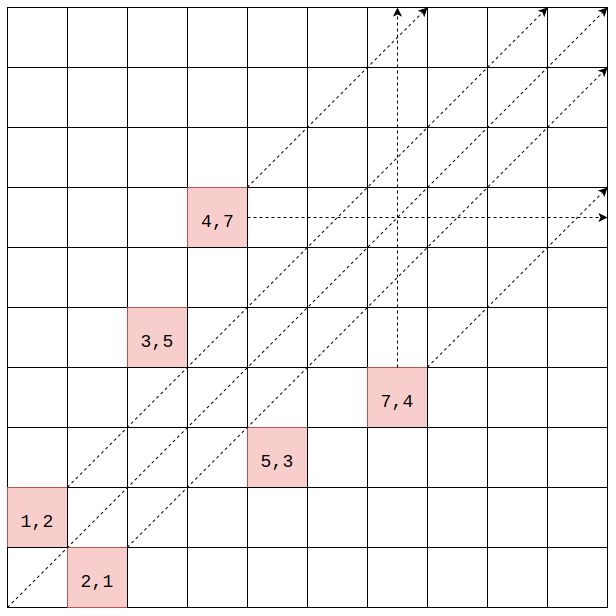

# Wythoff Game - 威佐夫博弈

--------

#### 问题

$$ A $$和$$ B $$两人轮流从苹果和梨子中取出水果，两堆水果的数量分别为$$ p $$（苹果）和$$ k $$（梨子）且$$ p \ne k $$。

每人每次既可以从一堆水果中取任意个水果（至少取$$ 1 $$个），也可以从两堆水果中同时取任意个水果（至少取$$ 1 $$个），取的数量没有上限，最后一个把水果取光的人获胜。

给定$$ p, k $$，当我方先手，我方和对方都是高手（在能赢的情况下一定能赢），求我方是否能赢。

#### 解法

$$ (1) $$ 当我方面临$$ p = 2, k = 1 $$局势时，我方必输，因为我方无法一次把两堆物品取光，且必然留给对方局势$$ (p, p) $$（$$ p \ge 0 $$），对方可以一次将两堆物品取光；

$$ (2) $$ 当我方面临$$ p = 3, k = 1 $$局势时，我方取$$ p = 1 $$时，留给对方$$ p = 2, k = 1 $$局势，我方才赢；

$$ (3) $$ 当我方面临$$ p = 3, k = 2 $$局势时，我方取$$ p = 1, k = 1 $$时，留给对方$$ p = 2, k = 1 $$局势，我方必赢。对于所有的$$ p = k + 1, 2 \le k $$局势，我方从两堆物品中同时取$$ k - 1 $$时必赢。

$$
\cdots
$$

把$$ (2, 1), (3, 1) $$这样的局势看作棋盘上的坐标时，很像“皇后的棋步”（Queen's Move）。

上图中$$ (1,1), (2,2), (3,2), (2,3), (3,3), (3,4), (4,3) \cdots $$这些在虚线上的坐标，当我方面对这样的局势时必赢（称这样的局势为安全局势）。棋盘上关键的位置是红色的$$ (1,2), (2,1), (3,5), (5,3) \cdots $$，这些是安全局势的边界点，当我方面临边界点时必输。

根据数学研究，这些边界实际是两条直线：

在二维坐标系上这两条直线的坐标计算方式是

$$

\phi = \frac{1 + \sqrt{5}}{2} \approx 1.6180339887\dots \\

\frac{y}{x} = \phi \\

\frac{x}{y} = \phi

$$

其中$$ \phi $$常被称为“黄金比例”（Golden Ratio），也称“黄金分割”。黄金分割常数是一个无理数，任何正整数乘以或除以它，结果都不是整数。本问题中给定一个坐标时可以算出另一个黄金分割点的坐标，再向坐标系的外围方向取整，可以得到两条直线上安全局势的边界点。我们将二维坐标系上半边黄金分割线称为$$ upper $$，黄金分割线称为$$ lower $$。

在下图中，当给定点$$ x, y $$，可以算出其与$$ x, y $$轴平行的直线与两条黄金分割线的四个交点$$ a, b, c, d $$。

$$
x = 2.5, y_{c} = \lceil x \times \phi \rceil \approx \lceil 2.5 \times 1.618 \rceil \approx \lceil 4.045 \rceil = 5 \\
x = 2.5, y_{d} = \lfloor x \div \phi \rfloor \approx \lfloor 2.5 \div 1.618 \rfloor \approx \lfloor 1.545 \rfloor = 1 \\
y = 1.8, x_{b} = \lceil y \times \phi \rceil \approx \lceil 1.8 \times 1.618 \rceil \approx \lceil 2.912 \rceil = 3 \\
y = 1.8, x_{a} = \lfloor y \div \phi \rfloor \approx \lfloor 1.8 \div 1.618 \rfloor \approx \lfloor 1.112 \rfloor = 1 \\
$$

若点$$ x,y $$满足$$ x_{a} \lt x \lt x_{b}, y_{d} \lt y \lt y_{c} $$，则该点为安全局势，即处于黄金分割线区域内的一方必赢。

$$ (1) $$ 当$$ (p, k) $$处于黄金分割区域，我方必赢；

$$ (2) $$ 当$$ (p, k) $$处于黄金分割区域的边界点，我方必输，因为无论我方如何取物品，对方下一轮都会进入黄金区域；

$$ (3) $$ 当$$ (p, k) $$处于其他区域时，我方需要取一个合适的数，将对方下一轮置于黄金分割区域的边界点，我方才赢；

当我方和对方都是高手时，只需一次计算即可分出胜负。该算法的时间复杂度为$$ O(1) $$。

--------

#### Wythoff’s Game

* http://math.rice.edu/~michael/teaching/2012Fall/Wythoff.pdf

--------

#### 源码

[import, lang:"c_cpp"](../../../src/GameTheory/WythoffGame.h)

#### 测试

[import, lang:"c_cpp"](../../../src/GameTheory/WythoffGame.cpp)
