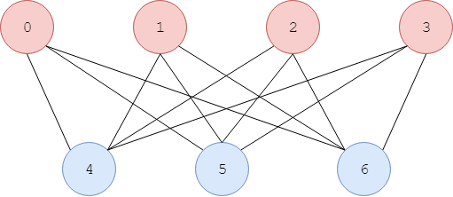

# Section-6 Binary Match
# 第6节 二分匹配

--------

1. [Hungarian - 匈牙利算法](Hungarian/)
2. [HopcroftKarp - Hopcroft-Karp算法](HopcroftKarp/)
3. [MatchToMaxflow - 二分匹配转化为最大流](MatchToMaxflow/)
4. [KuhnMunkres - Kuhn-Munkres算法](KuhnMunkres/)
5. [Introduction-Domination_Independent_Covering_Clique - 支配集、独立集、覆盖集、团的介绍](Introduction-Domination_Independent_Covering_Clique/)
6. [WeightedCoveringAndIndependentSet - 最小点权覆盖和最大点权独立集](WeightedCoveringAndIndependentSet/)
7. [MinDisjointPathCovering - 最小不相交路径覆盖](MinDisjointPathCovering/)
8. [MinJointPathCovering - 最小可相交路径覆盖](MinJointPathCovering/)
9. [Coloring - 染色问题](Coloring/)

--------

#### 二分图（Bipartite Graph）

二分图（Bipartite Graph）是一类特殊的无向图$$ G = <V,E> $$，图中的顶点可以被划分为两个子集$$ V_{1}, V_{2} $$（满足$$ V_{1} \bigcap V_{2} = \varnothing, V_{1} \bigcup V_{2} = V $$），且使所有边$$ e_{i,j} $$的两端点分别属于两个顶点子集$$ v_i \in V_{1}, v_j \in V_{2} $$。二分图可以表示为$$ G = (V_{1}, V_{2}, E) $$。二分图中的两个顶点子集也可用这样的染色方法描述：二分图中的顶点染成红色或蓝色，且任意两相邻顶点的颜色不同。如下图所示：

二分图中存在的边的子集$$ E_{match} $$，其中任意两条边都没有公共/相同顶点。称这样的边子集是一个二分匹配（Binary Match）。

--------

#### Introduction To Algorithms

* [VI.Graph Algorithms](https://www.google.com/search?q=Introduction+to+Algorithms+3rd+Edition+pdf)

#### 图论术语

* https://en.wikipedia.org/wiki/Glossary_of_graph_theory_terms
