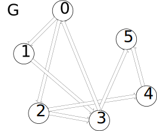

# Kosaraju - Kosaraju算法

--------

#### 问题

用Kosaraju算法求有向图$$ DG $$的所有强连通分支。

#### 解法

Kosaraju算法分为$$ 3 $$步：

$$ (1) $$ 初始化空队列$$ queue $$；

$$ (2) $$ （类似DFS和二叉树的后续遍历）遍历图$$ DG $$所有顶点$$ v_i $$，对每个顶点$$ v_i $$进行搜索操作：

$$ 2.1) $$ 若顶点$$ v_i $$已被访问过则跳过，否则将$$ v_i $$染红标记为访问；

$$ 2.2) $$ 递归的搜索顶点$$ v_i $$的所有邻节点（设为$$ v_j $$），同样做该搜索操作；

$$ 2.3) $$ 将$$ v_i $$添加到队列$$ queue $$的头部；

$$ (3) $$ （类似DFS和并查集算法）初始时，令队列中所有顶点$$ v_i $$属于根节点为$$ v_i $$即自己的强连通分支。遍历队列$$ queue $$所有顶点，对每个顶点$$ v_i $$进行分配操作：

$$ 3.1) $$ 若顶点$$ v_i $$所属的强连通分支的根节点不是自己则跳过；

$$ 3.2) $$ 搜索顶点$$ v_i $$的所有邻节点（设为$$ v_j $$），将$$ v_j $$分配给以$$ v_i $$为根节点的强连通分支（若$$ v_j $$所属的强连通分支的根节点不是$$ v_j $$则跳过）；

第$$ (3) $$步结束后，每个顶点都被分配给某个强连通分支，设$$ v_i $$所属的强连通分支的根节点为$$ v_j $$，则只有当$$ v_i = v_j $$时才说明$$ v_i $$为根节点，否则要递归的继续查询。

最终图$$ DG $$的所有顶点都被分配到某个强连通分支。

下图演示有向图的搜索操作和分配操作：

该算法时间复杂度为$$ O(|V|^2) $$。

--------

#### Strongly-Connectivity Algorithm

* https://pdfs.semanticscholar.org/1912/4d1b464fdbb4e9dffb1c915468ae201b5df0.pdf

--------

#### 源码

[Kosaraju.h](https://github.com/linrongbin16/Way-to-Algorithm/blob/master/src/GraphTheory/Connectivity/Kosaraju.h)

[Kosaraju.cpp](https://github.com/linrongbin16/Way-to-Algorithm/blob/master/src/GraphTheory/Connectivity/Kosaraju.cpp)

#### 测试

[KosarajuTest.cpp](https://github.com/linrongbin16/Way-to-Algorithm/blob/master/src/GraphTheory/Connectivity/KosarajuTest.cpp)
