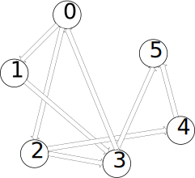

* [Upper Folder - 上一级目录](../../)
* [Source Code - 源码](https://github.com/zhaochenyou/Way-to-Algorithm/blob/master/src/GraphTheory/Connectivity/Tarjan.hpp)
* [Test Code - 测试](https://github.com/zhaochenyou/Way-to-Algorithm/blob/master/src/GraphTheory/Connectivity/Tarjan.cpp)

--------

### Tarjan
### Tarjan算法

问题：

用Tarjan算法求有向图\(G\)的强连通分支。 

解法：

Tarjan算法分为3个步骤：

\((1)\)对图\(G\)中的所有节点进行深度优先搜索，依次将所有遍历到的节点压入栈\(Stack\)中；

\((2)\)依次从栈\(Stack\)中取出所有节点，按照取出的顺序对每个节点再次进行深度优先搜索。在这一次搜索中，每次DFS所遍历到的节点，属于同一个强连通分支； 

按照反方向进行DFS是为了避免图\(G\)中可能存在的环。 

在有\(N\)个节点的有向图\(G\)上运行Tarjan算法的时间复杂度为\(O(N)\)。

