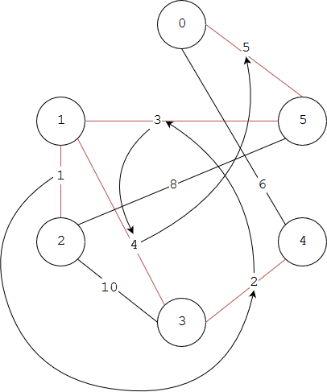

# Kruskal - Kruskal算法

--------

#### 问题

用Kruskal算法求无向图$$ UG $$的最小生成树。

#### 解法

Kruskal算法是贪心算法的应用：

$$ (1) $$ 初始时将无向图$$ UG = <V, E> $$的边集$$ E $$按照权值从小到大进行排序，设生成树的边集合为$$ E_{tree} $$，点集合为$$ V_{tree} $$，初始时生成树为空；

$$ (2) $$ 遍历每一条边（权值从小到大），对于边$$ e_{i,j} $$，若其与边集合$$ E_{tree} $$中已有的边不会形成环 ，则将$$ e_{i,j} $$加入$$ E_{tree} $$，将$$ e_{i,j} $$的两端点加入生成树的点集合$$ V_{tree} $$；

$$ (3) $$ 反之若$$ e_{i,j} $$与边集合$$ E_{tree} $$中已有的边会形成环，则跳过$$ e_{i,j} $$；

遍历边集$$ E $$中的所有边，最终$$ E_{tree} $$即为无向图$$ UG $$的最小生成树。判断添加边是否会使得生成树形成环的方法是：若边$$ e_{i,j} $$的两个端点$$ v_i $$和$$ v_j $$都属于生成树的点集合$$ V_{tree} $$，则边$$ e_{i,j} $$会使生成树中增加环，跳过该边。

下图演示无向图用Kruskal算法求解最小生成树的过程，边上的数字即为权值大小：

依次被选择的边为$$ [ e_{1,2}, e_{3,4}, e_{1,5}, e_{1,3}, e_{0,5} ] $$，这时剩余的边都会使生成树形成环，无法继续添加，且生成树中的点集$$ V_{tree} $$已经包含该图的所有顶点，即为最小生成树。

Kruskal算法的时间复杂度为$$ O(\mid E \mid) $$。

--------

#### Introduction To Algorithms

* [VI.Graph Algorithms - 23.Minimum Spanning Trees - 23.2.The algorithms of Kruskal and Prim](https://mcdtu.files.wordpress.com/2017/03/introduction-to-algorithms-3rd-edition-sep-2010.pdf)

--------

#### 源码

[Kruskal.h](https://github.com/linrongbin16/Way-to-Algorithm/blob/master/src/GraphTheory/MinSpanningTree/Kruskal.h)

[Kruskal.cpp](https://github.com/linrongbin16/Way-to-Algorithm/blob/master/src/GraphTheory/MinSpanningTree/Kruskal.cpp)

#### 测试

[KruskalTest.cpp](https://github.com/linrongbin16/Way-to-Algorithm/blob/master/src/GraphTheory/MinSpanningTree/KruskalTest.cpp)

