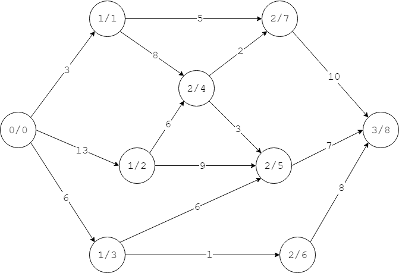

# Dinic - Dinic算法（距离标号算法）

--------

#### 问题

用Dinic算法（也称为距离标号算法）求网络$$ G = <V,E> $$的最大流，$$ G $$是单源点、单汇点，边的容量都为正整数的网络。

#### 解法

Dinic算法也是Ford–Fulkerson方法的一种实现，与Edmonds-Karp算法的区别在于增广路径的搜索方式不同。Dinic算法设计了水位图（Level Graph）/距离标号（Distance Label）来对网络进行搜索。

水位图（Level Graph）/距离图（Distance Graph）：从网络的源点（$$ s $$）出发进行BFS搜索，源点的水位/距离为$$ dist = 0 $$，每个节点根据BFS搜索到的邻节点的水位/距离在该节点的基础上加$$ 1 $$且都相等，即$$ dist(j) = dist(i) + 1 $$（设节点$$ v_j $$是节点$$ v_i $$的BFS搜索的邻节点）。下图演示一个网络的距离图，每个节点上前一个数字为该节点的距离，后一个数字为该节点的下标：

阻塞流（Blocking Flow）：增广路径中最小的剩余容量（瓶颈）$$ \Delta = min \{ c_f(i,j) \} $$，其中$$ v_i, v_j $$是相邻节点，且水位差满足$$ dist(i) = dist(j) + 1 $$。

Dinic算法的步骤如下：

$$ (1) $$ 初始化所有节点之间的流为$$ 0 $$，即$$ f(i,j) = f(j,i) = 0 $$（节点$$ v_i, v_j $$为相邻节点），初始化该网络的最大流为$$ flow_{max} = 0 $$；

$$ (2) $$ 通过BFS构建水位图；

$$ (3) $$ 在水位图中寻找一个阻塞流作为增广路径，更新该路径上所有边的剩余容量和最大流：

$$
\begin{matrix}
flow_{max} = flow_{max} + \Delta    \\
f(i,j) = f(i,j) + \Delta        \\
f(j,i) = f(j,i) - \Delta        \\
c_f(i,j) = c_f(i,j) - \Delta      \\
c_f(j,i) = c_f(j,i) + \Delta
\end{matrix}
$$

具体寻找阻塞流的方法，和Edmonds-Karp算法类似，从源点$$ s $$开始BFS搜索，并通过队列$$ queue $$存储所有待搜索节点，从队列取出头节点$$ v_i $$，遍历其所有邻节点$$ v_j $$，将满足$$ c_f(i,j) \gt 0 $$且$$ dist(i) = dist(j) + 1 $$条件的加入队列$$ queue $$中，直到找到汇点或队列为空为止。若通过BFS搜索到一条阻塞流，则更新剩余网络和最大流；若无法搜索到阻塞流，则算法结束。

可以看出Dinic算法与Edmonds-Karp算法的核心区别只在于BFS搜索的数据结构不同，Dinic算法用距离标号来限制邻节点的搜索，而Edmonds-Karp除了剩余容量以外没有其他限制。Dinic算法运行在重新构建的水位图上，边的数量比原始的网络少很多，因此搜索的时间复杂度大大降低。

该算法的时间复杂度为$$ O(\lvert V \rvert \cdot \lvert E \rvert \cdot log_2 \lvert V \rvert) $$。

--------

#### Dinic Algorithm

* http://101.96.10.64/www.cse.unt.edu/~tarau/teaching/AnAlgo/Dinic's%20algorithm.pdf
* http://www.cse.unt.edu/~tarau/teaching/AnAlgo/Dinic's%20algorithm.pdf

--------

#### 源码

[Dinic.h](https://github.com/linrongbin16/Way-to-Algorithm/blob/master/src/GraphTheory/NetworkFlow/Dinic.h)

[Dinic.cpp](https://github.com/linrongbin16/Way-to-Algorithm/blob/master/src/GraphTheory/NetworkFlow/Dinic.cpp)

#### 测试

[DinicTest.cpp](https://github.com/linrongbin16/Way-to-Algorithm/blob/master/src/GraphTheory/NetworkFlow/DinicTest.cpp)
