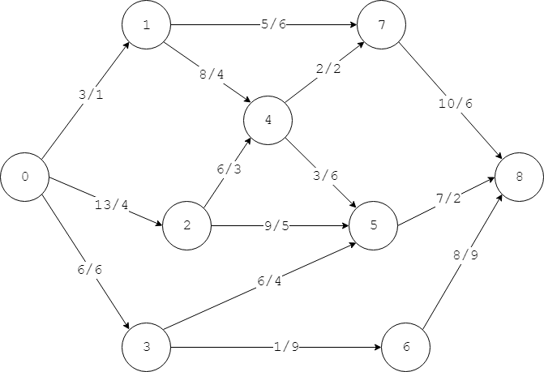
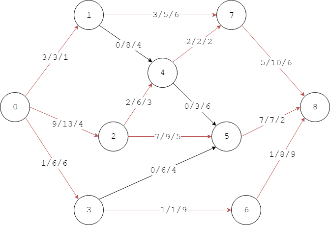

# Minimum Cost Flow - 最小费用流

--------

#### 问题

实际生活中一个城市网络可能存在多种路线保证每天能够运输的货物最多，但每条公路的使用会产生一定费用。用户希望在满足货物运输量最大的条件下，选择费用最低的路线运输货物。这类问题可以抽象为最小费用流问题。

网络$$ G = <V,E> $$是单源点、单汇点，边的容量都为正整数的网络。容量为$$ c(i,j) \gt 0 $$的边$$ e_{i,j} $$（两端点为$$ v_i, v_j $$），每消耗一个单位容量的费用为$$ a(i,j) $$（费用可以为负值），流$$ f(i,j) $$的费用为$$ f(i,j) \cdot a(i,j) $$。可得网络流的费用计算公式为：

$$
cost = \sum_{i,j \in V} f(i,j) \cdot a(i,j)     &   f(i,j) \gt 0
$$

下图中每条边上的2个数字分别表示：容量/费用：

该网络存在最大流：

上图中每条边上的3个数字分别表示：流/容量/费用。该最大流的费用是$$ cost = 160 $$。

求费用最小的最大流，即最小费用流。

#### 解法

在Ford–Fulkerson方法基础上，每找出一条增广路径$$ p $$，设路径上的最小剩余容量为$$ \Delta = min \{ c_f(i,j) \} $$，则该路径的费用为：

$$
a(p) = \sum_{i,j \in p} \Delta \cdot a(i,j) = \Delta \cdot \sum_{i,j \in p} a(i,j)
$$

搜索增广路径时每次选取费用最小的增广路径即可求出网络的最小费用流（不必优先选择流最大的增广路径），该问题转化为有向图中由源点$$ s $$到达汇点$$ t $$的最短路径问题。由于边的费用（距离）允许负值，（Dijkstra算法无法处理负距离边的最短路径）选择Bellman-Ford算法来进行搜索，则最小费用流的求解步骤为：

$$ (1) $$ 用Bellman-Ford算法尝试求出以边的费用为距离的有向图中$$ s \rightarrow t $$的最短路径$$ p $$，注意搜索中将剩余容量$$ c_f \leq 0 $$的边视作不存在。若不存在这样的最短路径则算法结束。若存在则将该路径作为最大流的增广路径。对于该增广路径，更新最大流、最小费用和剩余网络：

$$
\begin{matrix}
flow_{max} = flow_{max} + \Delta                                \\
a_{min} = a_{min} + \sum_{i,j \in p} \Delta \cdot a(i,j)     \\
f(i,j) = f(i,j) + \Delta                                    \\
f(j,i) = f(j,i) - \Delta                                    \\
c_f(i,j) = c_f(i,j) - \Delta                                  \\
c_f(j,i) = c_f(j,i) + \Delta
\end{matrix}
$$

$$ (2) $$ 重复第$$ (1) $$步直到无法找出更多的增广路径，算法结束，即可得到费用最小的最大流。

该算法的时间复杂度为$$ O(\lvert V \rvert \cdot \lvert E \rvert ^2) $$。

--------

#### 源码

[MinimumCostFlow.h](https://github.com/linrongbin16/Way-to-Algorithm/blob/master/src/GraphTheory/NetworkFlow/MinimumCostFlow.h)

[MinimumCostFlow.cpp](https://github.com/linrongbin16/Way-to-Algorithm/blob/master/src/GraphTheory/NetworkFlow/MinimumCostFlow.cpp)

#### 测试

[MinimumCostFlowTest.cpp](https://github.com/linrongbin16/Way-to-Algorithm/blob/master/src/GraphTheory/NetworkFlow/MinimumCostFlowTest.cpp)

