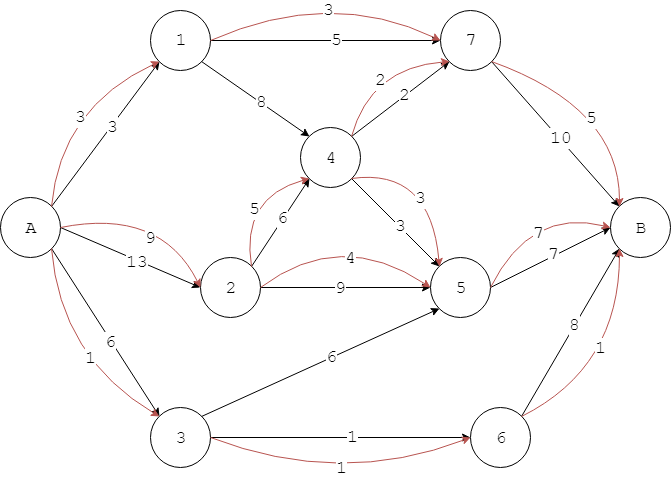

# Section-5 Network Flow
# 第5节 网络流

--------

#### 网络流（Network Flow）/最大流（Max Flow）

一片区域中有很多个城市，彼此间用公路相连，每条公路有自己能够运输的最大重量。城市$$ A $$生产货物，城市$$ B $$消费货物，通过公路将城市$$ A $$产生的货物运送到城市$$ B $$消费，经过其他城市。

上图是一个有向图$$ DG = <V,E> $$，假设城市$$ A $$每天产生的货物数量无穷多，城市$$ B $$每天能够消费的货物数量无穷多，每条边的数字表示该公路每天最多运送的货物数量，红色弧边的数字表示当整个运输网络充满时一条公路实际每天运送的货物数量。所有的红色弧边组成一组解，表示城市$$ A, B $$之间每天最多能够运输的货物。显然这样的解可以有多个。

网络流（Network Flow）是指在一个每条边都有容量（Capacity）的有向图分配流，使一条边的流量不会超过它的容量。运筹学中通常将有向图称为网络，顶点称为节点（Node）而边称为弧（Arc）。一道流必须匹配一个结点的进出的流量相同的限制，除非这是一个源点（Source）──有较多向外的流，或是一个汇点（Sink）──有较多向内的流。一个网络可以用来模拟道路系统的交通量、管中的液体、电路中的电流或类似一些东西在一个结点的网络中游动的任何事物。上面两个城市之间运输货物的例子就是典型的网络流问题，每个城市是一个节点，城市$$ A $$是源点$$ Source $$，城市$$ B $$是汇点$$ Sink $$，公路是弧。

有向图$$ DG = <V,E> $$的边$$ e_{u,v} \in E $$都有一个容量$$ c_{u,v} $$（若$$ e_{u,v} \notin E $$则认为$$ c_{u,v} = 0 $$），设源点为$$ s $$汇点为$$ t $$。一道网络流是对于有向图$$ DG $$中所有节点$$ u, v $$都有以下特性的实数函数：

$$
f : V \times V \rightarrow R
$$

满足：

$$ (1) $$ 容量限制（Capacity Constraints）：$$ f(u,v) \leq c(u,v) $$，表示一条边的流不能超过其容量；

$$ (2) $$ 反对称（Skew Symmetry）：$$ f(u,v) = -f(v,u) $$，表示由$$ u $$到$$ v $$的净流必须是由$$ v $$到$$ u $$的净流的相反；

$$ (3) $$ 流守恒（Flow Conservation）：除非$$ u = s $$或$$ u = t $$，否则$$ \sum_{w \in V} f(u, w) = 0 $$，表示节点$$ u $$的净流是$$ 0 $$，除了$$ Source $$和$$ Sink $$；

$$ (4) $$ 网络流中除了源点汇点外的任意节点，都满足流守恒：

$$
\sum_{(u,v) \in E} f(u,v) = \sum_{(v,z) \in E} f(v,z)
$$

表示对于除源点汇点外任意节点$$ u, v, z \in V \backslash {s, t} $$，所有流向节点$$ v $$的流等于从节点$$ v $$流出的流；

$$ (5) $$ 若由$$ u $$到$$ v $$有$$ 4 $$单位的流，而由$$ v $$到$$ u $$有$$ 3 $$单位的流，那么实际$$ f(u,v) = 1, f(v,u) = -1 $$；

$$ (6) $$ 边的剩余容量（Residual Capacity）是

$$
c_f (u,v) = c(u,v) - f(u,v)
$$

边的剩余容量定义了剩余网络（Residual Network）$$ G_f = <V, E_f>  $$，表示该网络的可用容量。

最大流（Max Flow）是单源点、单汇点、边的容量为正整数的网络流中流量最大的流。

--------

#### Introduction To Algorithms

* [VI.Graph Algorithms](https://mcdtu.files.wordpress.com/2017/03/introduction-to-algorithms-3rd-edition-sep-2010.pdf)

#### 图论术语

* https://en.wikipedia.org/wiki/Glossary_of_graph_theory_terms
