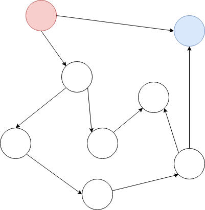
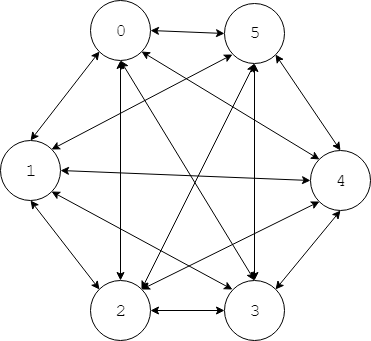
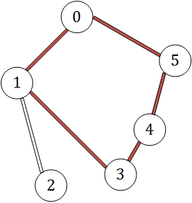
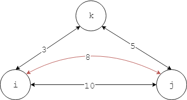

# Chapter-5 Graph Theory
# 第5章 图论

--------

1. Traverse - 遍历
    1. [DepthFirstSearch(DFS) - 深度优先搜索](Traverse/DepthFirstSearch/)
    2. [BreadthFirstSearch(BFS) - 广度优先搜索](Traverse/BreadthFirstSearch/)
    3. [TopologicalSort - 拓扑排序](Traverse/TopologicalSort/)
    4. [EulerCycle - 欧拉回路](Traverse/EulerCycle/)
2. MinSpanningTree - 最小生成树
    1. [Kruskal - Kruskal算法](MinSpanningTree/Kruskal/)
    2. [Prim - Prim算法](MinSpanningTree/Prim/)
3. ShortestPath - 最短路径
    1. [BellmanFord - BellmanFord算法](ShortestPath/BellmanFord/)
    2. [Dijkstra - Dijkstra算法](ShortestPath/Dijkstra/)
    3. [FloydWarshall - FloydWarshall算法](ShortestPath/FloydWarshall/)
    4. [DifferentConstraints - 差分约束](ShortestPath/DifferentConstraints/)
4. Connectivity - 连通
    1. [Kosaraju - Kosaraju算法](Connectivity/Kosaraju/)
    2. [Tarjan - Tarjan算法](Connectivity/Tarjan/)
    3. [Gabow - Gabow算法](Connectivity/Gabow/)
    4. [TwoSatisfiability - 2-SAT问题](Connectivity/TwoSatisfiability/)
    5. [Cut - 割](Connectivity/Cut/)
    6. [DoubleConnectedComponent - 双联通分支](Connectivity/DoubleConnectedComponent/)
    7. [LeastCommonAncestor - 最近公共祖先](Connectivity/LeastCommonAncestor/)
    8. [RangeExtremumQuery - 区域最值查询](Connectivity/RangeExtremumQuery/)
5. FlowNetwork - 网络流
    1. [EdmondsKarp - EdmondsKarp算法](FlowNetwork/EdmondsKarp/)
    2. [PushAndRelabel - 压入与重标记](FlowNetwork/PushAndRelabel/)
    3. [Dinic - Dinic算法](FlowNetwork/Dinic/)
    4. [DistanceLabel - 距离标号算法](FlowNetwork/DistanceLabel/)
    5. [RelabelToFront - 重标记与前移算法](FlowNetwork/RelabelToFront/)
    6. [HighestLabelPreflowPush - 最高标号预留与推进算法](FlowNetwork/HighestLabelPreflowPush/)
    7. [DistanceLabel_AdjacentListVersion - 距离标号算法-邻接表优化版](FlowNetwork/DistanceLabel_AdjacentListVersion/)
    8. [Summary-Maxflow - 最大流算法小结](FlowNetwork/Summary-Maxflow/)
    9. [MinCost_Maxflow - 最小费用最大流](FlowNetwork/MinCost_Maxflow/)
    10. [MultipleSourceMultipleSink_Maxflow - 多源点、多汇点最大流](FlowNetwork/MultipleSourceMultipleSink_Maxflow/)
    11. [Connectivity - 连通度](FlowNetwork/Connectivity/)
    12. [NoSourceNoSink_VolumeBounded_Flow - 无源点、无汇点、容量有上下界的流网络](FlowNetwork/NoSourceNoSink_VolumeBounded_Flow/)
    13. [VolumeBounded_Maxflow - 容量有上下界的最大流](FlowNetwork/VolumeBounded_Maxflow/)
    14. [VolumeBounded_Minflow - 容量有上下界的最小流](FlowNetwork/VolumeBounded_Minflow/)
6. BinaryMatch - 二分匹配
    1. [Hungarian - 匈牙利算法](BinaryMatch/Hungarian/)
    2. [HopcroftKarp - Hopcroft-Karp算法](BinaryMatch/HopcroftKarp/)
    3. [MatchToMaxflow - 二分匹配转化为最大流](BinaryMatch/MatchToMaxflow/)
    4. [KuhnMunkres - Kuhn-Munkres算法](BinaryMatch/KuhnMunkres/)
    5. [Introduction-Domination_Independent_Covering_Clique - 支配集、独立集、覆盖集、团的介绍](BinaryMatch/Introduction-Domination_Independent_Covering_Clique/)
    6. [WeightedCoveringAndIndependentSet - 最小点权覆盖和最大点权独立集](BinaryMatch/WeightedCoveringAndIndependentSet/)
    7. [MinDisjointPathCovering - 最小不相交路径覆盖](BinaryMatch/MinDisjointPathCovering/)
    8. [MinJointPathCovering - 最小可相交路径覆盖](BinaryMatch/MinJointPathCovering/)
    9. [Coloring - 染色问题](BinaryMatch/Coloring/)

--------

#### 图（Graph）

图$$ G = <V,E> $$是由顶点集合$$ V $$和边集合$$ E $$组成的数据结构。一个边连接两个顶点，若两顶点$$ u $$和$$ v $$为一条边的两个端点，则称$$ u $$和$$ v $$相邻。

图$$ G $$的子图的所有顶点和边都属于图$$ G $$。

完全图（Complete Graph）的所有顶点两两相邻。如下图所示：

#### 有向图（Directed Graph）/无向图（Undirected Graph）

无向边$$ e $$的两端点是$$ u $$和$$ v $$，表示既可以从$$ u $$到达$$ v $$，也可以从$$ v $$到达$$ u $$。有向边$$ e $$从$$ u $$指向$$ v $$，表示只能从$$ u $$到达$$ v $$，而不能反向。一条无向边也可以看作两条方向相反，端点相同的有向边的组合。

所有边都是无向边的图为无向图（Undirected Graph），所有边都是有向边的图为有向图（Directed Graph）。

#### 度数（Degree）/出度（Out Degree）/入度（In Degree）

节点$$ u $$的出度（Out Degree）是从节点$$ u $$出发的边的数量，也称为出度度数，从节点$$ u $$出发的边称为出弧边。无向图的顶点$$ u $$的所有边都可以看作出弧边，即节点的边数等于出度。

节点$$ u $$的入度（In Degree）是到达（指向）节点$$ u $$的边的数量，也称为入度度数，到达节点$$ u $$的边称为入弧边。无向图的顶点$$ u $$的所有边都可以看作入弧边，即节点的边数等于入度。无向图中每个节点的出度和入度相等。

节点$$ u $$所关联的边数，称作该节点的度数（Degree）。无向图中节点$$ v_i $$的度数等于边的数量，等于出度度数，等于入度度数。有向图中任意节点$$ v_i $$的度数等于出度度数与入度度数之和。如下图所示：

上面两个图，图$$ A $$为有向图，节点$$ [0,5] $$的出度分别为$$ [2, 2, 1, 1, 2, 1] $$，入度分别为$$ [1, 1, 2, 2, 0, 2] $$。图$$ B $$为无向图，节点$$ [0,5] $$的出度分别为$$ [3, 4, 3, 3, 2, 3] $$，入度与出度一样。

一般用$$ n \times n $$的矩阵表示一个拥有$$ n $$个节点的图$$ G $$，节点范围为$$ [0,n-1] $$。$$ G[i,j] $$表示从节点$$ i $$到$$ j $$的距离（$$ i,j \in [0,n-1] $$），或节点$$ i $$是否可以直接到达节点$$ j $$，等等信息。注意节点$$ i $$到自己的距离为$$ 0 $$，不能到达自己。上图中$$ A $$和$$ B $$可以表示为矩阵：

$$
A =
\begin{bmatrix}
0 & 1 & 0 & 0 & 0 & 1 \\
0 & 0 & 1 & 1 & 0 & 0 \\
0 & 0 & 0 & 0 & 0 & 1 \\
0 & 0 & 1 & 0 & 0 & 0 \\
1 & 0 & 0 & 1 & 0 & 0 \\
0 & 1 & 0 & 0 & 0 & 0
\end{bmatrix}

\quad

B =
\begin{bmatrix}
0 & 1 & 0 & 0 & 1 & 1 \\
1 & 0 & 1 & 1 & 0 & 1 \\
0 & 1 & 0 & 1 & 0 & 1 \\
0 & 1 & 1 & 0 & 1 & 0 \\
1 & 0 & 0 & 1 & 0 & 0 \\
1 & 1 & 1 & 0 & 0 & 0
\end{bmatrix}
$$

#### 环（Cycle）

若图$$ G $$中对于顶点$$ v_i $$，存在一条路径从它出发可以到达自己，则称该路径为一个环。不存在环的图称为无环图，存在环的图称为有环图。完全图都是有环图。

#### 拓扑排序（Topological Sort）

拓扑排序（Topological Sort）是有向无环图中所有顶点按照依赖进行的排序。

设完成任务$$ j $$需要先完成任务$$ i $$，则任务$$ j $$依赖任务$$ i $$。用有向图表示这一组任务的完成过程这样存在依赖关系的$$ n $$个任务，即存在边$$ e_{i,j} $$从顶点$$ v_i $$指向$$ v_j $$，最终得到一个有向无环图。如下图所示：

#### 路径（Path）/回路（Cycle）/欧拉路径（Eulerian Path）/欧拉回路（Eulerian Cycle）/汉密尔顿路径（Hamilton Path）/哈密尔顿回路（Hamilton Cycle）

图$$ G $$的路径（Path）是一组边的有序集合，表示随着时间依次经过的边的顺序。回路（Cycle）是起点和终点相同的路径。

欧拉路径（Eulerian Path）经过图$$ G $$中每条边一次且仅一次（同一个顶点可以经过多次），遍历所有边。

判断欧拉路径：

$$ (1) $$ 判断有向图是否存在欧拉路径：有向图$$ DG $$中存在一个起始顶点$$ v_0 $$满足出度比入度大1（$$ out_{1} = in_{1} + 1 $$），存在一个终止顶点$$ v_1 $$满足入度比出度大1（$$ in_{2} = out_{2} + 1 $$），其余所有顶点的入度等于出度，则该有向图$$ DG $$中存在欧拉路经；

$$ (2) $$ 判断无向图是否存在欧拉路径：无向图$$ UG $$中存在两个顶点$$ v_0 $$和$$ v_1 $$满足度数为奇数，其余节点的度数都是偶数，则该无向图$$ UG $$中存在欧拉路经；

欧拉回路（Eulerian Cycle）是既是欧拉路径又是回路的路径。

判断欧拉回路：

$$ (1) $$ 判断有向图是否存在欧拉回路：有向图$$ DG $$的任意顶点$$ v_i $$满足$$ in_{i} = out_{i} $$，出度等于入度，则该有向图$$ DG $$中存在欧拉回路；

$$ (2) $$ 判断无向图是否存在欧拉回路：无向图$$ UG $$的任意顶点$$ v_i $$满足度数为偶数，则该无向图$$ DG $$中存在欧拉回路；

拥有欧拉回路的图$$ G $$称为欧拉图（Eulerian Graph）。

汉密尔顿路径（Hamilton Path）经过图$$ G $$中每个顶点一次且仅一次（同一条边可以经过多次），遍历所有顶点。求解汉密尔顿路径是一个NP完全问题。

哈密尔顿回路（Hamilton Cycle）是既是哈密尔顿路径又是回路的路径。

拥有汉密尔顿回路的图$$ G $$称为汉密尔顿图。完全图必然是汉密尔顿图。

#### 最小生成树（Min Spanning Tree）

图$$ G $$中所有边都拥有一个正整数权值。最小生成树是图$$ G $$中连接所有顶点，边的权值之和最小的非环路径。

#### 最短路径（Shortest Path）/松弛操作（Relaxation）

图$$ G $$中所有边都拥有一个正整数距离$$ dist $$，若从顶点$$ v_i $$可以到达$$ v_j $$，必然存在一条距离最短的路径，即最短路径。最短路径中不存在环。

存在边的距离为0，或负值的图不存在最短路径。距离为0的边可以无限重复使用而不会增加两顶点之间的距离，距离为负值的边可以减小整个路径的距离，这些情况都会让最短路径中出现环。

用$$ dist(i,j) $$表示顶点$$ v_i $$到达$$ v_j $$的最短距离（$$ dist(i,j) = + \infty $$表示$$ v_i $$到$$ v_j $$的距离为无限远，即不可达）。当存在顶点$$ k $$满足：

$$
dist(i,j) > dist(i,k) + dist(k,j)
$$

说明$$ v_i $$经由$$ v_k $$到达$$ v_j $$的距离比当前已知的最短路径距离更近，这时更新$$ v_i, v_j $$之间的距离：

$$
dist(i,j) = dist(i,k) + dist(k,j)
$$

下图演示了一个最简单的松弛操作：

该更新过程即为松弛操作，松弛操作是最短路径算法的主要手段。

#### 平凡图（Trivial Graph）/非平凡图（Nontrivial Graph）/连通（Connected）/连通图（Connected Graph）/连通分支（Connected Components）

平凡图（Trivial Graph）是只有一个节点，没有边的图。非平凡图（Trivial Graph）是有至少两个节点，一条边的图。

图$$ G $$中顶点$$ v_i $$和$$ v_j $$连通（Connected）表示存在从顶点$$ v_i $$到达顶点$$ v_j $$，且从顶点$$ v_j $$也可以到达顶点$$ v_i $$的路径。注意无向图中$$ v_i $$到达$$ v_j $$，和$$ v_j $$到达$$ v_i $$，互为充分必要条件。

连通图（Connected Graph）是任意两顶点都连通的图。

连通分量/连通分支（Connected Components）是图$$ G $$的子图，又是连通图，且加入图$$ G $$的任意其他节点都会不再连通。（连通分支的概念比较笼统。）连通分支也称为极大连通子图（Maximal Strongly Connected Subgraph）。连通图的连通分支即为它自己，非连通图中存在多个连通分支。

强连通分量/强连通分支（Strongly Connected Components）是有向图$$ G $$的子图，又是连通图，且加入图$$ G $$的任意其他节点都会不再连通。

双连通分量/双连通分支（Biconnected Components）。

三连通分量/三连通分支（Triconnected Components）。

图$$ G = <V, E> $$的逆图是将原图的所有边都反向得到的图$$ G' = <V', E'> $$。逆图的点集与原图相同$$ V' = V $$，边集$$ E' $$中任意边$$ e' = (v, u) $$都在原图边集$$ E $$中存在对应的边$$ e = (u, v) $$。逆图也称为图的转置。无向图的逆图永远都是它自己。

#### 割（Cut）

割$$ C = <S, T> $$将图$$ G = <V, E> $$划分为两个子图$$ S $$和$$ T $$，两个子图的顶点集合没有交集$$ S \bigcap T = \emptyset $$，对图中的任意边$$ e = (u, v) $$，顶点$$ u $$属于子图$$ S $$，顶点$$ v $$属于子图$$ T $$。

图$$ G $$的所有的割组成割集$$ CS = { (u, v) \in E | u \in S, v \in T } $$，其中$$ S, T $$是互不相交的子图。

#### 点割集

图$$ G = <V, E> $$的点集$$ V $$中存在一个非空真子集$$ V_1 $$，满足$$ G $$中删去$$ V_1 $$后不再连通。但对于$$ V_1 $$的任意真子集$$ V_2 $$，$$ G $$中删去$$ V_2 $$后都仍然连通，称这样的点集$$ V_1 $$是$$ G $$的一个点割集。非平凡的无向连通图存在点割集的充要条件是该图中至少存在两个不相邻的相异节点。

#### 边割集

图$$ G = <V, E> $$的边集$$ E $$中有这样的非空真子集$$ E_1 $$，$$ G $$中删去$$ E_1 $$后不再连通。但对于$$E_1$$的任意真子集$$E_2$$，$$G$$中删去$$E_2$$后都仍然连通，称这样的边集$$E_1$$是$$G$$的一个边割集。任何非平凡的无向连通图一定具有边割集。

#### 点连通度

非平凡的无向连通图$$G$$的所有点割集$$V_{cut}$$中的节点数量最少的那个点割集$$V_1$$，其节点数量$$k$$即为图$$G$$的点连通度。即图$$G$$删除任意$$k-1$$个节点后都仍然能够连通，但存在一个方案（点割集）使删除$$k$$个节点后不连通。特别的，当$$k = 2$$时，即图$$G$$任意删除$$1$$个节点都仍然能够连通，但存在一个方案，删除$$2$$个节点后不再连通，称点连通度$$k = 2$$的连通分支(图)为点双连通分支。

#### 边连通度

非平凡的无向连通图$$G$$的所有边割集$$E_{cut}$$中的边数量最少的那个边割集$$E_1$$，其边数量$$k$$即为图$$G$$的边连通度，即图$$G$$删去任意$$k-1$$条边后都仍然能够连通，但存在一个方案(边割集)使删除k条边后不再连通。特别的，当k = 2时，即该图任意删除1条边都仍然连通，但存在一个方案使删除2条边后不再连通，称边连通度k = 2的连通分支(图)为边双连通分支。

#### 割点

无向图$$G$$中存在某个点$$v_1$$，删去该点后图的连通分支数量加1，即该点将原图分成两个连通分支，则称点$$v_1$$为无向图$$G$$的割点。假设删去一个割点后得到两个新的连通分支，则割点可以看作同时属于两个新连通分支，而非割点总是只属于一个连通分支。

#### 割边（桥）

无向图$$G$$中存在某条边$$e_1$$，删去该边后图的连通分支数量加1，即该边将原图分成两个连通分支。假设删去一条割边后得到两个新的连通分支，则割边的两端点可以看作分别属于两个新连通分支，而非割边的两端点只属于同一个连通分支。

--------

#### 图论术语

* https://zh.wikipedia.org/wiki/%E5%9B%BE%E8%AE%BA%E6%9C%AF%E8%AF%AD
