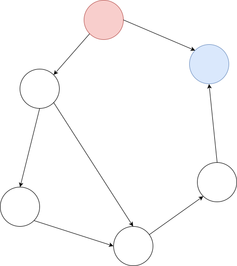
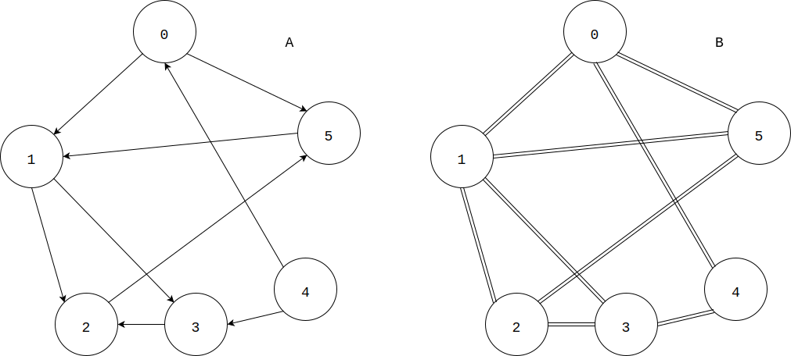
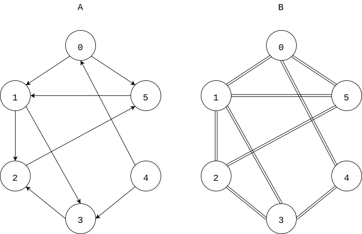
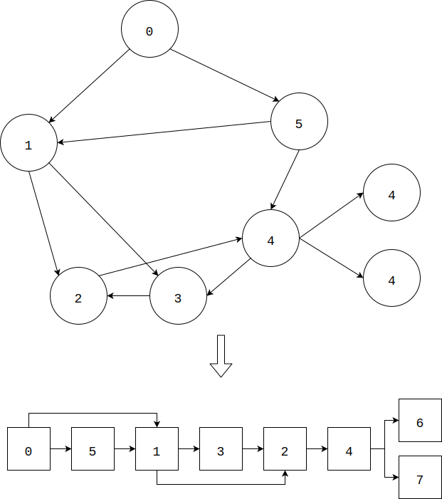

# Chapter-5 Graph Theory
# 第5章 图论

--------

1. Traverse - 遍历
    1. [DepthFirstSearch(DFS) - 深度优先搜索](Traverse/DepthFirstSearch/)
    2. [BreadthFirstSearch(BFS) - 广度优先搜索](Traverse/BreadthFirstSearch/)
    3. [TopologicalSort - 拓扑排序](Traverse/TopologicalSort/)
    4. [EulerCycle - 欧拉回路](Traverse/EulerCycle/)
2. MinimumSpanningTree - 最小生成树
    0. [KnowledgePoint - 知识要点](MinimumSpanningTree/KnowledgePoint/)
    1. [Kruskal - Kruskal算法](MinimumSpanningTree/Kruskal/)
    2. [Prim - Prim算法](MinimumSpanningTree/Prim/)
    3. [SecondMinimumSpanningTree - 次小生成树](MinimumSpanningTree/SecondMinimumSpanningTree/)
    4. [OptimalRatioSpanningTree - 最优比率生成树](MinimumSpanningTree/OptimalRatioSpanningTree/)
3. ShortestPath - 最短路径
    0. [KnowledgePoint - 知识要点](ShortestPath/KnowledgePoint/)
    1. [Relaxation - 松弛操作](ShortestPath/Relaxation/)
    2. [BellmanFord - BellmanFord算法](ShortestPath/BellmanFord/)
    3. [ShortestPathFasterAlgorithm - 最短路径更快算法（SPFA）](ShortestPath/ShortestPathFasterAlgorithm/)
    4. [Dijkstra - Dijkstra算法](ShortestPath/Dijkstra/)
    5. [Floyd - Floyd算法](ShortestPath/Floyd/)
    6. [DifferentConstraints - 差分约束](ShortestPath/DifferentConstraints/)
4. Connectivity - 连通
    0. [KnowledgePoint - 知识要点](Connectivity/KnowledgePoint)
    1. [Kosaraju - Kosaraju算法](Connectivity/Kosaraju/)
    2. [Tarjan - Tarjan算法](Connectivity/Tarjan/)
    3. [Gabow - Gabow算法](Connectivity/Gabow/)
    4. [TwoSatisfiability - 2-SAT问题](Connectivity/TwoSatisfiability/)
    5. [Cut - 割](Connectivity/Cut/)
    6. [DoubleConnectedComponent - 双联通分支](Connectivity/DoubleConnectedComponent/)
    7. [LeastCommonAncestor - 最近公共祖先](Connectivity/LeastCommonAncestor/)
    8. [RangeExtremumQuery - 区域最值查询](Connectivity/RangeExtremumQuery/)
5. FlowNetwork - 网络流
    1. [EdmondsKarp - EdmondsKarp算法](FlowNetwork/EdmondsKarp/)
    2. [PushAndRelabel - 压入与重标记](FlowNetwork/PushAndRelabel/)
    3. [Dinic - Dinic算法](FlowNetwork/Dinic/)
    4. [DistanceLabel - 距离标号算法](FlowNetwork/DistanceLabel/)
    5. [RelabelToFront - 重标记与前移算法](FlowNetwork/RelabelToFront/)
    6. [HighestLabelPreflowPush - 最高标号预留与推进算法](FlowNetwork/HighestLabelPreflowPush/)
    7. [DistanceLabel_AdjacentListVersion - 距离标号算法-邻接表优化版](FlowNetwork/DistanceLabel_AdjacentListVersion/)
    8. [Summary-Maxflow - 最大流算法小结](FlowNetwork/Summary-Maxflow/)
    9. [MinimumCost_Maxflow - 最小费用最大流](FlowNetwork/MinimumCost_Maxflow/)
    10. [MultipleSourceMultipleSink_Maxflow - 多源点、多汇点最大流](FlowNetwork/MultipleSourceMultipleSink_Maxflow/)
    11. [Connectivity - 连通度](FlowNetwork/Connectivity/)
    12. [NoSourceNoSink_VolumeBounded_Flow - 无源点、无汇点、容量有上下界的流网络](FlowNetwork/NoSourceNoSink_VolumeBounded_Flow/)
    13. [VolumeBounded_Maxflow - 容量有上下界的最大流](FlowNetwork/VolumeBounded_Maxflow/)
    14. [VolumeBounded_Minflow - 容量有上下界的最小流](FlowNetwork/VolumeBounded_Minflow/)
6. BinaryMatch - 二分匹配
    1. [Hungarian - 匈牙利算法](BinaryMatch/Hungarian/)
    2. [HopcroftKarp - Hopcroft-Karp算法](BinaryMatch/HopcroftKarp/)
    3. [MatchToMaxflow - 二分匹配转化为最大流](BinaryMatch/MatchToMaxflow/)
    4. [KuhnMunkres - Kuhn-Munkres算法](BinaryMatch/KuhnMunkres/)
    5. [Introduction-Domination_Independent_Covering_Clique - 支配集、独立集、覆盖集、团的介绍](BinaryMatch/Introduction-Domination_Independent_Covering_Clique/)
    6. [WeightedCoveringAndIndependentSet - 最小点权覆盖和最大点权独立集](BinaryMatch/WeightedCoveringAndIndependentSet/)
    7. [MinimumDisjointPathCovering - 最小不相交路径覆盖](BinaryMatch/MinimumDisjointPathCovering/)
    8. [MinimumJointPathCovering - 最小可相交路径覆盖](BinaryMatch/MinimumJointPathCovering/)
    9. [Coloring - 染色问题](BinaryMatch/Coloring/)

--------

#### 图（Graph）

图$$ G = <V,E> $$是由顶点集合$$ V $$和边集合$$ E $$组成的数据结构。一个边连接两个顶点，若两顶点$$ u $$和$$ v $$为一条边的两个端点，则称$$ u $$和$$ v $$相邻。

#### 子图（Subgraph）

一个所有顶点和边都属于图$$ G $$的图，称为$$ G $$的子图。

#### 完全图（Complete Graph）

所有顶点两两相邻的图称为完全图。

#### 无向边

一条无向边$$ e $$的两端点是$$ u $$和$$ v $$，则可以从$$ u $$出发到达$$ v $$，也可以从$$ v $$出发到达$$ u $$。

#### 有向边

一条有向边$$ e $$从$$ u $$指向$$ v $$，则只能从$$ u $$出发到达$$ v $$，不能反向。一条无向边也可以看作两条方向相反，端点相同的有向边的组合。

#### 出度/出弧

节点$$ u $$的出度是从节点$$ u $$出发的边的数量，也称为出度度数，从节点$$ u $$出发的边称为出弧边。对于无向边和无向图来说，节点$$ u $$的所有边都可以看作出弧边，即节点的边数等于出度。

#### 入度/入弧

节点$$ u $$的入度是到达（指向）节点$$ u $$的边的数量，也称为入度度数，到达节点$$ u $$的边称为入弧边。对于无向边和无向图来说，节点$$ u $$的所有边都可以看作入弧边，即节点的边数等于入度。无向图中每个节点的出度和入度相等。

#### 度数

图$$ G $$中的节点$$ u $$所关联的边数，称作该节点的度数。无向图中任意节点$$ v_i $$的度数等于出度度数，也等于入度度数。有向图中任意节点$$ v_i $$的度数等于出度度数与入度度数之和。

上面两个图中，图$$ A $$为有向图，节点$$ [0,6] $$的出度分别为$$ [2, 2, 1, 1, 2, 1] $$，入度分别为$$ [1, 1, 2, 2, 0, 2] $$。图$$ B $$为无向图，节点$$ [0,6] $$的出度分别为$$ [3, 4, 3, 3, 2, 3] $$，入度与出度一样。

一般用$$ n \times n $$的矩阵表示一个拥有$$ n $$个节点的图$$ G $$，节点范围为$$ [1,n] $$。$$ G[i,j] $$表示从节点$$ i $$到$$ j $$的距离（$$ i,j \in [1,n] $$），也可以是其他信息，比如节点$$ i $$是否可以直接到达节点$$ j $$，等等。上图中的$$ A $$和$$ B $$可以表示为矩阵：

$$
A =
\begin{bmatrix}
0_{0,0} & 1_{0,1} & 0_{0,2} & 0_{0,3} & 0_{0,4} & 1_{0,5} \\
0_{1,0} & 0_{1,1} & 1_{1,2} & 1_{1,3} & 0_{1,4} & 0_{1,5} \\
0_{2,0} & 0_{2,1} & 0_{2,2} & 0_{2,3} & 0_{2,4} & 1_{2,5} \\
0_{3,0} & 0_{3,1} & 1_{3,2} & 0_{3,3} & 0_{3,4} & 0_{3,5} \\
1_{4,0} & 0_{4,1} & 0_{4,2} & 1_{4,3} & 0_{4,4} & 0_{4,5} \\
0_{5,0} & 1_{5,1} & 0_{5,2} & 0_{5,3} & 0_{5,4} & 0_{5,5}
\end{bmatrix}
\quad
B =
\begin{bmatrix}
0_{0,0} & 1_{0,1} & 0_{0,2} & 0_{0,3} & 1_{0,4} & 1_{0,5} \\
1_{1,0} & 0_{1,1} & 1_{1,2} & 1_{1,3} & 0_{1,4} & 0_{1,5} \\
0_{2,0} & 1_{2,1} & 0_{2,2} & 1_{2,3} & 0_{2,4} & 1_{2,5} \\
0_{3,0} & 1_{3,1} & 1_{3,2} & 0_{3,3} & 1_{3,4} & 0_{3,5} \\
1_{4,0} & 0_{4,1} & 0_{4,2} & 1_{4,3} & 0_{4,4} & 0_{4,5} \\
1_{5,0} & 1_{5,1} & 1_{5,2} & 0_{5,3} & 0_{5,4} & 0_{5,5}
\end{bmatrix}
$$

#### 环

若图$$ G $$中存在一个节点$$ i $$，从它出发可以返回自己，则称这条路径为一个环。不存在环的图称为无环图。下图是一个五向有环图：

#### 拓扑排序

不存在环的有向图中存在拓扑排序。在可以拓扑排序的有向图$$ G $$中，节点可以分为三类：起点，终点和中间点。起点只有出弧边，没有入弧边；终点只有入弧边，没有出弧边；中间点既有出弧边也有入弧边。下图是一个有向无环图的拓扑排序：

#### 欧拉路径（Eulerian Path）

图$$ G $$中存在这样的一条路径，经过每条边一次且仅一次（同一个顶点可以经过多次），可以遍历图中的所有边，则这条路径称为欧拉路经。有向图$$ DG $$中存在一个起始顶点$$ v_1 $$满足$$ degree_{out} = degree_{in} + 1 $$（出度比入度大1），存在一个终止顶点$$ v_2 $$满足$$ degree_{in} = degree_{out} + 1 $$（入度比出度大1），其余所有顶点的入度等于出度，则该有向图$$ DG $$中存在欧拉路经。无向图$$ UG $$中存在两个顶点$$ v_1 $$和$$ v_2 $$满足度数为奇数，其余节点的度数都是偶数，则该无向图$$ UG $$中存在欧拉路经。

#### 欧拉回路（Eulerian Cycle）

若图$$ G $$中存在欧拉路经，且该路径为一个回路，则称该路径为欧拉回路。有向图$$ DG $$的任意顶点$$ v_i $$满足$$ degree_{in} = degree_{out} $$，出度等于入度，则该有向图$$ DG $$中存在欧拉回路。无向图$$ UG $$的任意顶点$$ v_i $$满足读数为偶数，则该无向图$$ DG $$中存在欧拉回路。

#### 欧拉图（Eulerian Diagram）

拥有欧拉回路的图$$ G $$称为欧拉图。

#### 汉密尔顿路径（Hamilton Path）

图$$ G $$中存在这样的一条路径，经过每个顶点一次且仅一次（同一条边可以经过多次），可以遍历图中的所有顶点，则这条路径称为汉密尔顿路径。求解汉密尔顿路径是一个NP完全问题。

#### 汉密尔顿回路（Hamilton Cycle）

图$$ G $$中存在汉密尔顿路径，且该路径为一个回路，则称该路径为汉密尔顿回路。

#### 汉密尔顿图（Hamilton Diagram）

拥有汉密尔顿回路的图$$ G $$称为汉密尔顿图。完全图必然是汉密尔顿图。

--------

#### 图论术语

* https://zh.wikipedia.org/wiki/%E5%9B%BE%E8%AE%BA%E6%9C%AF%E8%AF%AD
