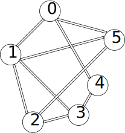

# Breadth First Search(BFS) - 广度优先搜索

--------

#### 问题

用广度优先搜索从图$$ G $$的顶点$$ v_0 $$开始遍历所有顶点。

#### 解法

广度优先搜索需要设置一个队列$$ queue $$，初始时将$$ v_0 $$加入队列$$ queue $$中作为等待访问的顶点，并染红。然后重复进行以下操作：

$$ (1) $$ 从队列$$ queue $$中取出头节点$$ v_i $$访问，将$$ v_i $$的所有邻节点都加入队列$$ queue $$中作为下次等待访问的顶点，并染红；

重复上述操作直到$$ queue $$为空，算法结束。下图演示无向图$$ UG $$广度优先搜索的过程：

顶点访问的顺序为$$ [0, 4, 5, 3, 1, 2] $$。广度优先搜索时间复杂度为$$ O(n) $$。

--------

#### Introduction To Algorithms - VI.Graph Algorithms - 22.Elementary Graph Algorithms - 22.2.Breadth-first search

* https://mcdtu.files.wordpress.com/2017/03/introduction-to-algorithms-3rd-edition-sep-2010.pdf

--------

#### 源码

[BreadthFirstSearch.h](https://github.com/linrongbin16/Way-to-Algorithm/blob/master/src/GraphTheory/Traverse/BreadthFirstSearch.h)

[BreadthFirstSearch.cpp](https://github.com/linrongbin16/Way-to-Algorithm/blob/master/src/GraphTheory/Traverse/BreadthFirstSearch.cpp)

#### 测试

[BreadthFirstSearchTest.cpp](https://github.com/linrongbin16/Way-to-Algorithm/blob/master/src/GraphTheory/Traverse/BreadthFirstSearchTest.cpp)
