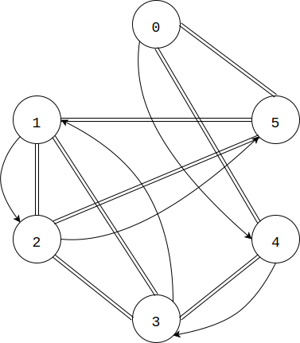
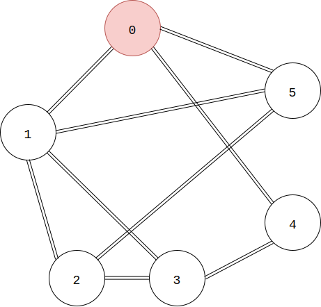
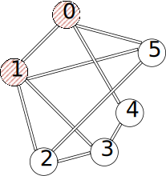
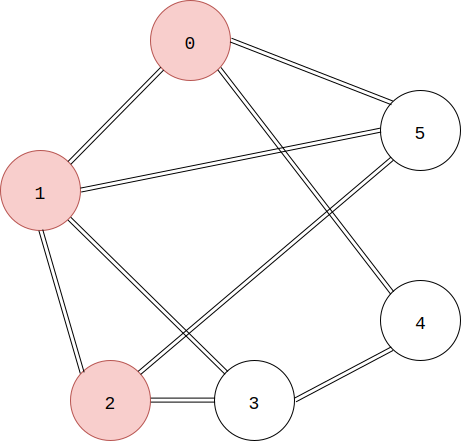
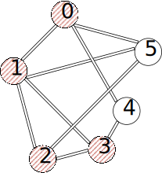
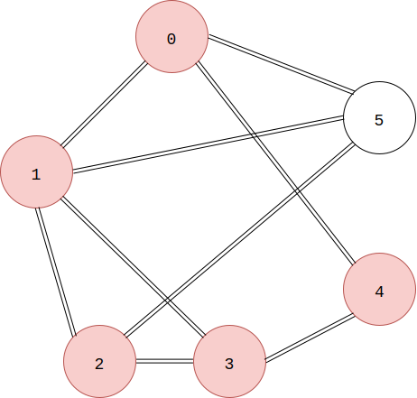
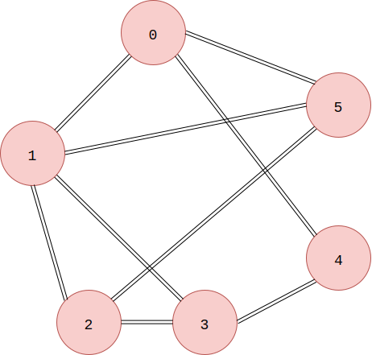

* [Upper Folder - 上一级目录](../../)
* [Source Code - 源码](https://github.com/zhaochenyou/Way-to-Algorithm/blob/master/src/GraphTheory/Traverse/DepthFirstSearch.hpp)
* [Test Code - 测试](https://github.com/zhaochenyou/Way-to-Algorithm/blob/master/src/GraphTheory/Traverse/DepthFirstSearch.cpp)

--------

### Depth First Search(DFS)
### 深度优先搜索

问题：

用深度优先搜索从图\(G\)的节点\(beg\)开始，遍历图\(G\)中的所有节点。 

解法：

在图\(G\)中，假设节点\(i\)的邻节点集合为\(V_i\)，类似于二叉树的先序遍历，对于图中的任意节点\(i\)，在访问节点\(i\)之后，从该节点的邻节点集合\(V_i\)中挑选其中一个\(j\)，继续递归的重复该遍历操作，直到没有更加深入的节点可以搜索时，再返回上一层，考虑邻节点集合\(V_i\)中的下一个节点。 

从某节点\(V_i\)开始\(DFS\)，遍历结束后会得到一串节点，即为从\(V_i\)开始遍历节点的顺序。我们称这串节点的最后一个节点为图\(G\)中以\(V_i\)为起点的\(DFS\)终点。这串节点的数量即为\(V_i\)到终点的搜索距离\(Distance\)，也可以称为DFS的搜索时间，即节点\(V_i\)进行一次DFS所需的时间（将遍历一个节点的时间看作单位时间）。很多算法中都会利用搜索距离，而不太关心搜索到的这串节点的具体内容。

在整个遍历过程中，为了避免重复的访问一个节点，在访问了某个节点\(i\)之后，我们将它染成红色（实际编码中，可以设置一个数组\(visited\)，通过\(visited_i = true \mid false\)来标记某个节点\(i\)时候被访问过）。下面演示从无向图\(G\)中的节点\(0\)开始进行深度优先搜索过程： 

\((1)\)访问节点\(0\)本身，将它染成红色，在其邻节点\( \{1, 5\} \)中挑选节点\(1\)，继续遍历； 

\((2)\)访问节点\(1\)本身，将它染成红色，其邻节点\( \{0, 2\} \)中由于节点\(0\)已经为红色，因此不再考虑该节点，挑选节点\(2\)，继续遍历； 

\((3)\)访问节点\(2\)本身，将它染成红色，其邻节点\( \{1, 3\} \)中由于节点\(1\)已经为红色，因此不再考虑该节点，挑选节点\(3\)，继续遍历； 

\((4)\)访问节点\(3\)本身，将它染成红色，其邻节点\( \{2, 4\} \)中由于节点\(2\)已经为红色，因此不再考虑该节点，挑选节点\(4\)，继续遍历； 

\((5)\)访问节点\(4\)本身，将它染成红色，其邻节点\( \{0, 3\} \)中的所有节点都已经为红色，遍历结束，返回上一层； 

\((6)\)上一层节点\(3\)的遍历中，其邻节点\( \{2, 4\} \)中的所有节点都已经为红色，遍历结束，返回上一层； 

\((7)\)上一层节点\(2\)的遍历中，其邻节点\( \{1, 3\} \)中的所有节点都已经为红色，遍历结束，返回上一层； 

\((8)\)上一层节点\(1\)的遍历中，其邻节点\( \{0, 2\} \)中的所有节点都已经为红色，遍历结束，返回上一层； 

\((9)\)上一层节点\(0\)的遍历中，其邻节点\( \{1, 5\} \)中节点\(1\)已经为红色，不再考虑，挑选节点\(5\)，继续遍历； 

\((10)\)访问节点\(5\)本身，将它染成红色，其邻节点\( \{0, 2\} \)中的所有节点都已经为红色，遍历结束，返回上一层； 

\((11)\)上一层节点\(0\)的遍历中，其邻节点\( \{1, 5\} \)中的所有节点都已经为红色，遍历结束，算法结束； 

深度优先搜索的时间复杂度是\(O(n)\)。 

 
深度优先搜索：
* https://en.wikipedia.org/wiki/Depth-first_search
