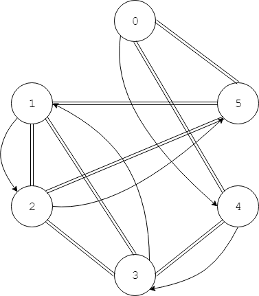
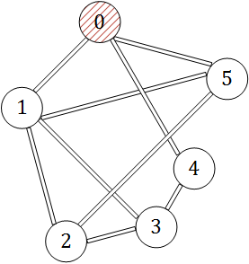
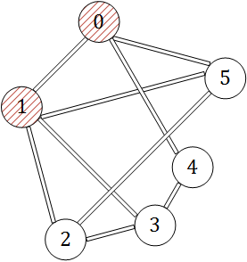
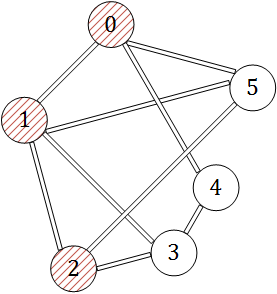
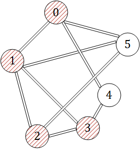
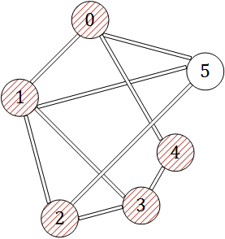

--------
* [Upper Folder - 上一级目录](../../)
* [Source Code - 源码](https://github.com/zhaochenyou/Way-to-Algorithm/blob/master/src/GraphTheory/Traverse/DepthFirstSearch.hpp)
* [Test Code - 测试](https://github.com/zhaochenyou/Way-to-Algorithm/blob/master/src/GraphTheory/Traverse/DepthFirstSearch.cpp)

--------

<h1 align="center">Depth First Search</h1>
<h1 align="center">深度优先搜索</h1>
 
问题：  
&emsp;&emsp;用深度优先搜索从图\(G\)的节点\(beg\)开始，遍历图\(G\)中的所有节点。  
 
解法：  
&emsp;&emsp;在图\(G\)中，假设节点\(i\)的邻节点集合为\(V_i\)，类似于二叉树的先序遍历，对于图中的任意节点\(i\)，总是优先访问节点\(i\)本身，然后挑选该节点的邻节点中的一个\(j\)，继续递归的重复该遍历操作，直到没有更加深入的节点可以搜索时，再返回上一层，考虑邻节点中的下一个。在&lt;Breadth First Search&gt;中可以看到，广度优先搜索的遍历规则则是，在访问节点\(i\)本身后，将节点\(i\)的邻节点\(V_i\)中的所有节点都遍历一遍之后，再挑选其中一个\(j\)，继续递归的重复遍历操作。  
&emsp;&emsp;在整个遍历过程中，为了避免重复的访问一个节点，在访问了某个节点\(i\)之后，我们将它染成红色（实际编码中，可以设置一个数组\(visited\)，通过\(visited_i = true \mid false\)来标记某个节点\(i\)时候被访问过）。下面演示从无向图\(G\)中的节点\(0\)开始进行深度优先搜索过程：  

&emsp;&emsp;\((1)\)访问节点\(0\)本身，将它染成红色，在其邻节点\( \{1, 5\} \)中挑选节点\(1\)，继续遍历；  

&emsp;&emsp;\((2)\)访问节点\(1\)本身，将它染成红色，其邻节点\( \{0, 2\} \)中由于节点\(0\)已经为红色，因此不再考虑该节点，挑选节点\(2\)，继续遍历；  

&emsp;&emsp;\((3)\)访问节点\(2\)本身，将它染成红色，其邻节点\( \{1, 3\} \)中由于节点\(1\)已经为红色，因此不再考虑该节点，挑选节点\(3\)，继续遍历；  

&emsp;&emsp;\((4)\)访问节点\(3\)本身，将它染成红色，其邻节点\( \{2, 4\} \)中由于节点\(2\)已经为红色，因此不再考虑该节点，挑选节点\(4\)，继续遍历；  

&emsp;&emsp;\((5)\)访问节点\(4\)本身，将它染成红色，其邻节点\( \{0, 3\} \)中的所有节点都已经为红色，遍历结束，返回上一层；  

&emsp;&emsp;\((6)\)上一层节点\(3\)的遍历中，其邻节点\( \{2, 4\} \)中的所有节点都已经为红色，遍历结束，返回上一层；  
&emsp;&emsp;\((7)\)上一层节点\(2\)的遍历中，其邻节点\( \{1, 3\} \)中的所有节点都已经为红色，遍历结束，返回上一层；  
&emsp;&emsp;\((8)\)上一层节点\(1\)的遍历中，其邻节点\( \{0, 2\} \)中的所有节点都已经为红色，遍历结束，返回上一层；  
&emsp;&emsp;\((9)\)上一层节点\(0\)的遍历中，其邻节点\( \{1, 5\} \)中节点\(1\)已经为红色，不再考虑，挑选节点\(5\)，继续遍历；  
&emsp;&emsp;\((10)\)访问节点\(5\)本身，将它染成红色，其邻节点\( \{0, 2\} \)中的所有节点都已经为红色，遍历结束，返回上一层；  

&emsp;&emsp;\((11)\)上一层节点\(0\)的遍历中，其邻节点\( \{1, 5\} \)中的所有节点都已经为红色，遍历结束，算法结束；  
&emsp;&emsp;深度优先搜索的时间复杂度是\(O(n)\)。  

 
深度优先搜索：

* [https://en.wikipedia.org/wiki/Depth-first_search](https://en.wikipedia.org/wiki/Depth-first_search)

--------
--------
