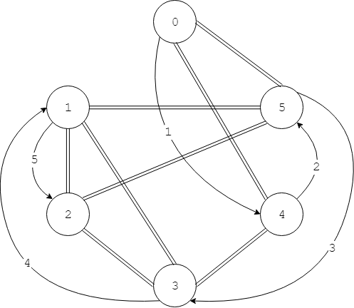
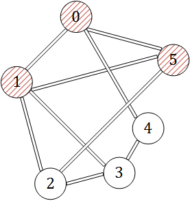
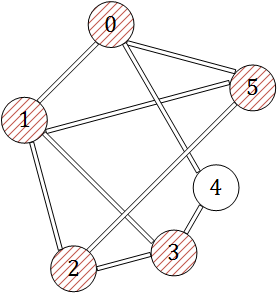
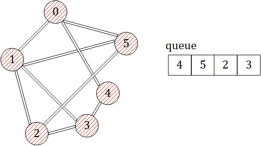

--------
[Upper Folder - 上一级目录](../../)

[Source Code - 源码](https://github.com/zhaochenyou/Way-to-Algorithm/blob/master/src/GraphTheory/Traverse/EulerCycle.hpp)

[Test Code - 测试](https://github.com/zhaochenyou/Way-to-Algorithm/blob/master/src/GraphTheory/Traverse/EulerCycle.cpp)

--------

<h1 align="center">Euler Cycle</h1>
<h1 align="center">欧拉回路</h1>
 
问题：  
&emsp;&emsp;分别求无向图\(UG\)和有向图\(DG\)的欧拉回路。  
 
解法：  
求无向图\(UG\)的欧拉回路：  
&emsp;&emsp;本文介绍求无向图欧拉回路的Fleury算法，它的时间复杂度为\(O(e^2)\)，其中\(e\)为无向图\(UG\)的边数。我们假定无向图\(UG\)中必然存在欧拉回路（因为欧拉回路存在的判定非常简单），对整个图进行DFS搜索，对于任意节点\(v_i\)，在选择下一个递归搜索的节点\(v_j\)时，总是选择\(v_i\)的所有邻节点中剩余度数最高的节点。称在无向图\(UG\)中，假设节点\(i\)的邻节点集合为\(V_i\)，类似于二叉树的先序遍历，对于图中的任意节点\(i\)，总是优先访问节点\(i\)本身，然后访问该节点的邻节点集合\(V_i\)中的所有节点，访问结束之后，再继续递归的对所有邻节点重复该遍历操作，直到没有更多的节点可以搜索，算法结束。  
求有向图\(DG\)的欧拉回路：  
&emsp;&emsp;在整个遍历过程中，为了避免重复的访问一个节点，在访问了某个节点\(i\)之后，我们将它染成红色（实际编码中，可以设置一个数组\(visited\)，通过\(visited_i = true \mid false\)来标记某个节点\(i\)时候被访问过）。下面演示从无向图\(G\)中的节点\(0\)开始进行广度优先搜索过程：  

&emsp;&emsp;\((1)\)访问节点\(0\)本身，将它染成红色，继续遍历其邻节点\( \{1, 5\} \)；  

&emsp;&emsp;\((2)\)访问节点\(1\)本身，将它染成红色，继续遍历其邻节点\( \{0, 2, 3\} \)（由于节点\(0\)已经为红色，因此不再考虑该节点）；  

&emsp;&emsp;\((3)\)访问节点\(2\)本身，将它染成红色，继续遍历其邻节点\( \{1, 3, 5\} \)（由于节点\(1\)已经为红色，因此不再考虑该节点）；  

&emsp;&emsp;\((4)\)访问节点\(3\)本身，将它染成红色，继续遍历其邻节点\( \{2, 4\} \)（由于节点\(2\)已经为红色，因此不再考虑该节点）；  

&emsp;&emsp;\((5)\)之后的所有节点都已经被访问过，只要返回递归即可，算法结束；  
&emsp;&emsp;广度优先搜索的时间复杂度是\(O(n)\)。  

 
广度优先搜索：
* [https://en.wikipedia.org/wiki/Breadth-first_search](https://en.wikipedia.org/wiki/Breadth-first_search)

--------
--------
