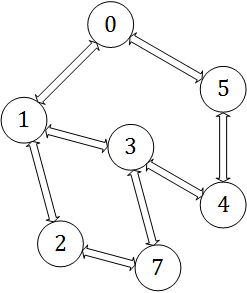
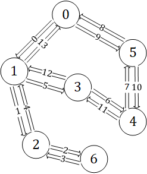

# Euler Cycle - 欧拉回路

--------

#### 问题

求无向图$$ UG $$和有向图$$ DG $$的欧拉回路。

#### 无向图判断欧拉回路的存在

无向图$$ UG $$的任意顶点$$ v_i $$的度数为偶数（注意这里的度数是指无向图的边数），则该无向图存在欧拉回路；

#### 无向图求欧拉回路

用$$ Fleury $$算法求无向图$$ G=<V,E> $$的欧拉回路。设$$ G(i,j) = 1 $$表示顶点$$ v_i $$可以到达顶点$$ v_j $$，$$ G(i,j) = 0 $$表示顶点$$ v_i $$无法到达$$ v_j $$。

上面的无向图可以表示为矩阵：

$$
G =
\begin{bmatrix}
0 & 1 & 0 & 0 & 0 & 1 & 0 \\
1 & 0 & 1 & 1 & 0 & 1 & 0 \\
0 & 1 & 0 & 0 & 0 & 0 & 1 \\
0 & 1 & 0 & 0 & 1 & 1 & 1 \\
0 & 0 & 0 & 1 & 0 & 1 & 0 \\
1 & 1 & 0 & 1 & 1 & 0 & 0 \\
0 & 0 & 1 & 1 & 0 & 0 & 0
\end{bmatrix}
$$

选择任意顶点$$ v_0 $$作为起始顶点，对$$ UG $$进行类似DFS搜索的操作。对于任意顶点$$ v_i $$，选取它的邻节点$$ v_j $$作为下一个访问的顶点（即经过边$$ e_{i,j} $$），但要保证必须存在边$$ e_{j,i} $$可以从$$ v_j $$回到$$ v_i $$。即必须保证$$ G(i,j) = G(j,i) = 1 $$。每经过一条边将其所在的单向边删除（令$$ G(i,j) = G(j,i) = 0 $$），类似DFS重复该搜索操作，直到再次回到起始顶点$$ v_0 $$，算法结束。整个过程中经过的边即为该图的欧拉回路。如图所示：

$$ Fleury $$算法的时间复杂度是$$ O(|E|) $$。

#### 有向图判断欧拉回路的存在

有向图$$ DG $$的任意顶点$$ v_i $$满足$$ in_{i} = out_{i} $$，即出度等于入度，则该有向图存在欧拉回路；

#### 有向图求欧拉回路

有向图的欧拉回路的求解方法与无向图一样。

--------

#### 源码

[EulerCycle.h](https://github.com/linrongbin16/Way-to-Algorithm/blob/master/src/GraphTheory/Traverse/EulerCycle.h)

[EulerCycle.cpp](https://github.com/linrongbin16/Way-to-Algorithm/blob/master/src/GraphTheory/Traverse/EulerCycle.cpp)

#### 测试

[EulerCycleTest.cpp](https://github.com/linrongbin16/Way-to-Algorithm/blob/master/src/GraphTheory/Traverse/EulerCycleTest.cpp)
