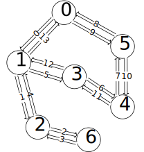
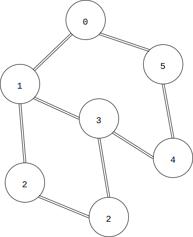
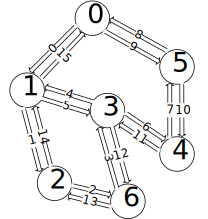

# Euler Cycle - 欧拉回路

--------

#### 问题

求无向图\(UG\)和有向图\(DG\)的欧拉回路。 

#### 无向图\(UG\)的欧拉回路解法

本文介绍求无向图欧拉回路的Fleury算法。我们假定本问题给定的无向图\(UG\)中必然存在欧拉回路（因为欧拉回路存在的判定非常简单）。设矩阵\(g\)表示无向图\(UG\)，其中\(g[i,j] = 1\)表示顶点\(v_i\)到\(v_j\)之间存在单向边\(e_{i,j}\)，\(g[i,j] = 0\)表示顶点\(v_i\)到\(v_j\)之间不存在单向边\(e_{i,j}\)。 

上面的无向图可以表示为 

$$
g =
\begin{bmatrix}
0_{0,0} & 1_{0,1} & 0_{0,2} & 0_{0,3} & 0_{0,4} & 1_{0,5} & 0_{0,6} \\
1_{1,0} & 0_{1,1} & 1_{1,2} & 1_{1,3} & 0_{1,4} & 0_{1,5} & 0_{1,6} \\
0_{2,0} & 1_{2,1} & 0_{2,2} & 0_{2,3} & 0_{2,4} & 0_{2,5} & 0_{2,6} \\
0_{3,0} & 1_{3,1} & 0_{3,2} & 0_{3,3} & 1_{3,4} & 0_{3,5} & 0_{3,6} \\
0_{4,0} & 0_{4,1} & 0_{4,2} & 1_{4,3} & 0_{4,4} & 1_{4,5} & 0_{4,6} \\
1_{5,0} & 0_{5,1} & 0_{5,2} & 0_{5,3} & 1_{5,4} & 0_{5,5} & 0_{5,6} \\
0_{6,0} & 0_{6,1} & 1_{6,2} & 0_{6,3} & 0_{6,4} & 0_{6,5} & 0_{6,6} \\
\end{bmatrix}
$$

随机的选取任意顶点（这里我们选择节点\(v_0\)）作为起始顶点，对整个图进行一种类似DFS搜索的操作。对于顶点\(v_i\)，在它的所有邻节点中选择任意节点\(v_j\)作为下一个遍历的节点。但需要保证：必须存在一条与边\(e_{i,j}\)相反的边\(e_{j,i}\)，来保证可以从\(v_i\)到达\(v_j\)，又可以从\(v_j\)到达\(v_i\)。即必须保证\(g[i,j] = 1\)且\(g[j,i] = 1\)。 

在进行上面的遍历操作过程中，从节点\(v_i\)移动到邻节点\(v_j\)时，将边\(e_{i,j}\)删去（令\(g[i,j] = 0\)）。重复这样的遍历操作，直到再次回到起始节点\(v_0\)，算法结束。整个过程中删除的边的顺序即为一条欧拉回路，可以用一个链表依次记录所有被删除的边。上面无向图的遍历过程如下，每条边上的数字代表该条边被经过的顺序。 

在上面删除边的操作中，当从\(v_1\)移动到\(v_2\)时，令\(g[1,2] = 0\)（即删除边\(e_1\)），之后还会出现从\(v_2\)移动到\(v_1\)的情况，这时边\(e_4\)不存在与它相反的边\(e_1\)（之前被删除了）。这时节点\(v_2\)相邻的节点中没有满足上述条件这样的两条相反的边，这时可以打破该原则，仍然选择边\(e_4\)，从\(v_2\)移动到\(v_1\)。 

优先选择两条相反的边的临节点，该原则是为了保证存在一条可以返回的路径。当图中不存在这些双向边的时候，说明图中已经不存在双向的边，这个原则就可以打破，不再考虑了。最后，在所有只有单向的边中，尽量最后选择返回起始节点的边，因为那条边应该是欧拉回路中的最后一条边。 

下图是在上图的基础上增加了边\(e_{3,6}\)： 

在遍历该图的时候，当从节点\(v_3\)移动到\(v_1\)时，这时可以选择的边有\(e_5\)和\(e_{15}\)。这时应该最后选择返回起点\(v_0\)的边，所以应该放弃边\(e_{15}\)，选择\(e_5\)。最终遍历的顺序如下： 

Fleury算法的时间复杂度是\(O(|E|)\)（\(|E|\)为无向图\(UG\)的边的数量）。 

#### 有向图\(DG\)的欧拉回路解法

有向图也可以用Fleury算法来进行求解，唯一的不同就是不能随意选择任意节点作为起始点，因为有向图中的欧拉回路与无向图不一样。有向图的欧拉回路起点满足\(degree_{out} = degree_{in} + 1\)，终点满足\(degree_{in} = degree_{out} + 1\)。因此需要遍历有向图\(DG\)找出欧拉回路的起点，再应用Fleury算法。 

--------

#### 源码

[import, lang:"c_cpp"](../../../../src/GraphTheory/Traverse/EulerCycle.hpp)

#### 测试

[import, lang:"c_cpp"](../../../../src/GraphTheory/Traverse/EulerCycle.cpp)
