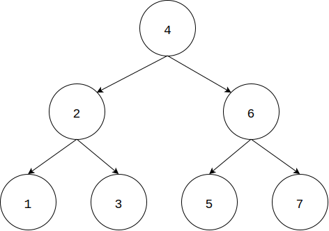

* [Upper Folder - 上一级目录](../../)
* [Source Code - 源码](https://github.com/zhaochenyou/Way-to-Algorithm/blob/master/src/GraphTheory/Traverse/InorderTraverse.hpp)
* [Test Code - 测试](https://github.com/zhaochenyou/Way-to-Algorithm/blob/master/src/GraphTheory/Traverse/InorderTraverse.cpp)

--------

### Inorder Traverse
### 中序遍历

问题：

用中序遍历的方式来遍历二叉树。
解法：

从二叉树根节点\(root\)开始，递归的对二叉树上的每个节点\(i\)，总是优先访问节点\(i\)的左孩子节点，然后访问\(i\)节点本身，最后访问\(i\)的右孩子节点。如图： 

中序遍历的时间复杂度是\(O(n)\)。 

