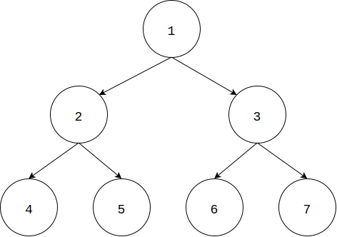

# Levelorder Traverse - 层序遍历

--------

#### 问题

用层序遍历的方式来遍历二叉树。

#### 解法

从二叉树根节点$$ root $$开始，递归的对二叉树上的每个节点$$ i $$，总是优先访问节点$$ i $$以及与$$ i $$处于同一高度的节点，然后再访问$$ i $$以及与$$ i $$处于同一高度的节点的孩子节点们。如图：

先序遍历、中序遍历和后序遍历都可以比较容易的用递归来实现，而层序遍历是无法用递归函数来实现的。我们可以借助队列来实现层序遍历。初始时将二叉树的根节点$$ root $$放入队列中，之后每次从队列中取出一个节点进行访问，并将该节点的左右孩子节点放入队列，直到队列为空，算法结束。在这个过程中，队列对所有节点的访问顺序进行控制，在上图中，保证对于节点$$ 1 $$，总是先访问它的孩子节点$$ 2 $$和$$ 3 $$，然后再访问$$ 2 $$和$$ 3 $$各自的孩子节点$$ 4, 5, 6, 7 $$。

层序遍历的时间复杂度是$$ O(n) $$。

--------

#### 源码

[import, lang:"c_cpp"](../../../../src/GraphTheory/Traverse/LevelorderTraverse.hpp)

#### 测试

[import, lang:"c_cpp"](../../../../src/GraphTheory/Traverse/LevelorderTraverse.cpp)
