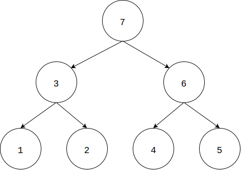

# Postorder Traverse - 后序遍历

--------

#### 问题

用后序遍历的方式来遍历二叉树。

#### 解法

从二叉树根节点$$ root $$开始，递归的对二叉树上的每个节点$$ i $$，总是优先访问节点$$ i $$的左孩子节点，然后访问$$ i $$的右孩子节点，最后访问$$ i $$节点本身。如图：

后序遍历的时间复杂度是$$ O(n) $$。

--------

#### 源码

[import, lang:"c_cpp"](../../../../src/GraphTheory/Traverse/PostorderTraverse.hpp)

#### 测试

[import, lang:"c_cpp"](../../../../src/GraphTheory/Traverse/PostorderTraverse.cpp)
