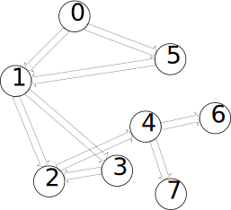
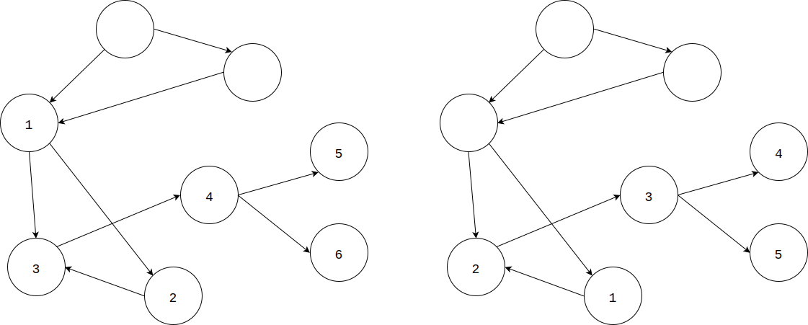

* [Upper Folder - 上一级目录](../../)
* [Source Code - 源码](https://github.com/zhaochenyou/Way-to-Algorithm/blob/master/src/GraphTheory/Traverse/TopologicalSort.hpp)
* [Test Code - 测试](https://github.com/zhaochenyou/Way-to-Algorithm/blob/master/src/GraphTheory/Traverse/TopologicalSort.cpp)

--------

### Topological Sort
### 拓扑排序

问题：

对有向图\(G\)进行拓扑排序。 

 
解法：

拓扑排序可以通过应用深度优先搜索来解决。 

对于有向图\(G\)中的每个节点\(i\)，都进行一次深度优先搜索，由于DFS的特性，每递归一次都尝试让节点\(i\)走的更远，直到终点。因此从节点\(i\)出发DFS所经过的节点数量可看作是节点\(i\)到终点的距离\(d\)。然后按照距离\(d\)对所有节点进行排序即可得到拓扑排序。其中将终点到自己的距离作为\(1\)。 

下面以有向图\(G\)作为一个例子进行拓扑排序： 

从节点\(4\)开始可以遍历到\(6\)个节点，从节点\(3\)开始可以遍历到\(5\)个节点： 

对图中的所有节点依次进行DFS，节点\(0 - 7\)到终点的距离依次为\(8, 6, 3, 4, 2, 7, 1, 1\)。因此按照距离排序后，有向图G的拓扑排序为[0, 5, 1, 3, 2, 4, 6, 7]。

拓扑先序遍历的时间复杂度是\(O(n)\)。 

