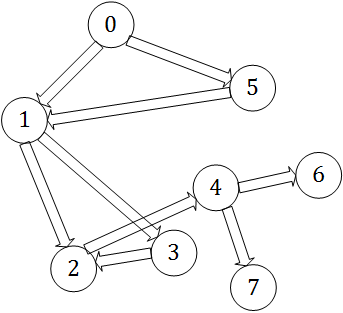
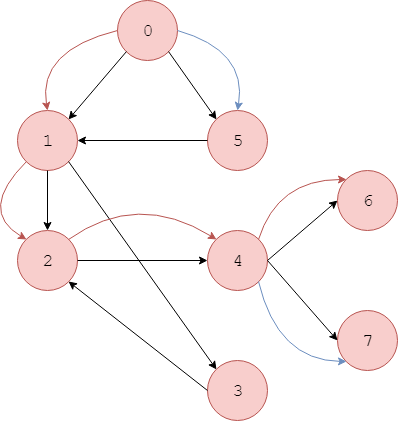
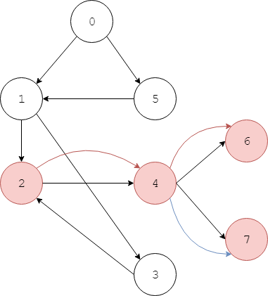

# Topological Sort - 拓扑排序

--------

#### 问题

对有向图$$ DG $$进行拓扑排序。

#### 解法

拓扑排序是深度优先搜索的典型应用。

遍历有向图$$ DG $$的所有顶点做DFS搜索。对任意顶点$$ v_i $$做DFS搜索，直到无法继续搜索为止，搜索到的顶点数量即为$$ v_i $$的DFS距离$$ d_i $$。将所有顶点按照其DFS距离从大到小排序，即为所有顶点的拓扑排序。一个顶点的DFS距离至少为$$ 1 $$。

对下图中的有向图$$ DG $$进行拓扑排序：

$$ (1) $$ 顶点$$ 0 $$的DFS距离为$$ d_0 = 8 $$，DFS搜索顺序为$$ [0, 1, 2, 4, 6, 7, 3, 5] $$，如下图；

$$ (2) $$ 顶点$$ 1 $$的DFS距离为$$ d_1 = 6 $$，DFS搜索顺序为$$ [1, 2, 4, 6, 7, 3] $$，如下图；

$$ (3) $$ 顶点$$ 2 $$的DFS距离为$$ d_2 = 4 $$，DFS搜索顺序为$$ [2, 4, 6, 7] $$，如下图；

$$ (4) $$ 顶点$$ 3 $$的DFS距离为$$ d_3 = 5 $$，DFS搜索顺序为$$ [3, 2, 4, 6, 7] $$；

$$ (5) $$ 顶点$$ 4 $$的DFS距离为$$ d_4 = 3 $$，DFS搜索顺序为$$ [4, 6, 7] $$；

$$ (6) $$ 顶点$$ 5 $$的DFS距离为$$ d_5 = 7 $$，DFS搜索顺序为$$ [5, 1, 2, 4, 6, 7, 3] $$；

$$ (7) $$ 顶点$$ 6 $$的DFS距离为$$ d_6 = 1 $$，DFS搜索顺序为$$ [6] $$；

$$ (8) $$ 顶点$$ 7 $$的DFS距离为$$ d_7 = 1 $$，DFS搜索顺序为$$ [7] $$；

最终得到拓扑排序$$ [0, 5, 1, 3, 2, 4, 6, 7] $$。

每个顶点DFS搜索的时间复杂度为$$ O(\| V \|) $$，拓扑遍历的时间复杂度为$$ O(\| V \| ^ 2) $$。

--------

#### Introduction To Algorithms

* [VI.Graph Algorithms - 22.Elementary Graph Algorithms - 22.4.Topological sort](https://mcdtu.files.wordpress.com/2017/03/introduction-to-algorithms-3rd-edition-sep-2010.pdf)

--------

#### 源码

[TopologicalSort.h](https://github.com/linrongbin16/Way-to-Algorithm/blob/master/src/GraphTheory/Traverse/TopologicalSort.h)

[TopologicalSort.cpp](https://github.com/linrongbin16/Way-to-Algorithm/blob/master/src/GraphTheory/Traverse/TopologicalSort.cpp)

#### 测试

[TopologicalSortTest.cpp](https://github.com/linrongbin16/Way-to-Algorithm/blob/master/src/GraphTheory/Traverse/TopologicalSortTest.cpp)
