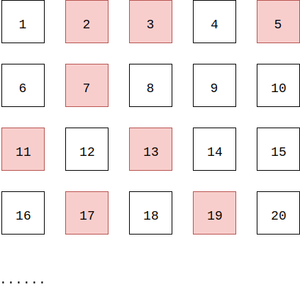

# Chapter-8 NumberTheory
# 第8章 数论

--------

1. [Sieve 筛选算法](Sieve/)
2. [Euclid 欧几里得](Euclid/)
3. [EuclidExtension 欧几里得扩展](EuclidExtension/)
4. [ModularLinearEquation 模线性方程](ModularLinearEquation/)
5. [ChineseRemainerTheorem 中国剩余定理](ChineseRemainerTheorem/)
6. [ModularExponentiation 模幂运算](ModularExponentiation/)
